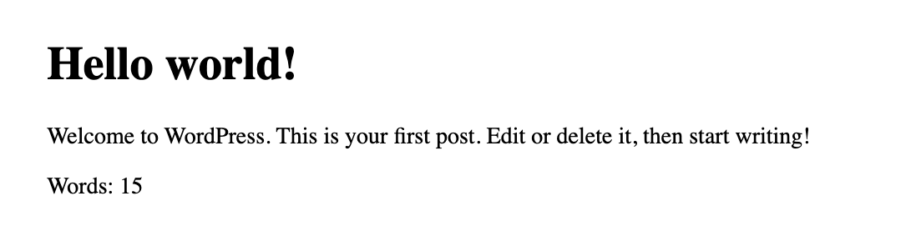
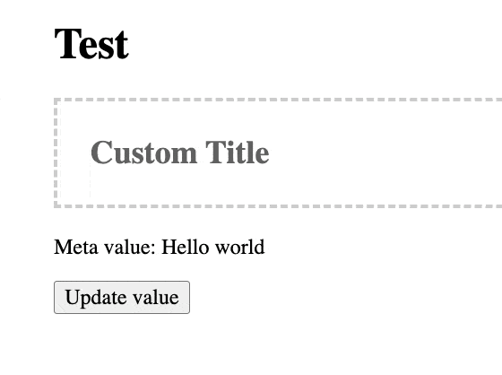

# Add Meta Information to Query Loop

The query loop in Gutenberg allows us to pull posts based on specific parameters. But it comes with a rather limited set of data that it can show. For most custom projects, we want to add *more* information like: author name, author profile image, content length in minutes and more.


Let's imagine we build a "Writers" site where authors can publish their short fiction. We want to showcase how long each work is in words, a common way to measure. So, we will create a new "Micro block" that will output only the words count of a blog post inside the query loop.

We will allow the **editor** to add it in the block editor. This is important note - we allow the editorial team of the site to pick which **meta** information is shown in a given query loop block. Just like they can add regular paragraphs or images in a column, they can add custom meta to query loops. 

### Action plan:

1. Create a new block for the meta information we want to showcase (How long is the article in words)
2. Allow the users to add it to the query loop
3. Test if each article showcases it's own length
4. Make sure the new block doesn't work outside of the query loop.

## Create the new block

We want to create a "micro component". A very small component that will output just the information we want. In our case, this is the length of the post in words. If we put aside the regular files/code we need to add for each component like block.json, index.js, edit.js etc, we can focus just on the important part:

 * How to know which post we are working with?
 * How to get the data we want
 * How to add it to the query loop.

First - **get the ID** of the post we need to get data from. This happens by telling WordPress about what "context" we need. Let's add this in the `block.json` file:

```
"usesContext": ["postId"],
```

> Block context is a feature which enables ancestor blocks to provide values which can be consumed by descendent blocks within its own hierarchy. Those descendent blocks can inherit these values without resorting to hard-coded values and without an explicit awareness of the block which provides those values.
> 
> [developer.wordpress.org](https://developer.wordpress.org/block-editor/reference-guides/block-api/block-context/)

Here, we get the postId provided by the block parent. If our block is added straight into a post, then we get that post's ID. If the block is added in the query loop, then for each post in the query loop, we get it's ID. Just what we needed!

Second - **How do we get the data?** Let's create our block and look at it's parts:

```jsx
import { __ } from '@wordpress/i18n';
import { useSelect } from '@wordpress/data';
import { count as wordCount } from '@wordpress/wordcount';

const PostLength = ({ context: { postId } }) => {
	const postData = useSelect((select) => {
		return select('core').getEntityRecord('postType', 'post', postId);
	}, []);

	return (
		<span>
			{__('Words:')} {wordCount(postData.content.raw)}
		</span>
	);
};
export default PostLength;
```

In the props, you can see that we will receive context in which we will find the postID. The same postID we requested in the block.json file. Next, we want some more information, not just the ID. `getEntityRecord()` will give us just that. With useSelect, we will grab a post by it's ID and return the result inside `postData`.

The final step would be to apply the functionality of our component and count the words. For this we will use the build-in function from WordPress wordCount and pass in the content of the post.

Here is how our block looks like on the front-end:



## Pull data from WP's meta fields

Meta has many meanings, and so far we were looking at meta information like "Post publish date" or "Words count" that can be placed in light gray text under the headings. The post meta. But in a different context, post meta means a speficic place in the database where we can store custom information for each post.

We can pull data from a given post using [useEntityProp()](https://make.wordpress.org/core/2020/03/02/general-block-editor-api-updates/). Lets include it from `core-data`: 

```js
import { useEntityProp } from '@wordpress/core-data';
```

And then inside the block, we can grab all meta information for our page (or post if needed, just update the second argument):

```js
const [meta, setMeta] = useEntityProp('postType', 'page', 'meta');
```

Later, whenerver you need to update the value of the meta field, you can use setMeta like this:

```js
const updateMetaValue = (newValue) => {
	setMeta({ ...meta, _my_custom_text: newValue });
};
```

In the demo case below, this happens when the user clicks on the button:



Code form the demo GIF above:

```js
/**
 * WordPress dependencies
 */
import { __ } from '@wordpress/i18n';
import { RichText, useBlockProps } from '@wordpress/block-editor';
// highlight-start
import { useEntityProp } from '@wordpress/core-data';
// highlight-end

...
const ExampleBockEdit = (props) => {
	const { attributes, setAttributes } = props;
	const { title } = attributes;

	const blockProps = useBlockProps();

   // highlight-start
	const [meta, setMeta] = useEntityProp('postType', 'page', 'meta');
	const metaFieldValue = meta;

	// _my_custom_text is our meta key
	const updateMetaValue = (newValue) => {
		setMeta({ ...meta, _my_custom_text: newValue });
	};
	// highlight-end

	return (
		<div {...blockProps}>
			<RichText
				className="wp-block-example-block__title"
				tagName="h2"
				placeholder={__('Custom Title')}
				value={title}
				onChange={(title) => setAttributes({ title })}
			/>

			<p>Meta value: {metaFieldValue._my_custom_text}</p>

			<button
				type="button"
				onClick={() => {
					// highlight-start
					updateMetaValue('updated');
					// highlight-end
				}}
			>
				Update value
			</button>
		</div>
	);
};
export default ExampleBockEdit;
```

Of course, the post or page has to be saved to store the changes in the database.

:::info
Note that the meta has to be shown in REST:


```php
add_action( 'init', function() {
	register_post_meta( 'page', '_my_custom_text', [
		// highlight-start
		'show_in_rest' => true,
		// highlight-end
		'single' => true,
		'type' => 'string',
		'default' => 'Hello world'
	] );
} );

```
:::