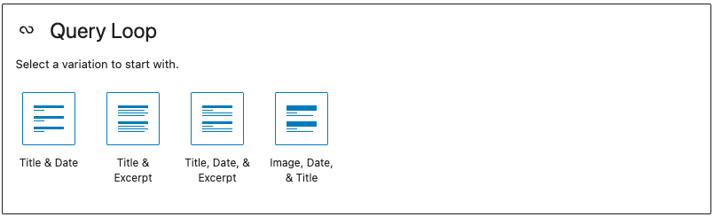

# Add Meta Information to Query Loop

The query loop in Gutenberg allows us to pull posts based on specific parameters. But it comes with a rather limited set of data that it can show. For most custom projects, we want to add *more* information like: author name, author profile image, content length in minutes and more.



Let's imagine we build a "Writers" site where authors can publish their short fiction. We want to showcase how long each work is in words, a common way to measure. So, we will create a new "Micro block" that will output only the words count of a blog post inside the query loop.

We will allow the **editor** to add it in the block editor. This is important note - we allow the editorial team of the site to pick which **meta** information is shown in a given query loop block. Just like they can add regular paragraphs or images in a column, they can add custom meta to query loops. 

### Action plan:

1. Create a new block for the meta information we want to showcase (How long is the article in words)
2. Allow the users to add it to the query loop
3. Test if each article showcases it's own length
4. Make sure the new block doesn't work outside of the query loop.

## Create the new block

We want to create a "micro component". A very small component that will output just the information we want. In our case, this is the length of the post in words:

```jsx
/**
 * WordPress dependencies
 */
import { __ } from '@wordpress/i18n';
import { useSelect } from '@wordpress/data';
import { count as wordCount } from '@wordpress/wordcount';

const PostLength = ({ context: { postId } }) => {
	const siteTitle = useSelect((select) => {
		return select('core').getEntityRecord('postType', 'post', postId);
	}, []);

	return (
		<span>
			{__('Words:')} {wordCount(siteTitle.content.raw)}
		</span>
	);
};
export default PostLength;
```

The important bit here is that we are getting the ID where the component is used. This can be the current post you edit if it's added directly or the post in the query. But in order  to access this postID, we need to say we need it in the block.json file by adding it in an array to the usesContext property:

```
"usesContext": ["postId"],
```

