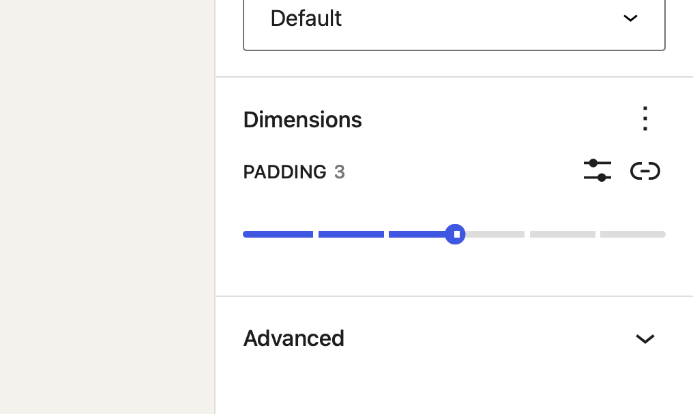
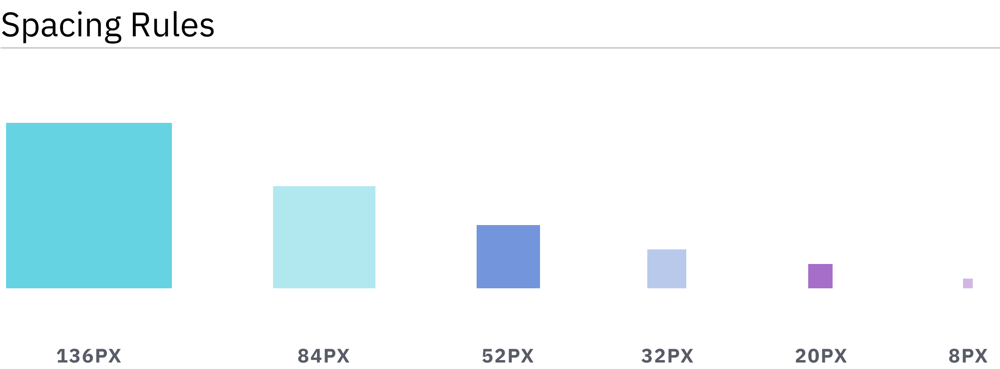

# Handling Block Spacing

There are many ways to handle the spacing between individual blocks in the editor. This guide focusses on what we've found to work best for most client builds.

This guide is also written for WordPress 6.1 or above because it uses the `spacingScale`/`spacingSizes` settings in `theme.json`.

## Providing sensible defaults

The most important step is to provide sensible default spacing through the themes styling. **The goal here should be that editors shouldn't need to touch the spacing controls in most cases.**

<details>

<summary>Example default block spacing css</summary>

```css
/* provide default spacing for all blocks */
.site-content > * {
	margin-top: var(--wp--custom--spacing--m);
}

/* increase top spacing of align wide blocks  */
.site-content > .alignwide {
	margin-top: var(--wp--custom--spacing--l);
}

/* increase top spacing of blocks following align wide blocks  */
.site-content > .alignwide + * {
	margin-top: var(--wp--custom--spacing--l);
}

/* increase top spacing of all align full blocks */
.site-content > .alignfull {
	margin-top: var(--wp--custom--spacing--xl);
}

/* increase top spacing of all blocks following align full blocks */
.site-content > .alignfull + * {
	margin-top: var(--wp--custom--spacing--xl);
}

/* remove spacing between two adjacent align full blocks */
.site-content > .alignfull + .alignfull {
	margin-top: 0;
}

/* add extra spacing for the last block on the page */
.site-content > :last-child {
	margin-bottom: var(--wp--custom--spacing--xl);
}

/*
 * remove bottom spacing from the last block
 * on the page if it is align full
 */
.site-content > :last-child.alignfull {
	margin-bottom: 0;
}
```

</details>

## Allowing editors to override the defaults

Now that we have sensible defaults in place that cover the spacing for most if not all cases we need to provide editors an escape hatch to override these default styles.



:::tip
In most cases the spacing scale of a design has already been established in the styleguide of a project. This serves as a great starting point for the spacing scale we want to provide to editors


:::

In order to give editors the ability to choose from these spacing presets we need to add them to the themes `theme.json`.

```json title="theme.json"
{
	"apiVersion": 2,
	"settings": {
		"spacing": {
			"spacingSizes": [
				{
					"slug": "xs",
					"name": "S",
					"size": "8px"
				},
				{
					"slug": "s",
					"name": "S",
					"size": "20px"
				},
				{
					"slug": "m",
					"name": "M",
					"size": "32px"
				},
				{
					"slug": "l",
					"name": "L",
					"size": "52px"
				},
				{
					"slug": "xl",
					"name": "XL",
					"size": "84px"
				},
				{
					"slug": "2xl",
					"name": "2XL",
					"size": "136px"
				}
			]
		}
	}
}
```


:::info
By default editors are able to bypass the spacing sizes and switch to entering a raw css value (px, rem, em, vh, vw, %, etc.).

If a project should never use these custom sizes that option can be removed by setting `customSpacingSize` to `false`

```json title="theme.json"
{
	"apiVersion": 2,
	"settings": {
		"spacing": {
			"customSpacingSize": false
		}
	}
}
```

:::

## Controlling where the spacing sizes can be used

The defined spacing sizes are available for the `margin`, `padding`, and `blockGap` options of each block that supports these settings.

Each block type can set which of these setting it wants to display and also whether all the individual sides should be controlled individually or whether axial controls. You can learn more about the individual support options in the [block supports reference article](../reference/Blocks/block-supports#spacing).

Additionally the `spacingScale` can be changed on a block by block basis.

```json title="theme.json"
{
	"apiVersion": 2,
	"settings": {
		"spacing": {
			"spacingSizes": [
				{
					"slug": "xs",
					"name": "S",
					"size": "8px"
				},
				...
			]
		},
		"blocks": {
			"core/heading": {
				"spacing": {
					"spacingSizes": [
						{
							"slug": "xs",
							"name": "S",
							"size": "10px"
						},
						...
					]
				}
			}
		}
	}
}
```

:::note
By providing an empty `spacingScale` you are also removing all the spacing settings from a block even if it adds the support in its block supports options.
:::

## Making spacing sizes responsive

In most cases the amount of spacing a component should get is dependant on the size of the viewport. Whilst core lacks actual responsive controls that would alow editors to override spacing settings for certain viewport sizes, there are other mechanisms we can use to make these spacing sizes responsive.

### Fluid spacing values

We can leverage [CSS `clamp`](https://developer.mozilla.org/en-US/docs/Web/CSS/clamp) to make the actual spacing size fluid.

```json
"spacingSizes": [
	{
		"name": "X-Small",
		"slug": 30,
		"size": "clamp(0.5rem, 5vw, 0.75rem)"
	},
	{
		"name": "Small",
		"slug": 40,
		"size": "clamp(0.75rem, 5vw, 1rem)"
	}, ...
```

### Overriding the spacing size value with custom css

We can also override the value of a spacing size in a media query in our CSS. In order to do so we first need to make sure that the spacing size itself doesn't reference a straight up value but instead a custom property (CSS variable). Then we can use our custom CSS to override the value of that custom property.

```json title="theme.json"
{
	"apiVersion": 2,
	"settings": {
		"custom": {
			"spacing": {
				"xs": '8px'
			}
		},
		"spacing": {
			"spacingSizes": [
				{
					"slug": "xs",
					"name": "S",
					"size": "var(--wp--custom--spacing--xs)"
				},
				...
			]
		}
	}
}
```

```css title="style.css"
body {
	--wp--custom--spacing--xs: 8px;

	@media (--bp-medium) {
		--wp--custom--spacing--xs: 12px;
	}

	@media (--bp-large) {
		--wp--custom--spacing--xs: 16px;
	}
}
```

:::caution
The CSS custom properties that get generated from Core are scoped to the `body` element rather than the `:root` element. Therefore we also need to scope our overrides to the `body` element
:::
