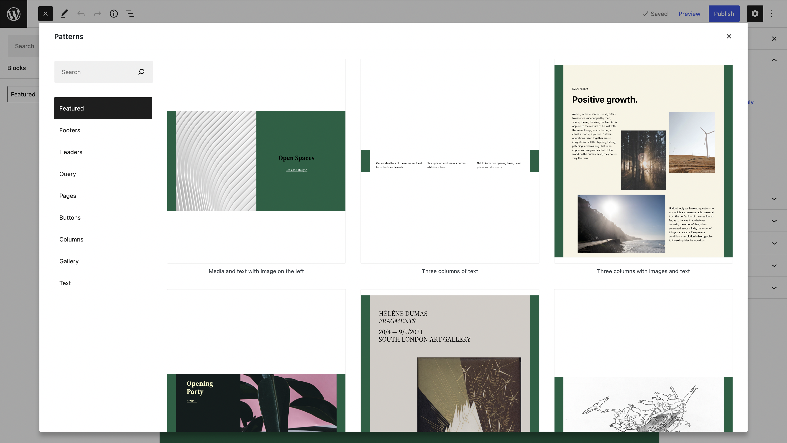

# When and how should block patterns be used?

Block Patterns are a great way to get up and running quickly when editing a page in WordPress. They allow you to insert entire predefined templates so that you don't have to start from scratch. As an editor you get a really nice visual preview of what the pattern looks like.

:::info
If you want to learn more about how to build Block Patterns you should take a look at the [Reference Documentation for Block Patterns](/reference/Blocks/block-patterns).
:::

In this guide, we will take a deep dive into what we should be using block patterns for and what alternatives we have.

## What are patterns good at?

Patterns are great at allowing editors to quickly insert entire sections when they build out new content. They are very visual and therefore a great tool for creatively building out a page with pre-designed sections.

## What are patterns not so good at?

Patterns should not be used for any standalone elements that editors would expect to be able to insert via the block library or using a `/` quick-inserter. Discovering patterns from the various inserters is not as easy as finding individual blocks.

:::caution
**Patterns should not be used to add custom class names to style components differently than how they usually appear.** Doing this creates confusing experiences since it is almost impossible to determine why this one block behaves differently from any other block.

If you need to add special styling to a block based on a custom class name there should also be a way in the UI to get to that state without having to insert the Pattern. This can be done by either [creating a block extension](/reference/Blocks/block-extensions) to add additional settings to a block that handles the class name or by [registering a block variant](/reference/Blocks/block-variations) that adds the class name.
:::

## Looking at an example

The main [WordPress.org](https://wordpress.org) homepage got a new design in 2022. In this example, we are using the mockups of that design to analyze what we should be using block patterns for. The [original designs can be found in the WordPress.org Figma organization](https://www.figma.com/file/WHhRwVc4swYnPKdyVWj3du/Home-%26-Download-Pages?node-id=970%3A9767&t=bwTo7cBEECV6xbdG-1).

Looking at this site, we can split up the design into individual sections of content. These sections are a great place to start when it comes to creating patterns for your site. Each of these sections is a self-contained unit that can be used anywhere on the site.

:::tip
It doesn't matter whether these sections are made up of just one singular block with some options applied, or a bunch of blocks combined.

**Patterns are best used to allow editors to quickly build out sections of content. Regardless of how the section is built.**
:::
