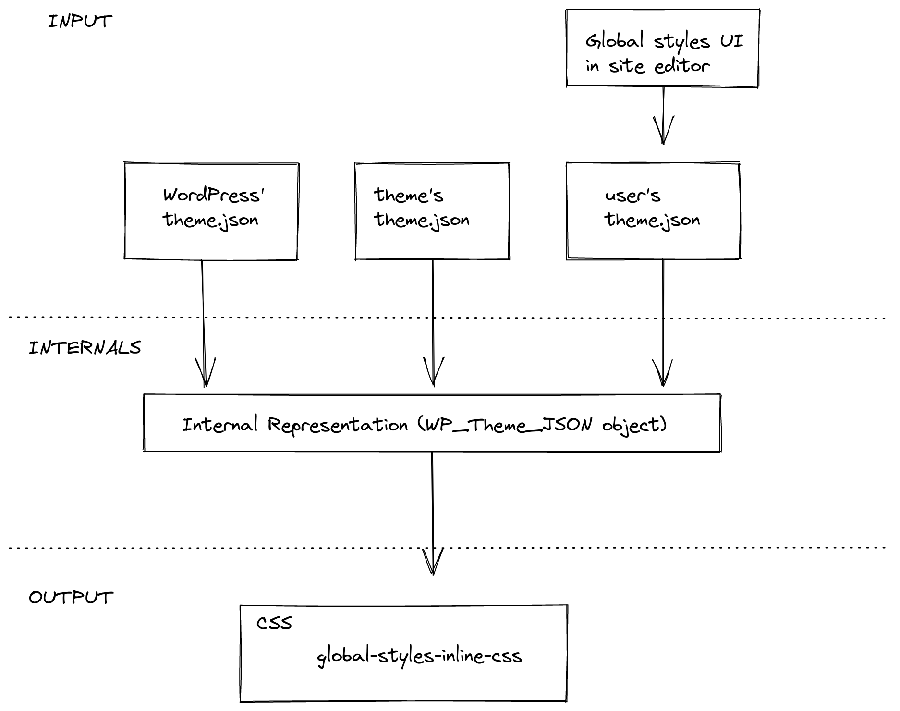

# Global Settings & Styles (`theme.json`)

Theme.json has been introduced in WordPress 5.8 as the way to control the overall appearance and settings of blocks. These settings and style presets get applied both in the editor and on the frontend of the site.

## When to use `theme.json`

By default any new WordPress Theme at 10up includes a `theme.json` file with some minimal configuration. It is recommended to keep this file and use it to control which settings should be exposed on each block in the editor. Theme.json is the easiest mechanism of controlling what options should be exposed.

## How to use `theme.json`

The `theme.json` file gets added to the root directory of a Theme. There are two main areas that you can control with the `theme.json` file: settings and styles. Both of these can have properties defined on the global level, meaning applying to the entire site with all its blocks, or on the block level where you can target individual block types.

```json
{
    "settings": {
        // Global settings get defined here...

        "blocks": {
            // Block specific settings get defined here...
        }
    },

    "styles" : {
        // Global styles get defined here...

        "blocks": {
            // Block specific styles get defined here...
        }
    }

}
```

:::tip
Add the `$schema` key to your `theme.json` files:

```json
{
    "$schema": "https://schemas.wp.org/trunk/theme.json"
}
```

This will give you autocomplete and inline documentation while working on `theme.json` files.

_You can interchange `trunk` with a specific WordPress version like so: `https://schemas.wp.org/wp/6.5/theme.json`_
:::

As mentioned earlier the `theme.json` file has two main purposes. It allows you to control which settings get displayed, and also define certain default values for styles. This styling mechanism is build on CSS custom properties.

So when you define a custom color palette like so:

```json title="theme.json"
{
    "$schema": "https://schemas.wp.org/trunk/theme.json",
    "version": 2,
    "settings": {
        "color": {
            "palette": [
                {
                    "name": "Black",
                    "slug": "black",
                    "color": "#000000"
                },
                {
                    "name": "White",
                    "slug": "white",
                    "color": "#ffffff"
                }
            ]
        },
        "blocks": {
            "core/paragraph": {
                "color": {
                    "palette": [
                        {
                            "name": "Red",
                            "slug": "red",
                            "color": "#ff0000"
                        }
                    ]
                }
            }
        }
    }
}
```

WordPress automatically generates and includes the following custom properties get added to the page:

```css title="generated custom properties"
body {
    --wp--preset--color--black: #000000;
    --wp--preset--color--white: #ffffff;
}

.wp-block-paragraph {
    --wp--preset--color--red: #ff0000;
}
```

:::tip
By default WordPress [caches the Stylesheet](https://github.com/WordPress/wordpress-develop/blob/9b105d92a4b769f396ba798db1f106abab75001f/src/wp-includes/global-styles-and-settings.php#L91-L97) that gets generated out of `theme.json`. For development purposes you can bypass that caching by enabling [debug mode](https://wordpress.org/support/article/debugging-in-wordpress) via the `WP_DEBUG` global in your `wp-config.php`. (`SCRIPT_DEBUG` also achieves the same thing)

Additionally setting the `WP_DEVELOPMENT_MODE` to `all` also is encouraged when working on both custom themes and plugins locally.
:::

## Understanding the cascade

These settings and styles exist at three levels, each overwriting the specificity of the previous layer. At the root there is the default core `theme.json` file which houses all the default values for everything. All the properties in this core `theme.json` file can be overwritten via the `theme.json` file of a theme. Finally there also is the third layer which is the user generated `theme.json` that comes out of the global styles panel in the site editor. This only impacts "Block Based Themes" which allow users to define colors, fonts, etc. manually using the Site Editor.



## Using the values from `theme.json` custom blocks

You can access the settings & values defined in `theme.json` via the `useSettings` hook. This hook accepts a `string` as its parameter which is used as the path for a setting. This means that it checks through the different specificity levels whether a value has been defined for this key.

It first checks whether the user has defined something, then whether the block has defined something in its settings, following the global settings in `theme.json`. If none of these places have any value it will use the default value specified in core.

```js
import { useSettings } from '@wordpress/block-editor';

export function BlockEdit() {
    const [isEnabled] = useSettings( ['typography.dropCap'] );

    // ...
}
```

<details>
    <summary>Example:</summary>
<p>

 Lets say we have this `theme.json` file:

```json title="theme.json"
{
    "settings": {
        "typography": {
            "dropCap": false
        }
    },
    "blocks": [
        "core/paragraph": {
            "settings": {
                "typography": {
                    "dropCap": true
                }
            }
        }
    ]
}
```

Using `useSettings(['typography.dropCap'])` would only return `[true]` if it is being called from within the `core/paragraph` block.

</p>
</details>

## Schema version

The `version` key at the root of `theme.json` controls which schema is in use:

| Version | Introduced | Notes |
| ------- | ---------- | ----- |
| 1 | 5.8 | Initial release, deprecated. |
| 2 | 5.9 | Default for several years. Most settings/styles documented here are v2. |
| 3 | 6.6 | Adopts the modern fluid typography defaults, sectioned styles, and the `dimensions.defaultAspectRatios` toggle. |

```json title="theme.json"
{
    "$schema": "https://schemas.wp.org/trunk/theme.json",
    "version": 3
}
```

When migrating from v2 → v3, WordPress automatically rewrites theme tokens at runtime, but you should still review fluid typography output and aspect ratio presets because the defaults change.

## Settings reference

Below are the settings most commonly used on 10up builds, grouped by area. All of them live under the top-level `settings` key (and can be repeated inside `settings.blocks[blockName]` for per-block overrides).

### Appearance tools shortcut

```json
"settings": {
    "appearanceTools": true
}
```

Setting `appearanceTools: true` enables the full set of design controls in one go (border, color link, color heading, color button, spacing, typography line-height, etc.). This is the recommended starting point for most 10up themes — turn it on globally and then disable specific controls per block as needed.

### Layout & root padding

```json
"settings": {
    "layout": {
        "contentSize": "640px",
        "wideSize":    "1200px"
    },
    "useRootPaddingAwareAlignments": true
}
```

`useRootPaddingAwareAlignments` (added in 6.1) moves the root padding to inner blocks so that `align: full` blocks can still extend edge-to-edge while content blocks honor the gutter. This is now the default for new block themes.

### Spacing presets (added in 5.9, expanded in 6.1)

```json
"settings": {
    "spacing": {
        "units":          [ "px", "em", "rem", "%", "vw", "vh" ],
        "padding":        true,
        "margin":         true,
        "blockGap":       true,
        "spacingScale":   { "operator": "*", "increment": 1.5, "steps": 7, "mediumStep": 1.5, "unit": "rem" },
        "spacingSizes":   [
            { "slug": "20", "size": "0.5rem", "name": "Small" },
            { "slug": "30", "size": "1rem",   "name": "Medium" },
            { "slug": "40", "size": "2rem",   "name": "Large" }
        ]
    }
}
```

`spacingScale` auto-generates a `t-shirt` style scale; `spacingSizes` lets you author named presets manually. If both are provided, `spacingSizes` wins. Presets are exposed both in the spacing controls and as `var(--wp--preset--spacing--{slug})` CSS variables.

### Typography (added throughout 5.9 → 7.0)

```json
"settings": {
    "typography": {
        "fontSizes":       [ /* ... */ ],
        "fontFamilies":    [ /* ... */ ],
        "fluid":           true,
        "customFontSize":  true,
        "fontStyle":       true,
        "fontWeight":      true,
        "letterSpacing":   true,
        "lineHeight":      true,
        "textAlign":       true,
        "textColumns":     true,
        "textDecoration":  true,
        "textIndent":      true,
        "textTransform":   true,
        "writingMode":     true,
        "dropCap":         false
    }
}
```

Highlights:

- `typography.fluid` (added in 6.1) enables CSS `clamp()`-based fluid sizing. In v3 it can also be defined per-font-size via `fluid: { min, max }` on individual entries.
- `typography.textAlign` (6.6) and `typography.textIndent` (7.0) are the most recent additions.
- Set `customFontSize: false` to lock editors to your preset scale.

### Border settings (added in 5.9)

```json
"settings": {
    "border": {
        "color":  true,
        "radius": true,
        "style":  true,
        "width":  true
    }
}
```

### Color (with duotone added in 5.9)

```json
"settings": {
    "color": {
        "palette":           [ /* preset colors */ ],
        "gradients":         [ /* preset gradients */ ],
        "duotone":           [ /* preset duotone filters */ ],
        "background":        true,
        "text":              true,
        "link":              true,
        "heading":           true,
        "button":            true,
        "caption":           true,
        "customDuotone":     true,
        "defaultPalette":    false,
        "defaultGradients":  false,
        "defaultDuotone":    false
    }
}
```

Disable the `default*` keys when you want only your brand presets to show up — by default WordPress merges in its own palette and duotone filters.

### Shadow presets (added in 6.3)

```json
"settings": {
    "shadow": {
        "defaultPresets": false,
        "presets": [
            { "slug": "soft",   "shadow": "0 4px 12px rgba(0,0,0,0.08)", "name": "Soft" },
            { "slug": "strong", "shadow": "0 12px 32px rgba(0,0,0,0.18)", "name": "Strong" }
        ]
    }
}
```

These presets feed both the global shadow picker in the site editor and any block that opts into the `shadow` block support.

### Dimensions (added in 6.5, expanded in 7.0)

```json
"settings": {
    "dimensions": {
        "defaultAspectRatios": true,
        "aspectRatios": [
            { "slug": "wide", "ratio": "16/9", "name": "Wide" }
        ],
        "minHeight": [
            { "slug": "small", "size": "20rem", "name": "Small" },
            { "slug": "large", "size": "60rem", "name": "Large" }
        ]
    }
}
```

WordPress 7.0 also adds `height` and `width` preset arrays for the new `dimensions.height` / `dimensions.width` block supports.

### Background (added in 6.4)

```json
"settings": {
    "background": {
        "backgroundImage": true,
        "backgroundSize":  true
    }
}
```

When enabled, blocks that opt into the `background` block support can accept background images directly from the inspector.

### Lightbox (added in 6.4)

```json
"settings": {
    "blocks": {
        "core/image": {
            "lightbox": { "enabled": true, "allowEditing": true }
        }
    }
}
```

Turns the click-to-zoom lightbox on for the Image block site-wide. The Gallery block also supports it via the same setting.

### Custom CSS toggle (added in 6.2)

```json
"settings": {
    "css": true
}
```

Required for the `styles.css` and `styles.blocks[blockName].css` keys to be honored.

## Styles reference

`styles` mirrors `settings` in that you can target the whole site (`styles.*`), individual elements (`styles.elements.*`), and individual blocks (`styles.blocks[blockName].*`).

### Element styles (added in 5.9, expanded in 6.x)

```json
"styles": {
    "elements": {
        "link":    { "color": { "text": "var(--wp--preset--color--accent)" } },
        "button":  { /* … */ },
        "heading": { "typography": { "fontFamily": "var(--wp--preset--font-family--display)" } },
        "h1":      { "typography": { "fontSize": "var(--wp--preset--font-size--xx-large)" } },
        "h2":      { /* … */ },
        "caption": { "typography": { "fontSize": "0.875rem" } },
        "cite":    { /* … */ }
    }
}
```

Element styles cascade across **every** block that renders that HTML element, which is exactly what you want for a design-system theme.

### Per-block & per-element interaction states

```json
"styles": {
    "elements": {
        "link": {
            "color":  { "text": "var(--wp--preset--color--accent)" },
            ":hover": { "color": { "text": "var(--wp--preset--color--accent-2)" } },
            ":focus": { /* … */ }
        }
    }
}
```

`:hover`, `:focus`, `:focus-visible`, and `:active` are supported on link and button elements. WordPress 7.0 extends this to the `core/button` block specifically (see below).

### Custom CSS per block / globally (added in 6.2)

```json
"styles": {
    "css": ":root { --site-max-width: 1280px; }",
    "blocks": {
        "core/quote": {
            "css": "& { border-inline-start: 4px solid currentColor; padding-inline-start: var(--wp--preset--spacing--40); }"
        }
    }
}
```

The `&` selector is automatically replaced with the block's root selector, so you can scope styles without duplicating the class name.

### Style variations (added in 6.6)

```json
"styles": {
    "blocks": {
        "core/group": {
            "variations": {
                "accent": {
                    "color": { "background": "var(--wp--preset--color--accent)" }
                }
            }
        }
    }
}
```

Any variation defined this way is automatically registered as a block style on `core/group` and surfaces in the Styles panel.

### Pseudo-element styles on `core/button` (added in 7.0)

```json title="theme.json"
{
    "version": 3,
    "styles": {
        "blocks": {
            "core/button": {
                "color": { "background": "var(--wp--preset--color--accent)" },
                ":hover":         { "color": { "background": "var(--wp--preset--color--accent-2)" } },
                ":focus-visible": { "outline": { "width": "2px", "style": "solid", "color": "currentColor", "offset": "2px" } }
            }
        }
    }
}
```

## Filtering `theme.json` data

Starting in WordPress 6.1 it is possible to filter the values of `theme.json` on the server. There are 4 different hooks for the 4 different layers or `theme.json`. Default, Blocks, Theme, and User.

- `wp_theme_json_data_default`: hooks into the default data provided by WordPress
- `wp_theme_json_data_blocks`: hooks into the data provided by the blocks
- `wp_theme_json_data_theme`: hooks into the data provided by the theme
- `wp_theme_json_data_user`: hooks into the data provided by the user

Each of these filters receives an instance of the `WP_Theme_JSON_Data` class with the data for the respective layer. To provide new data, the filter callback needs to use the `update_with( $new_data )` method, where `$new_data` is a valid `theme.json`-like structure.

As with any `theme.json`, the new data needs to declare which `version` of the `theme.json` is using, so it can correctly be migrated.

```php
function filter_theme_json_theme( $theme_json ){
	$new_data = array(
		'version'  => 2,
		'settings' => array(
			'color' => array(
				'text'       => false,
				'palette'    => array(
					array(
						'slug'  => 'foreground',
						'color' => 'black',
						'name'  => __( 'Foreground', 'theme-domain' ),
					),
					array(
						'slug'  => 'background',
						'color' => 'white',
						'name'  => __( 'Background', 'theme-domain' ),
					),
				),
			),
		),
	);

	return $theme_json->update_with( $new_data );
}
add_filter( 'wp_theme_json_data_theme', 'filter_theme_json_theme' );
```

## Filtering `theme.json` client side

Having the filters available on the backend is great. But sometimes we need to be able to change settings based on contextual clues. That isn't possible on the server because we cannot access the actual state of the block consuming the `theme.json` settings on the server.

In order to allow for these types of contextual settings a new client side hook called `blockEditor.useSetting.before` was introduced in WordPress 6.2.

```js
import { select } from  '@wordpress/data';
import { addFilter } from '@wordpress/hooks';
import { store as blockEditorStore } from '@wordpress/block-editor';

/**
 * Disable text color controls on Heading blocks
 * when placed inside of Media & Text blocks.
 */
addFilter(
	'blockEditor.useSetting.before',
	'namespace/useSetting.before',
	( settingValue, settingName, clientId, blockName ) => {
		if ( blockName === 'core/heading' ) {
			const { getBlockParents, getBlockName } = select( blockEditorStore );
			const blockParents = getBlockParents( clientId, true );
			const isNestedInMediaTextBlock = blockParents.some( ( ancestorId ) => getBlockName( ancestorId ) === 'core/media-text' );

			if ( isNestedInMediaTextBlock && settingName === 'color.text' ) {
			    return false;
			}
		}

		return settingValue;
	}
);
```

## Links

- [Block Editor Handbook - Global Settings & Styles (theme.json)](https://developer.wordpress.org/block-editor/how-to-guides/themes/theme-json/)
- [Block Editor Handbook - Theme JSON API Reference](https://developer.wordpress.org/block-editor/reference-guides/theme-json-reference/theme-json-living/)
- [Filters for theme.json data - WordPress 6.1 Dev Note](https://make.wordpress.org/core/2022/10/10/filters-for-theme-json-data/)
- [How to modify theme.json data using server-side filters - WordPress Developer Blog](https://developer.wordpress.org/news/2023/07/how-to-modify-theme-json-data-using-server-side-filters/)
- [Customize settings for any block in WordPress 6.2 - WordPress 6.2 Dev Note](https://make.wordpress.org/core/2023/02/28/custom-settings-wordpress-6-2/)
- [WordPress 7.0 Field Guide](https://make.wordpress.org/core/2026/05/14/wordpress-7-0-field-guide/)
