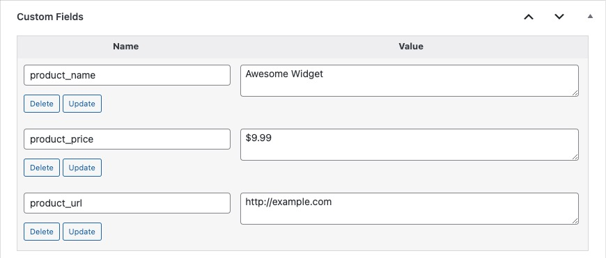
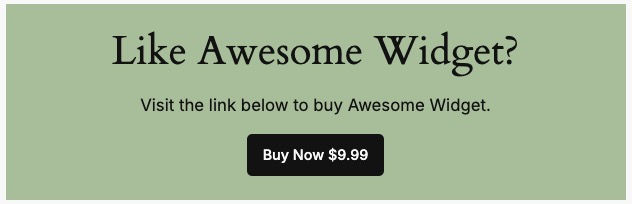

# Block Bindings API

In WordPress 6.6 the [Block Bindings API](https://make.wordpress.org/core/2024/03/06/new-feature-the-block-bindings-api/) was introduced.  What this does is allow our blocks to read data from a variety of sources such as custom fields (post meta) or other logic created in php.  Under the hood, it is this feature that allows us to override our synced patterns.

Again, it should be noted that only a handful of core blocks allow for this, and custom block support does not currently exist.  As of WordPress 6.6, the following blocks are enabled with the supported attributes listed after each one.

| Supported Blocks | Supported Attributes |
| ---------------- | ---------------------|
| Image            | url, alt, title      |
| Paragraph        | content              |
| Heading	       | content              |
| Button           | url, text, linkTarget, rel |

While the editor does not currently have an interface for applying these features, we can manually apply attributes to our block markup using the Code Editor view.  Let's run through an example using our Call to Action block from the previous entries on Synced Patterns.

## How Synced Patterns leverage the API

If we open up the **Edit Original** screen of our Synced Pattern and choose the code editor view **(⇧⌥⌘M
)**, we can get a little more insight into what's happening to make this work.

Let's take a closer look at our Heading block within our pattern and format it a bit for readability.

```html
<!--
wp:heading
{
  "metadata": {
    "bindings": {
      "__default": {
        "source": "core/pattern-overrides"
      }
    },
    "name": "Call to Action Title"
  },
  "fontSize":"x-large"
}
-->
<h2 class="wp-block-heading has-x-large-font-size">Want to get in touch?</h2>
<!-- /wp:heading -->
```

Here we can see our new attribute added to the block for **"binding"** that controls the synchronization.  In a Synced Pattern, the binded attribute is set as **"__default"**, which essentially means it's bound to all default supported attributes we initially set in our pattern.  In our Heading's case, that would mean the *content* attribute but for a Button it would mean *url*, *text*, *linkTarget*, and *rel*. We can also see it has a source set to **"core/pattern-overrides"**.  It is these attributes that we can alter using the Block Bindings API to create our own logic for managing our patterns content.

## Creating our own Bindings

Let's say we are using our pattern on a post type about products where the individual items data is stored in various post meta fields.  Using the Block Bindings API, we can set defaults and use those meta fields to dynamically alter our patterns content.

Let's quickly look at the structure of the attributes we will need to use on our blocks.  It's very similar to the one used on a Synced Pattern, with a notable difference in using our custom source (which we will create below) and then adding a key within the **args** object which allows for dynamic content.

```json
{
  "metadata": {
    "bindings": {
      "content": {
        "source": "tenup/cta-binding",
        "args": {
          "key": "cta_heading"
        }
      }
    }
  }
}
```

Here, we're using a Heading block as an example where we are binding its **content** attribute to our custom source.

:::caution
Much like Synced Pattern Overrides, when using the Block Bindings API it is very important to know that our blocks are not optional, and we cannot display them conditionally.

For example, if we bind our Heading's `content` attribute to post meta, but that post meta does not return a value, an empty `<h2>` tag will display on the frontend.  Similarly, we cannot use multiple Buttons in our pattern and have the ability to sometimes display just a single one.  Whatever blocks are given bindings, their markup will **always** be returned.

Because of this, when creating your pattern and setting up your custom binding source, it is recommended to always set default values.  More on that below.
:::

### 1. Register our Post Meta

First things first, lets register our meta fields.  We'll want the name of our product, it's price, and a link to purchase.

```php
add_action( 'init', 'tenup_register_post_meta', 99, 0 );

function tenup_register_post_meta() {

	register_post_meta(
		'post',
		'product_name',
		array(
			'show_in_rest' => true,
			'single'       => true,
			'type'         => 'string',
		)
	);

	register_post_meta(
		'post',
		'product_price',
		array(
			'show_in_rest' => true,
			'single'       => true,
			'type'         => 'string',
		)
	);

	register_post_meta(
		'post',
		'product_url',
		array(
			'show_in_rest' => true,
			'single'       => true,
			'type'         => 'string',
		)
	);
}
```

### 2. Register our own Block Bindings source

As noted above, a Synced Pattern uses the **"core/pattern-overrides"** for it's source.  Here we can register our own to use in a similar way.  It's a fairly simple function, we just need to give a slug, a label, and then a callback function we can use to dynamically alter our content.

```php
add_action( 'init', 'tenup_register_block_bindings', 99, 0 );

function tenup_register_block_bindings() {

	register_block_bindings_source(
		'tenup/cta-binding',
		array(
			'label'              => __( 'Call to Action Binding', 'tenup-theme' ),
			'get_value_callback' => 'tenup_bindings_callback',
		)
	);
}
```

### 3. Create the callback function

This is where the fun begins.  Take a look at the complete picture and then let's walk through each step below to create dynamic content in our pattern.

```php
function tenup_bindings_callback( $source_args ) {

	// Return null if no key is set.
	if ( ! isset( $source_args['key'] ) ) {
		return null;
	}

	// Create defaults for our bindings.
	$cta_heading     = __( 'Want to get in touch?', 'tenup-theme' );
	$cta_paragraph   = __( 'We would love to hear from you!', 'tenup-theme' );
	$cta_button_text = __( 'Contact Us', 'tenup-theme' );
	$cta_button_url  = '/contact-us';

	// Get the data from the post meta.
	$product_name  = get_post_meta( get_the_ID(), 'product_name', true ) ?? false;
	$product_price = get_post_meta( get_the_ID(), 'product_price', true ) ?? false;
	$product_url   = get_post_meta( get_the_ID(), 'product_url', true ) ?? false;

	// If we have all of the data we want, change our default values to use it.
	if ( $product_name && $product_price && $product_url ) {
		$cta_heading = __( 'Like ', 'tenup-theme' ) . $product_name . __( '?', 'tenup-theme' );
		$cta_paragraph = __( 'Visit the link below to buy ', 'tenup-theme' ) . $product_name . __( '.', 'tenup-theme' );
		$cta_button_text = __( 'Buy Now ', 'tenup-theme' ) . $product_price;
		$cta_button_url = $product_url;
	}

	// Return the data based on the key argument set in the block attributes.
	switch ( $source_args['key'] ) {
		case 'cta_heading':
			return $cta_heading;
		case 'cta_paragraph':
			return $cta_paragraph;
		case 'cta_button_text':
			return $cta_button_text;
		case 'cta_button_url':
			return $cta_button_url;
		default:
			return null;
	}
}
```

1. First we are looking for our keys.  If no key is set telling us how to map our dynamic data, we will return null in our callback. The pattern will then use the defaults set when the pattern is created.
2. Next we create defaults for our keys.  These can be the same items set when creating our pattern.  Here for example, we will create our pattern with generic messaging leading to a Contact page and set our defaults to the same.
3. We then get our data from our post meta fields.  If we have all desired data, we can then remap our bindings to dynmaic text to include our product's info.  If any if the data is missing, we have our defaults to fall back on.
4. Finally, we return each key in a switch statement.

All that's it!  Similar to the steps outlined in [Synced Patterns](../../reference/Patterns/synced-patterns#creating-synced-patterns-for-theme-authors), we can then create a pattern in our theme and manually set our blocks attributes as outlined above using our custom source's slug and our callback functions keys to sync it in our environments.

Below is the full code from our example Call to Action.

```html
<!-- wp:group {"metadata":{"name":"Call to Action"},"style":{"spacing":{"blockGap":"var:preset|spacing|10","padding":{"top":"var:preset|spacing|20","bottom":"var:preset|spacing|20","left":"var:preset|spacing|20","right":"var:preset|spacing|20"}}},"backgroundColor":"accent-4","layout":{"type":"flex","orientation":"vertical","justifyContent":"center"}} -->
<div class="wp-block-group has-accent-4-background-color has-background" style="padding-top:var(--wp--preset--spacing--20);padding-right:var(--wp--preset--spacing--20);padding-bottom:var(--wp--preset--spacing--20);padding-left:var(--wp--preset--spacing--20)">

<!-- wp:heading {"metadata":{"bindings":{"content":{"source":"tenup/cta-binding","args":{"key":"cta_heading"}}}},"fontSize":"x-large"} -->
<h2 class="wp-block-heading has-x-large-font-size">Want to get in touch?</h2>
<!-- /wp:heading -->

<!-- wp:paragraph {"metadata":{"bindings":{"content":{"source":"tenup/cta-binding","args":{"key":"cta_paragraph"}}}},"fontSize":"medium"} -->
<p class="has-medium-font-size">We would love to hear from you!</p>
<!-- /wp:paragraph -->

<!-- wp:buttons -->
<div class="wp-block-buttons">

<!-- wp:button {"metadata":{"bindings":{"url":{"source":"tenup/cta-binding","args":{"key":"cta_button_url"}},"text":{"source":"tenup/cta-binding","args":{"key":"cta_button_text"}}}}} -->
<div class="wp-block-button">
	<a class="wp-block-button__link wp-element-button" href="/contact-us">Contact Us</a>
</div>
<!-- /wp:button -->

 </div>
<!-- /wp:buttons -->

 </div>
<!-- /wp:group -->
```

Here we can see that our Call to Action will display a nice fallback should our post meta fields be missing.


<br/>
*Call to action with default settings applied*

If we have our all of our desired data, we will display our custom content.


<br/>
*An example of our populated post meta fields*


<br/>
*Our dynamic Call to Action populated with our post meta fields*

## Further reading

- [Introducing Block Bindings, part 1: connecting custom fields](https://developer.wordpress.org/news/2024/02/20/introducing-block-bindings-part-1-connecting-custom-fields/)
- [Introducing Block Bindings, part 2: Working with custom binding sources](https://developer.wordpress.org/news/2024/03/06/introducing-block-bindings-part-2-working-with-custom-binding-sources/)
