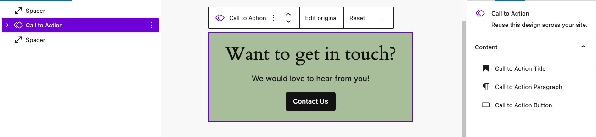

# Synced Pattern Overrides

Editors now have the capability to maintain a Synced Pattern while being able to edit the content of the block on an individual basis.  In other words, we can keep the look and feel of our component in sync across the site, while being able to alter the text, links, or even images used within on a per use basis.

It should be noted that only a handful of core blocks allow for this, and custom block support does not currently exist. As of WordPress 6.6, the following blocks are enabled with the supported attributes listed after each one.

| Supported Blocks | Supported Attributes |
| ---------------- | ---------------------|
| Image            | url, alt, title      |
| Paragraph        | content              |
| Heading	       | content              |
| Button           | url, text, linkTarget, rel |

In the case of our Call to Action pattern, we can override the Heading, Paragraph, and Button used *within*, but not overide the settings as a whole on the parent Group for example.

:::caution
When using Synced Pattern Overrides, it is very important to know that our blocks are not optional, and we cannot display them conditionally.

For example, we cannot use multiple Buttons in our pattern and have the ability to sometimes display just a single one.  Every block used in the original pattern will *always* render its markup, even if we leave its text content empty.

Another example of this limitation is the lack of support on the List block.  As currently implemented, you would only ever be able to use the exact same amount of List Item blocks and they would not be optional.

[Follow along on GitHub here to see the progress of inserting additional innerblocks within a `contentOnly` locked pattern](https://github.com/WordPress/gutenberg/issues/52018).
:::

## How to enable Overrides

After enabling a Synced Pattern as outlined in the previous lesson, to allow Overrides you would do the following.

1. Select the pattern in the editor window and choose **Edit Original** in the block toolbar.
2. Select the supported block you wish to enable Overrides on.  For now, lets choose the Heading block.
3. In the Advanced panel of the block's setting, choose **Enable Overrides**.
4. Give your Heading a title in the pop up window, we will call ours *"Call to Action Title"*. Then choose **Enable**.
5. Repeat the steps for any other supported blocks you wish to enable and hit **Save** in the upper right.
6. You can return to the page you were editing by using the **Back** button located near the Patterns title in the upper center of the screen.

Upon inserting our pattern into a new post, we can now edit our Heading.

## Settings for Override enabled blocks

When an Override enabled block is selected, after editing a **Reset** control is availble in the blocks toolbar.

When the pattern itself *or* any of its Override enabled innerblocks are selected, the usual block Inspector Control "Settings" panel is replaced by a "Content" panel where we can select the blocks that allow for editing.

 
*The updated block settings for an override enabled Synced Pattern*

On the next page, we'll take a look at what's going on under the hood of a Synced Pattern and learn how we can apply our own logic to manage the content of our Patterns using the Block Bindings API.
