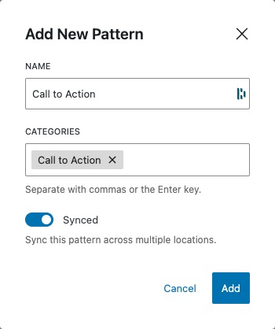
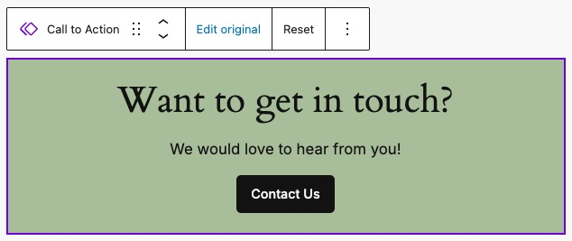

# Synced Patterns (Reusable Blocks)

Block Patterns are an excellent way to quickly add common components across our site. But what if we decide we want to update the language, link, or design used within that component?  With standard patterns, we'd have to manually find and replace every use, this might mean dozens or even thousands of instances on a larger site.

This is where Synced Patterns shine.  We can create a global component which can be edited once to then update across all instances where it is used.  For example an info card, a grid of logos, or perhaps a simple call to action are all excellent candidates which may require such a feature.  We will use the latter in our examples.


<br/>
*A simple Call to Action block pattern*

:::caution
One major caveat of using Synced Patterns is that they cannot be created programatically.  A Synced Pattern is stored in the database and therefore would need to be manually created in each environment it is to be used.  While any pattern you create can *become* synced, it is not possible to declare it as such in your theme or plugin.

We will discuss potential solutions for this problem below.
:::

## Creating a Synced Pattern

To mark a pattern as Synced, you would follow these steps:

1. Select the block(s) you wish to sync and open the options dropdown along the right hand side of the List View or block toolbar.
2. Choose "Create Pattern" from the dropdown.
3. A modal window will then display where you can give your pattern a name and category, and most importantly, mark the pattern as **Synced**.

That's it!  You can now find your component via the block inserter under the Patterns tab > My Patterns *(and any other categories you declared in step 3)*.


<br/>
*The modal window for adding a new Pattern*

## Updating a Synced Pattern

To edit your Synced Pattern, you would do the following:

1. Either navigate to it in your themes Patterns directory under the dashboard Appearance tab or select the pattern in a posts block editor window.
2. Choose **Edit Original** in the block toolbar.
3. On the next screen, edit your pattern as desired.  Make a small text change, a major design overhaul, or even replace the component entirely with different blocks if you wish.
4. Once completed, hit **Save** in the upper right.
5. You can return to the page you were editing using the **Back** button located near the title in the upper center of the screen.


<br/>
*The block toolbar to edit your Synced Pattern*

## Creating Synced Patterns for Theme Authors

As mentioned above, Synced Patterns have to be manually set in each environment they are to be used.

This limitation somewhat complicates their use and while there is no one size fits all approach for how to best handle this, lets walk through one workflow that could make this easier on the developer experience for theme authors.

:::caution

### Ask yourself, is this the best approach?

Synced Patterns can be trickier to maintain and come with special considerations.  Depending on your circumstances *(budget, ability, time, etc...)*, it might be easier as a theme author to add a pattern in a block template part for use in your page templates.  Or maybe you could create a simple custom block that renders your pattern instead.

If you need more flexibility, Synced Patterns can be a viable option to achive that end.  Perhaps your end users are creatives and want the ability to make design changes to the component. Or you could be handing off the project to the client entirely and this gives them a bit more freedom in the long term.

It is up to you or your team to thoughtfully consider the trade offs to using Synced Patterns in your project.
:::

### 1. Add the pattern in your theme

Add the pattern you wish to use to your themes `patterns` directory.  In the doc comment up top, set the *Categories* declaration to "hidden", and *Inserter* to "false".

```php title="patterns/call-to-action.php"
<?php
/**
 * Title: Call to Action
 * Slug: tenup-theme/call-to-action
 * Categories: hidden
 * Inserter: false
 */
?>

<!-- wp:group {"metadata":{"name":"Call to Action"},"style":{"spacing":{"blockGap":"var:preset|spacing|10","padding":{"top":"var:preset|spacing|20","bottom":"var:preset|spacing|20","left":"var:preset|spacing|20","right":"var:preset|spacing|20"}}},"backgroundColor":"accent-4","layout":{"type":"flex","orientation":"vertical","justifyContent":"center"}} -->
<div class="wp-block-group has-accent-4-background-color has-background" style="padding-top:var(--wp--preset--spacing--20);padding-right:var(--wp--preset--spacing--20);padding-bottom:var(--wp--preset--spacing--20);padding-left:var(--wp--preset--spacing--20)">

<!-- wp:heading -->
<h2 class="wp-block-heading has-x-large-font-size">Want to get in touch?</h2>
<!-- /wp:heading -->

<!-- wp:paragraph -->
<p class="has-medium-font-size">We would love to hear from you!</p>
<!-- /wp:paragraph -->

<!-- wp:buttons -->
<div class="wp-block-buttons">

<!-- wp:button -->
<div class="wp-block-button">
<a class="wp-block-button__link wp-element-button">Contact Us</a>
</div>
<!-- /wp:button -->

</div>
<!-- /wp:buttons -->

</div>
<!-- /wp:group -->
```

### 2. Create a block template part to house your pattern

In your themes `parts` directory, create a new file containing your pattern.  Perhaps you only have the one pattern you wish to sync in which case this file could be called `call-to-action.html`, though depending on preference it might be nicer to use a single file to add **all** Synced Patterns, in which case `synced-patterns.html` would be more semantic.

```html title="parts/synced-patterns.html"
<!-- wp:pattern {"slug":"tenup-theme/call-to-action"} /-->

<!-- wp:pattern {"slug":"tenup-theme/a-second-pattern-to-be-synced"} /-->

```

[For more information on Block Template Parts, refer to this section of the Gutenberg Best Practices](../../reference/Themes/block-template-parts).

:::info

### Why are we doing this?

In the first step, we marked our pattern as hidden and disabled it from being inserted manually.  By doing so, we are ensuring that editors will never have access to the original, unsynced pattern and cannot use our themes component in posts or pages until it has been marked as Synced and added to the database.
:::

### 3. Mark your pattern as Synced

Now that we have a block template part in place, navigate to the Site Editor in the WordPress admin and select the Synced Patterns template part.  It is here that we will [follow the steps outlined above to sync](#creating-a-synced-pattern).

:::caution
This step needs to be taken in all environments.
:::

Your pattern is now Synced and has been added to the database. It is ready to use throughout your site.

### 4. Updating across environments

Should we wish to change the styles or text used, we will still have to manually update our Synced Pattern in each enviroment.

One approach might be to:

1. Open each enviroment in a separate browser tab and navigate to your themes Patterns directory under the dashboard Appearance tab. Choose your Synced Pattern.
2. In one browser tab, make your updates as desired and hit **Save**. Then select **Copy all blocks** from the Options settings in the upper right of the screen.
3. In the other browser tabs, overwrite the pattern by copying the updated one into the editor.
4. Optionally, you may want to also copy our updates back into the `patterns/call-to-action.php` file to keep that up to date.

:::caution
It is important to note this last step is a fairly major difference in traditional theme authoring.  Typically you'd rewrite your component locally first, push the updated codebase, *then* see your changes in the other environments.  Here, we must make our updates in all environments first and essentially work backwards to update a Synced Pattern in our theme.

This is another reason trying to maintain a Synced Pattern as a theme author should come with special consideration as mentioned above.

Because of these special considerations, we don't recommend the usage of Synced Patterns for most sites today.  [Follow along on GitHub here](https://github.com/WordPress/gutenberg/issues/59272) to see the progress of syncing Patterns within your theme someday.
:::
