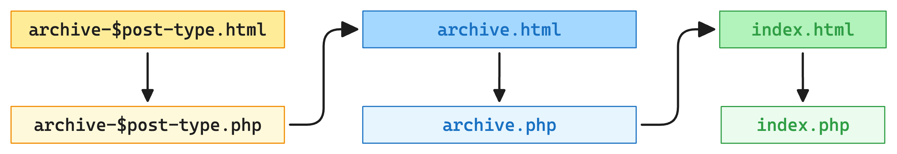
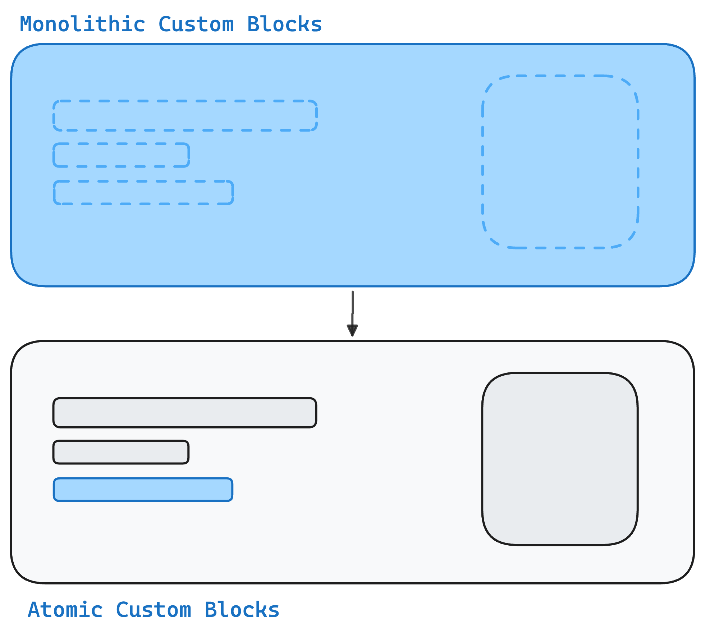
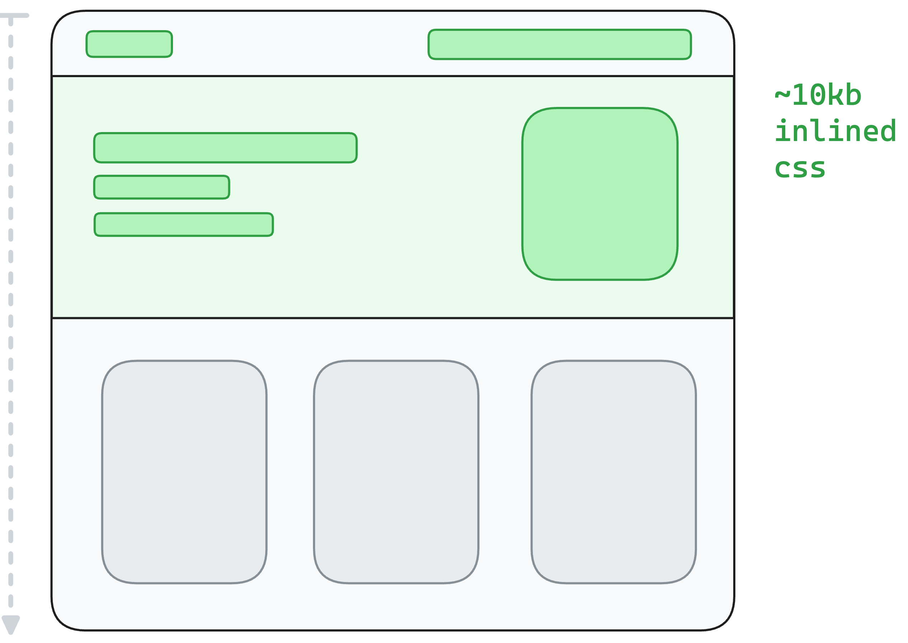

# Lesson 1: Anatomy of a block based theme

Block Based Themes (sometimes referred to as Full Site Editing) are a new way of building WordPress themes. Instead of using PHP templates, you build your theme using blocks. This means that everything in your theme is a block, from the header to the footer, and everything in between.

In this lesson, we'll take a look at the anatomy of a block based theme, and how you can start building your own.

## The Basics

Even though it might seem like a big change, building a block based theme is not that different from building a traditional theme. The main difference is that instead of using PHP templates, you HTML template files that contain block markup. These files are stored in a `templates` folder in your theme.

Everything else is pretty much the same. Any theme still requires a `style.css` file for the theme metadata, and a `functions.php` file for any custom functions or hooks, and so on.

You can think of block based themes as a superset on top of traditional themes. If you look at the template hierarchy in WordPress (e.g. `index.php`, `single.php`, `page.php`, etc.), the introduction of block based themes doesn't change that. Instead of `index.php`, you now have `templates/index.html`, and so on. The same rules apply, but instead of PHP files, you use HTML files. The cool part here is that technically speaking you can even still use PHP files. The template hierarchy will look for `.html` files first, and then fall back to `.php` files if it can't find an `.html` version.



So if you ever encounter a situation where you need to use a PHP template in a block based theme, you can still do that.

<details>

<summary>Using a PHP template in a block based theme</summary>

As mentioned you can still use PHP templates in a block based theme. The template hierarchy will look for `.html` files first, and then fall back to `.php` files if it can't find an `.html` version.

But since block based themes don't contain the traditional `header.php`, `footer.php`, etc. files since they are now also made out of blocks you will need to manually include these template parts using the [`block_template_part`](https://developer.wordpress.org/reference/functions/block_template_part/) function.

```php title="single-book.php"
<?php
/**
 * The template for displaying a single book
 */

// We need to load the templates before we call the `wp_head` function so that any of the styles and scripts
// that are enqueued in the templates are included in the head of the document.
$header_template = get_block_template( get_stylesheet() . '//header', 'wp_template_part' );
$footer_template = get_block_template( get_stylesheet() . '//footer', 'wp_template_part' );
$header_template = do_blocks( $header_template->content );
$footer_template = do_blocks( $footer_template->content );

?>
<!DOCTYPE html>
<html <?php language_attributes(); ?>>
<head>
	<meta charset="<?php bloginfo( 'charset' ); ?>" />
	<?php wp_head(); ?>
</head>

<body <?php body_class(); ?>>
	<?php wp_body_open(); ?>

	<div class="wp-site-blocks">
		<?php echo $header_template; ?>

		<main class="is-layout-constrained">
			<h1><?php the_title(); ?></h1>
			
			<?php
			// do custom work here
			?>

		</main>

		<?php echo $footer_template; ?>
	</div>

	<?php wp_footer(); ?>
</body>
</html>

```

As you can see this works but has a few gotchas such as manually needing to load the template parts before calling the `wp_head` function. Because of this the recommendation is to stick with the `.html` files as much as possible unless you have a very good reason to use a `.php` file.

</details>

## Block Templates / Template Parts

The block templates and template parts are the `.html` files we just learned about. They need to be located inside a `templates` / `parts` folder in your theme. These files contain the block markup for the different parts of your theme. For example, you might have a `parts/header.html` file that contains the block markup for the header of your theme.

### What do we mean by "block markup"?

Block markup is the HTML structure that defines a block. It includes the `<!-- wp: -->` comments that define the block and its attributes. For example, here's what the block markup for a heading block might look like:

```html
<!-- wp:heading {"style":{"elements":{"link":{"color":{"text":"var:preset|color|text-inverted"}}}},"backgroundColor":"brand","textColor":"text-inverted"} -->
<h2 class="wp-block-heading has-text-inverted-color has-brand-background-color has-text-color has-background has-link-color">Hello World!</h2>
<!-- /wp:heading -->
```

:::danger
You **cannot use arbitrary HTML** in a block template. **It needs to be valid block markup**.
:::

If you need custom markup that isn't already available via any of the core blocks you can create it as a custom block. You can learn more about how to do that in the [Blocks section](../blocks).

Block based themes don't mean that we no longer write custom blocks. But rather that the custom blocks we do build are much more atomic rather that the big monolithic blocks that we might have built in the past.



:::tip
The best way to create block templates is to use the site editor itself. You can create the block markup in the editor, and then save it back to the theme using the [Create Block Theme plugin](https://wordpress.org/plugins/create-block-theme/).

No one should have to hand author the block markup in the `.html` files. The editor is the best place to do that.
:::

## The Site Editor

We just mentioned the site editor, and it's a key part of building block based themes. The site editor is where you create and edit your block templates and template parts. It's a visual editor that lets you see how your changes will look on the frontend in real-time.

We should think of the site editor as a kind of visual IDE for developing WordPress themes. It is a development feature rather that something we would expect end users to use.

## Theme.json

There is a myth out there that you don't wite any CSS in a block based theme and instead do everything in the `theme.json` file. **This is not true.**

Whilst you may find core themes such as twentytwentyfive to strive for _zero css_ that is not at all a requirement and I would even go so far as to say it is only really something you should consider if you are building a theme for the WordPress theme directory.

For custom built themes for client projects it brings very little value and adds a lot of complexity in terms of fighting with WordPress cores stylesheet specificity.

:::tip
A rule of thumb is that you should `theme.json` as the source of truth for all your design tokens and settings. But any actual styles should be written in CSS files.
:::

## Styles

One of the nice benefits of block based themes where everything is made out of blocks is, that only the styles for the blocks that are actually used on the page are loaded. So you WordPress essentially does some code splitting for you.

Whats even more interesting is that on top of just code splitting, WordPress also does some light critical CSS extraction for you.

When a page is loaded WordPress parses the blocks from top to bottom. And any time it encounters a block it will try to load all the styles associated with that block. As it does that it has a little buffer where instead of loading the individual css file, it will take the styles and actually inline them into the head of the document. WordPress will to that until that buffer is full and then it will start loading the css remaining CSS files separately. That way the blocks at the top of the page should have all their styles already present on the page when they are rendered.



_You can learn more about loading styles and the whole critical CSS functionality in the [Styles Reference Documentation](../../reference/Themes/styles)._

### Writing CSS for individual blocks

As we just learned, in block based themes we no longer want to have one big CSS file that contains all the styles for the entire theme. Instead, we want to have smaller CSS files that contain the styles for individual blocks.

Our theme scaffold is already setup for this and has a special `assets/css/blocks` folder where you can put your block specific CSS files. These files use the folder structure / file name to map a stylesheet to a block. For example if you want to create a stylesheet for the core cover block you would create a file called `cover.css` in the `assets/css/blocks/core` folder.


## Takeaways

- Block based themes are a new way of building WordPress themes that use blocks instead of PHP templates.
- Block templates are HTML files that contain block markup. They need to be stored in a `templates` folder in your theme.
- The site editor is where you create and edit your block templates and template parts.
- You should use the site editor to create your block templates, rather than hand-authoring the block markup in the `.html` files.
- You can still use PHP templates in a block based theme, but it's recommended to stick with `.html` files as much as possible.
- You should use the `theme.json` file as the source of truth for your design tokens and settings, but write your styles in CSS files.
- You should write your CSS for individual blocks in separate CSS files in the `assets/css/blocks` folder.
- WordPress does some code splitting and critical CSS extraction for you in block based themes.
