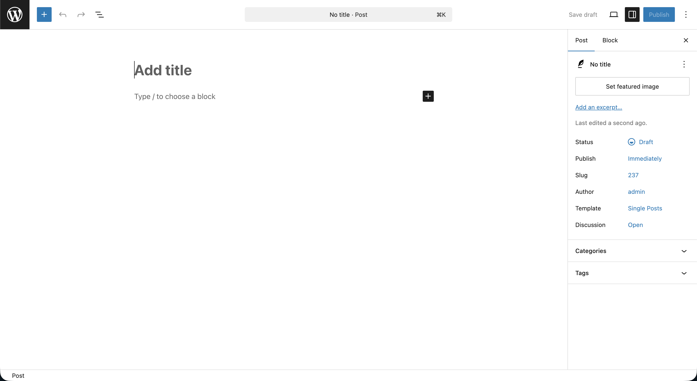
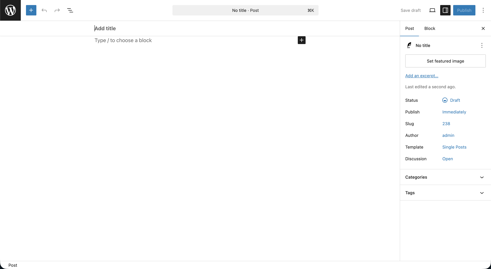
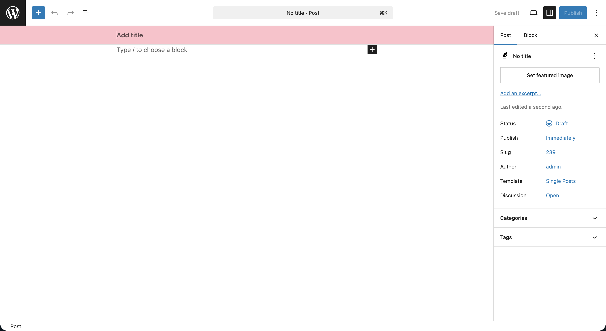

# 2. Orientation: The 10up Block Theme

If your environment is [set up as outlined in the overview](./index.md#getting-started), let's take a quick look at the 10up Block Theme scaffold and what it provides on top of a vanilla block theme.

## Learning Outcomes

1. Know what the 10up WP Scaffold adds beyond a standard block theme.
2. Be able to run the build pipeline and see the result.

## What the scaffold provides

We'll be using the [10up WP Scaffold](https://github.com/10up/wp-scaffold) as our starting point. Beyond a standard block theme, it includes:

- **10up-toolkit**: a zero-config webpack-based build pipeline that handles CSS and JS compilation, block asset detection, and hot reloading.
- **Auto-enqueue block CSS**: drop a CSS file into `assets/css/blocks/{namespace}/{block-name}.css` and it loads only when the block is present on the page.
- **Auto-register custom blocks**: create a folder with a `block.json` in `blocks/` and it's automatically registered.
- **PostCSS with globals and mixins**: custom media queries and mixins are available across all style entry points without manual imports.
- **10up WP framework integration**: uses the [10up WP Framework](https://github.com/10up/wp-framework) pattern for organized, auto-discovered PHP modules.
- **Sensible CSS architecture**: organized into base, blocks, components, globals, mixins, templates, and utilities.
- **A must use plugin**: a place to register post types, taxonomies, or other non-theme specific features.

We'll explore the CSS architecture, JS entry points, editor style scopes, and PHP module system in detail as we encounter them in later lessons. For now, the goal is to understand the high-level structure and prove the build pipeline works.

## Theme structure

```bash
cd themes/10up-block-theme
```

<details>
<summary>View tree</summary>

```bash
10up-block-theme/
├── composer.json
├── functions.php
├── package.json
├── style.css
├── theme.json
├── assets/
│   ├── css/
│   │   ├── base/
│   │   ├── blocks/
│   │   │   └── core/
│   │   ├── components/
│   │   ├── editor-canvas-style-overrides.css
│   │   ├── editor-frame-style-overrides.css
│   │   ├── frontend.css
│   │   ├── globals/
│   │   ├── mixins/
│   │   ├── templates/
│   │   └── utilities/
│   ├── js/
│   │   ├── block-extensions.js
│   │   └── frontend.js
│   └── fonts/
├── blocks/
├── parts/
│   ├── footer.html
│   ├── header.html
│   ├── site-footer-legal-navigation-area.html
│   └── site-header-navigation-area.html
├── patterns/
│   └── card.php
├── src/
│   ├── Assets.php
│   ├── Blocks.php
│   ├── TemplateTags.php
│   └── ThemeCore.php
├── styles/
│   ├── surface-primary.json
│   ├── surface-secondary.json
│   └── surface-tertiary.json
└── templates/
    ├── 404.html
    ├── index.html
    ├── single.html
    └── singular.html
```

</details>

The key directories to know right now:

| Directory | Purpose |
|-----------|---------|
| `templates/` | HTML template files (block markup) following the WordPress template hierarchy |
| `parts/` | Reusable template parts (header, footer, navigation areas) |
| `patterns/` | PHP-based block patterns |
| `theme.json` | Design tokens, settings, and layout configuration |
| `assets/css/` | CSS source files, organized by purpose |
| `assets/js/` | JS entry points for frontend and editor |
| `blocks/` | Custom block source files (auto-registered) |
| `src/` | PHP modules (auto-discovered via the 10up WP Framework) |
| `styles/` | Style variation JSON files |

We'll dig into each of these as we work with them in upcoming lessons.

## Task: Verify the build pipeline

Let's do one quick exercise to prove the build pipeline works.

The 10up Block Theme contains an opinionated modification to the block editor Post Title text input wrapper.  Typically this appears as part of the content area of the post, however this can often times feel undesirable when using Page Header or Hero type blocks that display the title as it does on the frontend.  Our theme modification makes this appear as part of the standard editor UI, providing a bit more visual clarity.


*The unmodified Post Title wrapper*


*The 10up Block Theme modified Post Title wrapper*

1. Open `assets/css/editor-canvas-style-overrides.css`.

2. Find the `background-color` declaration and change it from `#fff` to `pink`:

```css
.editor-styles-wrapper .editor-post-title {
    background-color: pink;
}
```

3. Run the build:

```bash
npm run build
```

4. Open any post in the editor. The title area should now have a pink background.



5. Revert the change back to `#fff` and rebuild.

That's it. The build pipeline compiles CSS and JS from `assets/` into `dist/`, and WordPress loads the output. We'll explore how that enqueuing works in [Lesson 5](./05-styles.md) when we dive into the CSS architecture.

## Takeaways

- The 10up scaffold provides a build pipeline, CSS architecture, PHP module system, and auto-registration for blocks and block CSS out of the box.
- We'll explore each of these systems in depth as we use them in later lessons.
