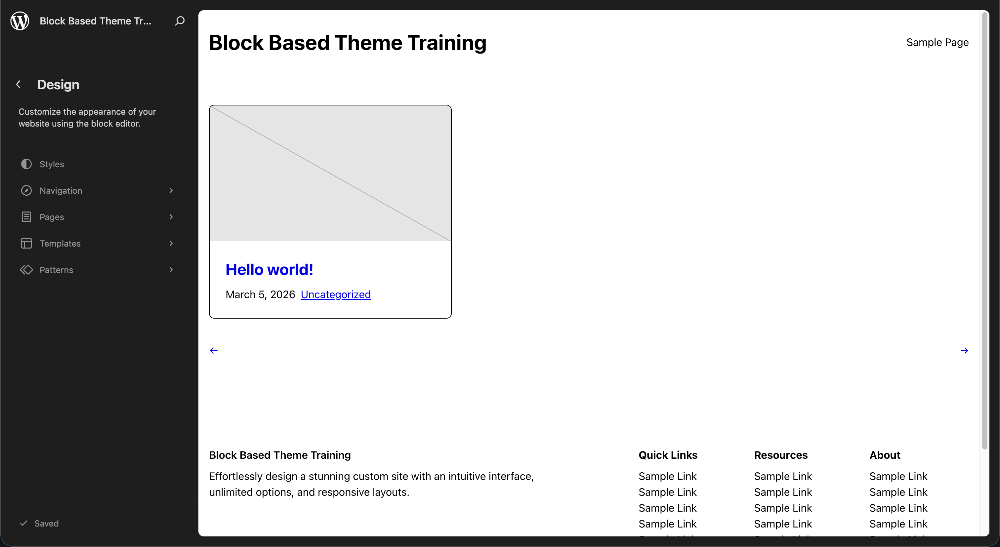
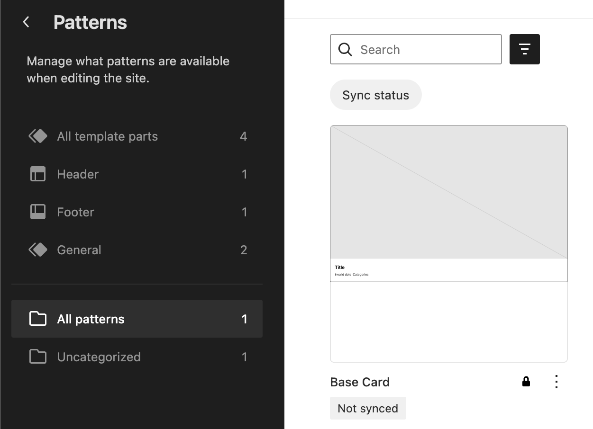
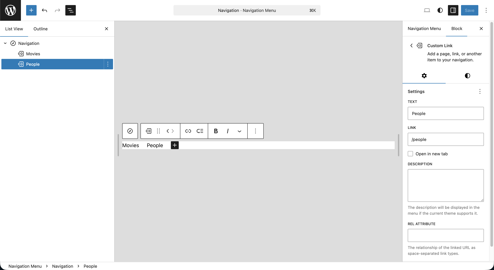
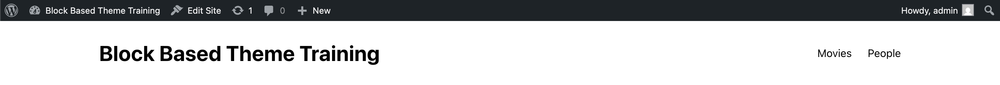
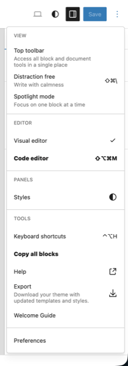
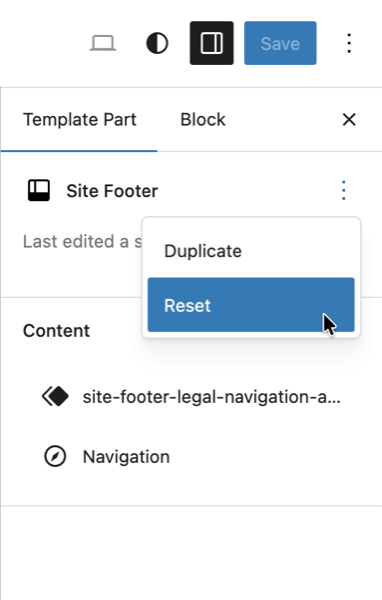
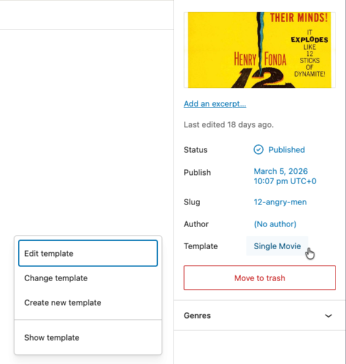
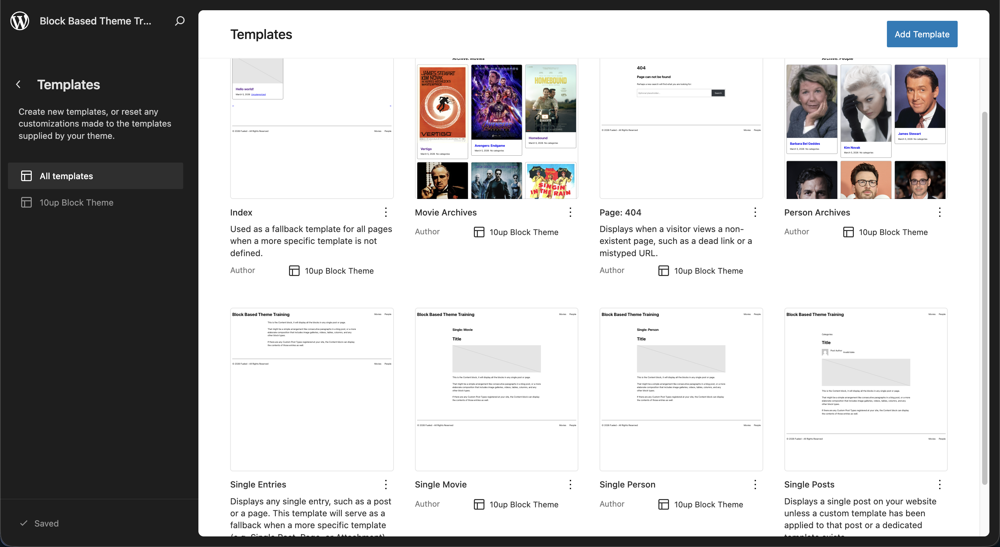
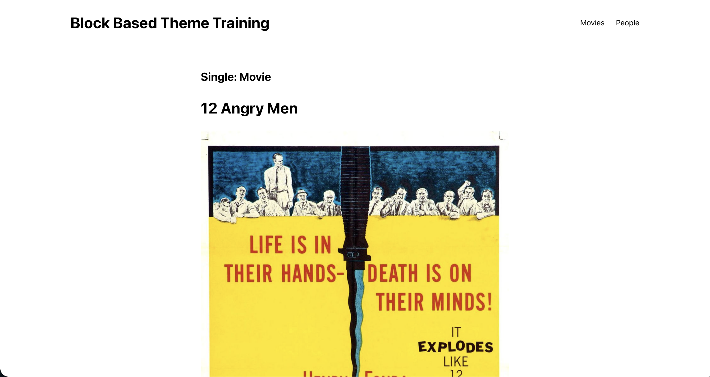

# 3. The Site Editor

This is your first truly hands-on lesson. You'll use the Site Editor to update the site's navigation and footer, then export the changes back to your theme files.

## Learning Outcomes

1. Know how to navigate the Site Editor UI: Templates, Parts, Styles, and Navigation panels.
2. Be able to edit a template part visually and export the result to the theme.
3. Understand the "Copy All Blocks" workflow for getting markup out of the editor and into `.html` files.
4. Know when to use a template vs. a template part vs. a pattern.

## Context

The `10up-block-theme` ships with a header, footer, and two navigation area parts. The header references a navigation area part, and the footer has a multi-column layout. We'll simplify both to match our movie theme.

```bash
parts/
├── footer.html
├── header.html
├── site-footer-legal-navigation-area.html
└── site-header-navigation-area.html
```

## Tasks

### 1. Tour the Site Editor

Open the Site Editor via **Appearance > Editor**.



Explore the main panels:

- **Styles** - Global Styles panel for design tokens _(colors, typography, spacing)_ as well as managing the appearance of specific blocks throughout the whole of the site
- **Navigation** - manage navigation menus
- **Pages**  - create or edit Pages
- **Templates** - lists all templates in your theme (`index.html`, `single.html`, `404.html`, etc.)
- **Patterns** - reusable sections and template parts

:::info
Note that the Site Editor lists no patterns currently even though the theme contains a `card.php` file in the `/patterns` directory.  This is due to `Inserter: false` property in the files metadata.  Set it `true` for the card to see it display it the editor and revert back to `false` when done.


:::

### 2. Edit the header navigation

1. Open the **Navigation** tab in the Site Editor sidebar.
2. Click the three dots next to **Navigation** and select **Edit**.
3. Open the Document Overview along the top left side and select the **Navigation** block.
4. You can delete the "Page List" block within and then click the plus sign in the content area to **Add block**.
5. From there choose **Add block** again and select **Custom Link**.
6. Type `/movies` and hit **Enter**.  Use the **Edit link** button to change the text to Movies.
7. Follow the same process to create a `/people` custom link.
8. Hit Save.



If you view the frontend of your site, you should see the new items in both your header and footer.


*Frontend header navigation*


*Frontend footer navigation*

### 3. Edit the footer

1. Open **Patterns > Template Parts > Footer** in the Site Editor.
2. Replace the existing footer with a different layout. You could modify or delete the Columns block entirely, change the separator style to "Dots", add additional blocks, etc.
3. Have fun playing around, Save your changes, and view the frontend to see it applied.

### 4. Export changes to theme files

Once you're happy with your changes in the Site Editor, you need to get them back into your theme's `.html` files:

From the template part in the Site Editor:

1. Click the Options dropdown (three dots) in the upper right near the Save button.
2. Choose **Copy all blocks**.
   1. Alternatively, you can open the **Code Editor** view (three dots > Code editor, or `Ctrl/Cmd + Shift + Alt + M`) and select all of the block markup and copy it. This is a nice view to be aware of when you wish to make small manual block attribute adjustments.
3. Paste this into the corresponding file in your theme at `parts/footer.html`.
4. **Reset the template part** in the Site Editor sidebar under **Settings > Template Part > Actions (three dots) > Reset**

:::tip
That last step is pretty important, this clears the database customization so the editor reads from the theme file again.
  After pasting markup into a theme file, always reset the template part in the Site Editor. Without resetting, the Site Editor continues to use the database version (your customization), not the theme file. Resetting ensures the editor and the theme file are in sync.
:::

:::info
[Create Bock Theme](https://wordpress.org/plugins/create-block-theme/) is a very handy plugin that can help to manage these steps as well.  We went with the manual approach for this training but it is worth checking out.
:::


*The Options dropdown with relevant items in bold*


*The template part Reset button*

## Templates, parts, and patterns: when to use what

| Concept | Lives in | Shared? | Use when |
| ------- | -------- | ------- | -------- |
| **Template** | `templates/` | N/A | Defining a full page layout |
| **Template part** | `parts/` | Yes, across templates | Reusable sections (header, footer) |
| **Pattern** | `patterns/` | Depends on usage | Starter content or template composition |

The key distinction: template parts always maintain a live link. When you edit a part, every template that references it gets the update.

Patterns have two modes. When an editor **inserts** a pattern into a post, the markup is copied and detached. But when a template **references** a pattern via `<!-- wp:pattern {"slug":"..."} /-->`, the pattern re-executes on every page load. We'll use patterns this way in [Lesson 9](./09-archive-templates-and-cards.md).

## Registering custom templates

When you need templates for custom post types, add them to the `customTemplates` array in `theme.json`. This is how the editor discovers them in the template picker:

```json title="theme.json (partial)"
{
    "customTemplates": [
        {
            "name": "archive-tenup-movie",
            "title": "Movie Archives",
            "postTypes": []
        },
        {
            "name": "single-tenup-movie",
            "title": "Single Movie",
            "postTypes": ["tenup-movie"]
        },
        {
            "name": "archive-tenup-person",
            "title": "Person Archives",
            "postTypes": []
        },
        {
            "name": "single-tenup-person",
            "title": "Single Person",
            "postTypes": ["tenup-person"]
        }
    ]
}
```

The `postTypes` array controls which post types show this template as a selectable option in the Editor. Both single and archive templates are resolved automatically by the WordPress template hierarchy (`single-{post-type}.html`, `archive-{post-type}.html`), so `postTypes` does not affect which template file is used. It only affects editor UI visibility. Single templates list their post type so the template appears in the editor when editing that post type. Archive templates use an empty array because archives aren't assigned to individual posts.

Go ahead and add this `customTemplates` array to your `theme.json` now. It can go at the top level, before the `settings` key.

### 5. Create placeholder templates

Now let's create the actual template files. These will be simple placeholders, just copies of the existing `index.html` and `single.html` with identifying headings so you can confirm they're loading. We'll build out their real content in later lessons.

For the **archive templates**, copy `index.html` and add a heading above the query loop:

```html title="templates/archive-tenup-movie.html"
<!-- wp:template-part {"slug":"header","tagName":"header"} /-->

<!-- wp:group {"tagName":"main","style":{"spacing":{"margin":{"top":"0","bottom":"0"},"padding":{"top":"var(--wp--preset--spacing--32-48)","bottom":"var(--wp--preset--spacing--32-48)"}}},"layout":{"type":"constrained"}} -->
<main class="wp-block-group" style="margin-top:0;margin-bottom:0;padding-top:var(--wp--preset--spacing--32-48);padding-bottom:var(--wp--preset--spacing--32-48)">

    <!-- wp:heading {"level":1} -->
    <h1 class="wp-block-heading">Archive: Movies</h1>
    <!-- /wp:heading -->

    <!-- wp:query {"queryId":0,"query":{"perPage":9,"postType":"tenup-movie","order":"desc","orderBy":"date","inherit":true},"align":"wide"} -->
    <div class="wp-block-query alignwide">

        <!-- wp:post-template {"layout":{"type":"grid","columnCount":null,"minimumColumnWidth":"21rem"}} -->

            <!-- wp:pattern {"slug":"tenup-theme/base-card"} /-->

        <!-- /wp:post-template -->

        <!-- wp:query-pagination {"paginationArrow":"arrow","align":"wide"} -->
            <!-- wp:query-pagination-previous /-->
            <!-- wp:query-pagination-next /-->
        <!-- /wp:query-pagination -->

    </div>
    <!-- /wp:query -->

</main>
<!-- /wp:group -->

<!-- wp:template-part {"slug":"footer","tagName":"footer"} /-->
```

Create `templates/archive-tenup-person.html` using the same structure, changing the heading to "Archive: People" and the `postType` to `tenup-person`.

For the **single templates**, copy `single.html` and add a heading above the post title:

```html title="templates/single-tenup-movie.html"
<!-- wp:template-part {"slug":"header","tagName":"header"} /-->

<!-- wp:group {"tagName":"main","style":{"spacing":{"margin":{"top":"0"},"padding":{"top":"var(--wp--preset--spacing--32-48)","bottom":"var(--wp--preset--spacing--32-48)"}}}} -->
<main class="wp-block-group" style="margin-top:0;padding-top:var(--wp--preset--spacing--32-48);padding-bottom:var(--wp--preset--spacing--32-48)">

    <!-- wp:group {"layout":{"type":"constrained"}} -->
    <div class="wp-block-group">

        <!-- wp:heading {"level":2} -->
        <h2 class="wp-block-heading">Single: Movie</h2>
        <!-- /wp:heading -->

        <!-- wp:post-title {"level":1} /-->
        <!-- wp:post-featured-image /-->

    </div>
    <!-- /wp:group -->

    <!-- wp:post-content {"layout":{"type":"constrained"}} /-->

</main>
<!-- /wp:group -->

<!-- wp:template-part {"slug":"footer","tagName":"footer"} /-->
```

Create `templates/single-tenup-person.html` using the same structure, changing the heading to "Single: Person".

These headings are intentionally rough. They confirm the correct template is loading for each post type. We'll replace these placeholder templates with their final versions in [Lesson 9](./09-archive-templates-and-cards.md) (archives) and [Lesson 10](./10-block-bindings.md) (singles).


*The template select button on a single Movie*


*The Templates section of the Site Editor displaying our new templates*

## Files changed in this lesson

| File | Change type | What changes |
| ---- | ----------- | ------------ |
| `theme.json` | Modified | Added `customTemplates` for movie and person single/archive templates |
| `parts/footer.html` | Modified | Replaced multi-column layout with copyright line + nav |
| `templates/archive-tenup-movie.html` | **New** | Placeholder archive template for movies |
| `templates/archive-tenup-person.html` | **New** | Placeholder archive template for people |
| `templates/single-tenup-movie.html` | **New** | Placeholder single template for movies |
| `templates/single-tenup-person.html` | **New** | Placeholder single template for people |

## Ship it checkpoint

- Navigation includes Movies and People links that resolve to `/movies/` and `/people/`
- Footer is simplified to a single copyright line with navigation
- Changes exist in `parts/*.html` files (exported from Site Editor)
- `/movies/` loads the Movie Archives template (shows "Archive: Movies" heading)
- A single movie post loads the Single Movie template (shows "Single: Movie" heading)
- Same for People


*The frontend of our site on a single Movie displaying our added template title*

## Takeaways

- The Site Editor is your visual IDE for building templates and parts. Author templates here, not by hand.
- After exporting changes to theme files, reset the template part in the Site Editor so it reads from the file again.
- Template parts maintain a live link across templates. Patterns can be either detached (inserted) or live (referenced via `<!-- wp:pattern -->`).
- Register custom templates in `theme.json` under `customTemplates` so the editor knows they exist.

## Further reading

- [Block Patterns](/reference/Patterns/overview)
- [Block Based Templates](/reference/Themes/block-based-templates)
- [Block Template Parts](/reference/Themes/block-template-parts)
