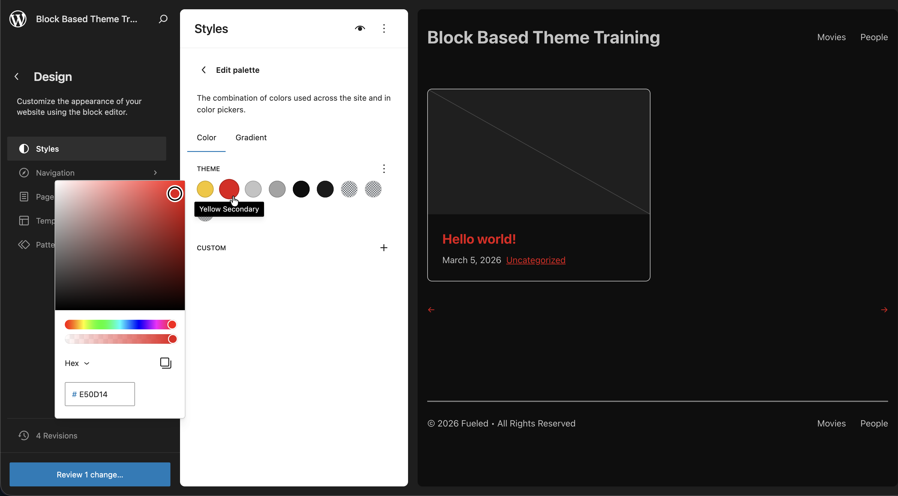

# 4. theme.json: Design Tokens and Settings

There's a misconception that block themes put all their styles in `theme.json`. This is not the case, and fighting core stylesheet specificity is a losing battle.

The rule of thumb: **`theme.json` is the source of truth for design tokens and settings. Actual styles belong in CSS files.**

## Learning Outcomes

1. Know what belongs in `theme.json` (tokens, settings, layout constraints) and what doesn't (actual CSS).
2. Understand the cascade: default → theme → user.
3. Be able to add a new color, spacing size, or typography preset and use it in a template.
4. Know how `theme.json` values become CSS custom properties.

## The cascade

WordPress resolves `theme.json` values in three layers:

1. **Default** - WordPress core ships built-in presets (default palette, default spacing, etc.)
2. **Theme** - Your `theme.json` overrides or extends the defaults
3. **User** - Changes made in the Site Editor's Global Styles panel override the theme

This means an editor can always override your theme's tokens via the Site Editor. That's by design. The theme establishes sensible defaults, and editors customize from there.

## Comparing the two themes

The `10up-block-theme` ships a minimal `theme.json`: spacing presets, layout widths, a system font stack, and some viewport-aware calculations. The color palette is intentionally empty.

The `fueled-movies` theme builds on that foundation significantly. Let's walk through what it adds.

### Color palette

```json title="theme.json (fueled-movies, partial)"
{
    "settings": {
        "color": {
            "defaultPalette": false,
            "palette": [
                {
                    "slug": "yellow",
                    "color": "var(--wp--custom--color--yellow--primary)",
                    "name": "Yellow"
                },
                {
                    "slug": "yellow-secondary",
                    "color": "var(--wp--custom--color--yellow--secondary)",
                    "name": "Yellow Secondary"
                },
                {
                    "slug": "text-primary",
                    "color": "var(--wp--custom--color--text--primary)",
                    "name": "Text Primary"
                },
                {
                    "slug": "background-primary",
                    "color": "var(--wp--custom--color--background--primary)",
                    "name": "Background Primary"
                }
            ]
        }
    }
}
```

Notice the indirection: palette colors reference `--wp--custom--*` variables rather than hardcoded hex values. This keeps the actual values in one place (the `settings.custom` block) and lets the palette entries act as aliases. Change the custom property, and every palette usage updates automatically.

Setting `defaultPalette: false` removes WordPress's built-in colors from the editor picker. This ensures editors can only use your intentional palette.

### Custom properties (`settings.custom`)

The `settings.custom` block is where you define arbitrary CSS custom properties. WordPress generates `--wp--custom--*` variables from the nested structure:

```json title="theme.json (fueled-movies, partial)"
{
    "settings": {
        "custom": {
            "color": {
                "yellow": {
                    "primary": "#F5C518",
                    "secondary": "#D8C882"
                },
                "text": {
                    "primary": "#C3C3C3",
                    "secondary": "#a3a3a3"
                },
                "background": {
                    "primary": "#0E0E0E",
                    "secondary": "#1A1A1A",
                    "nav": "#080808aa"
                }
            }
        }
    }
}
```

This generates CSS custom properties like:

- `--wp--custom--color--yellow--primary` → `#F5C518`
- `--wp--custom--color--text--primary` → `#C3C3C3`
- `--wp--custom--color--background--primary` → `#0E0E0E`

You can use these anywhere: in CSS files, in `theme.json` style declarations, or via the editor's color controls.

### Element-level styles

The `fueled-movies` theme defines default button and link styles at the element level:

```json title="theme.json (fueled-movies, partial)"
{
    "styles": {
        "elements": {
            "button": {
                "color": {
                    "background": "var(--wp--preset--color--yellow)",
                    "text": "#121212"
                },
                "border": {
                    "radius": "10px"
                },
                "shadow": "0 -2px 2px 0 rgba(0, 0, 0, 0.25) inset",
                ":hover": {
                    "color": {
                        "background": "var(--wp--preset--color--yellow-secondary)"
                    }
                }
            },
            "link": {
                "color": {
                    "text": "var(--wp--preset--color--yellow-secondary)"
                }
            }
        }
    }
}
```

These provide consistent defaults across all buttons and links in the theme. Individual blocks can still override them.

:::tip
Notice we use `--wp--preset--color--*` here, not `--wp--custom--color--*`. The difference matters:

- **`--wp--preset--color--*`** comes from the palette. When you use a preset reference in `styles`, the Site Editor knows which palette color you chose. An editor can override that color in Global Styles and the change flows through to buttons and links automatically.
- **`--wp--custom--color--*`** is a raw CSS variable. The Site Editor has no way to know it maps to a palette entry, so editor overrides in Global Styles won't affect it.

Use `--wp--preset--` references in `styles` whenever the color is in your palette. Reserve `--wp--custom--` for internal values that editors should not change, or for colors that are not exposed in the palette.
:::

:::caution
Avoid putting layout or visual styles in `theme.json` `styles` beyond element-level defaults. For anything more specific, use CSS. Core stylesheet specificity will fight you otherwise.
:::

### Spacing units

```json title="theme.json (fueled-movies, partial)"
{
    "settings": {
        "spacing": {
            "units": ["px", "em", "rem", "vh", "vw", "%"]
        }
    }
}
```

This controls which spacing units appear in the editor's dimension controls. The scaffold already includes fluid spacing presets using `clamp()`. These generate responsive values that scale between viewport widths.

### Layout width

Update `layout.wideSize` from the scaffold's default to `1219px`:

```json title="theme.json (fueled-movies, partial)"
{
    "settings": {
        "layout": {
            "wideSize": "1219px"
        }
    }
}
```

### Custom templates

We already registered the four CPT-specific `customTemplates` entries and created placeholder template files in [Lesson 3](./03-site-editor.md). No changes needed here.

## How tokens become CSS

Every preset in `theme.json` generates a CSS custom property following a naming convention:

| Setting | CSS variable pattern | Example |
|---------|---------------------|---------|
| `settings.color.palette` | `--wp--preset--color--{slug}` | `--wp--preset--color--yellow` |
| `settings.spacing.spacingSizes` | `--wp--preset--spacing--{slug}` | `--wp--preset--spacing--24` |
| `settings.typography.fontFamilies` | `--wp--preset--font-family--{slug}` | `--wp--preset--font-family--system-font` |
| `settings.custom.*` | `--wp--custom--{path}` | `--wp--custom--color--yellow--primary` |

The key difference: `preset` variables come from defined presets (palette, spacing sizes, font families). `custom` variables come from the `settings.custom` block. Both are equally usable in CSS, but presets also power the editor's UI controls (color picker, spacing controls, etc.).

## Tasks

1. **Add the `settings.custom` block** with the semantic color tokens shown above (yellow, text, background, transparent backgrounds, spacing tokens).

2. **Add the 8-color palette** referencing custom properties (set `defaultPalette: false`).

3. **Add `styles.elements.button` and `styles.elements.link`** defaults as shown above.

4. **Add `spacing.units`** array and update `layout.wideSize` to `1219px`.

5. **Verify.** No build needed: `theme.json` changes are read directly by WordPress. Refresh the editor and confirm colors appear in the picker and the site is dark.

6. **Test the cascade.** Override one of your theme's colors in the Site Editor's Global Styles panel. Refresh and verify the user override wins. Reset it and verify the theme default returns.

## Files changed in this lesson

| File | Change type | What changes |
| ---- | ----------- | ------------ |
| `theme.json` | Modified | Added: 8-color palette, `settings.custom` with semantic tokens, `styles.elements.button` and `styles.elements.link`, `spacing.units`, `layout.wideSize` 1200px to 1219px |

## Ship it checkpoint

- Site is dark with yellow accents
- Color pickers on blocks such as Heading show the custom palette with no default WordPress colors
- Buttons are yellow with inset shadow
- Updating a color in the Styles section of the Editor updates usage everywhere


*Editing the palette from the Site Editor, noting how it changes our link color*

:::warning
If you've experimented and wish to keep our training in sync with the finished product, you can use this command to copy the completed theme.json into the 10up Block Theme.  Be sure to reset any Editor changes you may have made as well.

```bash
cp themes/fueled-movies/theme.json themes/10up-block-theme/theme.json
```

:::

## Takeaways

- `theme.json` is for tokens and settings. CSS is for styles.
- Every preset generates a CSS custom property you can use anywhere.
- `settings.custom` creates `--wp--custom--*` variables for anything you need.
- The cascade is default, theme, then user. User overrides in the Site Editor win.
- Setting `defaultPalette: false` (and similar `default*: false` flags) removes core presets so only your intentional choices appear.
- Palette colors can reference custom properties for a single source of truth.

## Further reading

- [Theme.json Reference](/reference/Themes/theme-json)
- [Styles Reference](/reference/Themes/styles)
