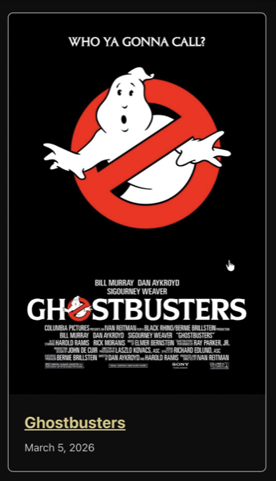
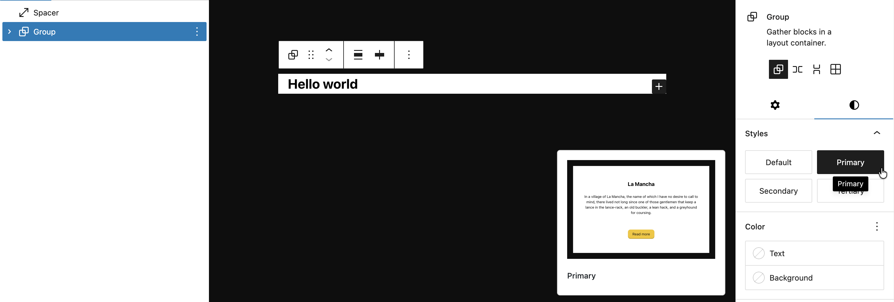
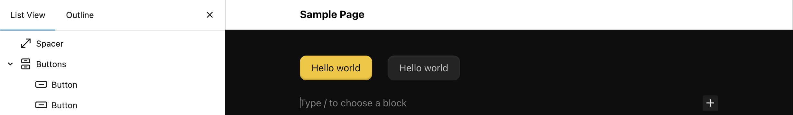
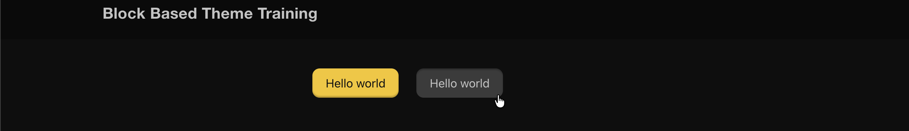

# 5. Styles: CSS Architecture and Style Variations

This lesson combines two related topics: how the scaffold organizes and code-splits CSS, and how style variations give editors controlled design choices.

## Learning Outcomes

1. Understand the autoenqueue pipeline: `assets/css/blocks/{namespace}/{block-name}.css` loads only when the block is present.
2. Know the difference between block CSS, component CSS, and base CSS.
3. Know what style variations are (`styles/{block-type}/{slug}.json`) and how they differ from JS-registered block styles.
4. Be able to create a style variation and a code-split block stylesheet.

## Part A: Copy CSS from the finished theme

Most of the CSS in this lesson is straightforward styling. Rather than writing every file from scratch, copy the CSS files from the `fueled-movies` answer-key theme and review the file table below to understand what each file does.

### The CSS architecture

The scaffold organizes CSS into purpose-specific directories:

| Directory | Loads | When to use | Example |
| --------- | ----- | ----------- | ------- |
| `blocks/core/` | Per-block (autoenqueue) | Styling a core block | `separator.css`, `post-terms.css` |
| `blocks/{namespace}/` | Per-block (autoenqueue) | Styling a third-party block | `jetpack/contact-form.css` |
| `components/` | Globally via `frontend.css` | Styles that span multiple blocks | `card.css`, `header.css` |
| `base/` | Globally via `frontend.css` | Foundational resets and layout | `reset.css`, `layout.css` |
| `utilities/` | Globally via `frontend.css` | Single-purpose utility classes | `visually-hidden.css` |
| `templates/` | Globally via `frontend.css` | Template-specific styles | `index.css` |
| `globals/` | Not output directly | PostCSS variables available everywhere | `media-queries.css` |
| `mixins/` | Not output directly | PostCSS mixins available everywhere | `visually-hidden.css` |

**Block-scoped vs global**: if a style only matters when a specific block is on the page, put it in `blocks/`. If it affects multiple blocks or the overall page, it belongs in `components/` or `base/`.

### How autoenqueue works

1. You create a CSS file at `assets/css/blocks/core/separator.css`
2. `10up-toolkit` compiles it to `dist/blocks/autoenqueue/core/separator.css` and `src/Blocks.php` registers each file with `wp_enqueue_block_style()`
3. WordPress only loads it on pages where the corresponding block is present

### Editor and frontend CSS scopes

The CSS files directly in `assets/css/` provide the main theme style entry and some editor adjustments:

| File | Scope | Loaded via | Purpose |
| ---- | ----- | ---------- | ------- |
| `frontend.css` | Frontend (and editor canvas) | `wp_enqueue_scripts` + `add_editor_style()` | Main theme styles, imports base/components/utilities/templates |
| `editor-frame-style-overrides.css` | Editor frame only | `enqueue_block_editor_assets` | Styles for the editor chrome outside the editing canvas (toolbar, sidebar) |
| `editor-canvas-style-overrides.css` | Editor canvas only | `enqueue_block_assets` (admin only) | Styles inside the canvas iframe, e.g. making the post title look like part of the editor UI |

:::tip
The editor has **two CSS scopes**. The "frame" is everything outside the editing area. The "canvas" is the iframe where blocks render. `frontend.css` is loaded in the canvas via `add_editor_style()` so blocks look the same in the editor as they do on the frontend. The frame and canvas override files are separate.
:::

### Files to copy from fueled-movies

Copy these files into your `10up-block-theme`:

- `assets/css/base/html.css` (new)
- `assets/css/base/layout.css` (modified, adds `accent-color`, `@view-transition`)
- `assets/css/base/index.css` (modified, adds `@import url("html.css")`)
- `assets/css/components/header.css`, `card.css`, `button.css` (new)
- `assets/css/components/index.css` (modified, adds imports)
- `assets/css/mixins/is-clickable-card.css` (new)
- `assets/css/blocks/core/separator.css`, `post-featured-image.css`, `post-terms.css`, `group.css` (new)
- `assets/css/utilities/layout.css` (new)
- `assets/css/utilities/visually-hidden.css` (modified, adds `.is-hidden`)
- `assets/css/utilities/index.css` (modified, adds import)
- `assets/js/is-clickable-card.js` (new)
- `assets/js/frontend.js` (modified, adds `import './is-clickable-card'`)

:::info
If you'd like to skip the manual copying and keep your theme in sync with the finished product, run this command to copy all Part A files at once:

```bash
# CSS files
cp themes/fueled-movies/assets/css/base/html.css themes/10up-block-theme/assets/css/base/html.css
cp themes/fueled-movies/assets/css/base/layout.css themes/10up-block-theme/assets/css/base/layout.css
cp themes/fueled-movies/assets/css/base/index.css themes/10up-block-theme/assets/css/base/index.css
cp themes/fueled-movies/assets/css/components/header.css themes/10up-block-theme/assets/css/components/header.css
cp themes/fueled-movies/assets/css/components/card.css themes/10up-block-theme/assets/css/components/card.css
cp themes/fueled-movies/assets/css/components/button.css themes/10up-block-theme/assets/css/components/button.css
cp themes/fueled-movies/assets/css/components/index.css themes/10up-block-theme/assets/css/components/index.css
cp themes/fueled-movies/assets/css/mixins/is-clickable-card.css themes/10up-block-theme/assets/css/mixins/is-clickable-card.css
mkdir -p themes/10up-block-theme/assets/css/blocks/core
cp themes/fueled-movies/assets/css/blocks/core/separator.css themes/10up-block-theme/assets/css/blocks/core/separator.css
cp themes/fueled-movies/assets/css/blocks/core/post-featured-image.css themes/10up-block-theme/assets/css/blocks/core/post-featured-image.css
cp themes/fueled-movies/assets/css/blocks/core/post-terms.css themes/10up-block-theme/assets/css/blocks/core/post-terms.css
cp themes/fueled-movies/assets/css/blocks/core/group.css themes/10up-block-theme/assets/css/blocks/core/group.css
cp themes/fueled-movies/assets/css/utilities/layout.css themes/10up-block-theme/assets/css/utilities/layout.css
cp themes/fueled-movies/assets/css/utilities/visually-hidden.css themes/10up-block-theme/assets/css/utilities/visually-hidden.css
cp themes/fueled-movies/assets/css/utilities/index.css themes/10up-block-theme/assets/css/utilities/index.css

# JS files
cp themes/fueled-movies/assets/js/is-clickable-card.js themes/10up-block-theme/assets/js/is-clickable-card.js
cp themes/fueled-movies/assets/js/frontend.js themes/10up-block-theme/assets/js/frontend.js
```

:::

:::info
`is-style-single-movie-backdrop` styles in `post-featured-image.css` won't be visually testable until we build the single templates in [Lesson 10](./10-block-bindings.md). The `.has-separator` styles in `group.css` won't have a toggle until [Lesson 11](./11-block-extensions.md). Both are harmless CSS that we're placing now.
:::

After copying, run `npm run build` and verify the site looks styled.  The changes are subtle at this point, you can confirm our changes worked if the build succeeds and the Separator block matches what we've added to `css/blocks/core/separator.css`.


*Notice the Separator is using our `--wp--custom--color--background--light-transparent-10` variable created in theme.json*

### Key CSS patterns

**Sticky header** (`assets/css/components/header.css`):

```css
header:where(.wp-block-template-part) {
    backdrop-filter: saturate(180%) blur(20px);
    background-color: var(--wp--custom--color--background--nav);
    inset-block-start: var(--wp-admin--admin-bar--height, 0);
    isolation: isolate;
    position: sticky;
    z-index: 1000;

    & .wp-block-site-title {
        font-family: "SF Pro Display", "SF Pro Icons", "Helvetica Neue", Helvetica, Arial, sans-serif;
        font-size: 21px;
        font-weight: 600;
        letter-spacing: 0.011em;
        line-height: 1.1428;
    }
}
```

**Genre pill styling** (`assets/css/blocks/core/post-terms.css`):

```css
.wp-block-post-terms {
    display: flex;
    flex-wrap: wrap;
    gap: var(--wp--custom--spacing--12);

    & .wp-block-post-terms__separator { display: none; }

    & [rel="tag"] {
        background: var(--wp--custom--color--background--light-transparent-10);
        border-radius: 45px;
        color: var(--wp--custom--color--text--primary);
        padding: 8px 18px;
        text-decoration: none;
        transition: background-color 0.2s ease;

        &:hover { background: var(--wp--custom--color--background--light-transparent-20); }
    }
}
```

**Has-separator dots** (`assets/css/blocks/core/group.css`):

```css
.wp-block-group.has-separator {
    gap: 0;

    & > * {
        align-items: center;
        display: flex;
    }

    & > *:not(:first-child)::before {
        background-color: currentcolor;
        block-size: 4px;
        border-radius: 999px;
        content: "";
        display: inline-flex;
        inline-size: 4px;
        margin-inline: var(--wp--custom--spacing--8);
    }
}
```

### Clickable cards

The `assets/js/is-clickable-card.js` file is an accessibility-focused pattern based on [Inclusive Components](https://inclusive-components.design/cards/#theredundantclickevent). Add the `is-clickable-card` class to the card's wrapping Group in the pattern, and the JS makes the entire card clickable by forwarding clicks to the primary link (the post title heading link). It handles text selection, scroll detection, and Ctrl/Cmd+click. Students just need to copy the files.

The heading link provides good screen reader context since it contains the post title. The `is-clickable-card` class is added via the "Additional CSS class(es)" panel in the block editor. This is fine because the card pattern is code-only (`Inserter: false`), so editors never interact with it.

:::warning
**If this were an editor-facing block, a block extension with a toggle control would be better** since classes added via the Additional CSS panel can be accidentally deleted with no way for editors to know how to restore them.
:::

Card hover CSS (`assets/css/components/card.css`) uses the mixin from `assets/css/mixins/is-clickable-card.css` to apply hover feedback. The title starts with a transparent underline and transitions to `currentcolor` on card hover (smooth underline reveal). The secondary button gets its hover state. This is why `theme.json` doesn't set `textDecoration: none` on link hover, as that would fight the CSS transition.

```css title="assets/css/components/card.css"
.is-clickable-card .wp-block-post-title {
    text-decoration: underline;
    text-decoration-color: transparent;
    transition: text-decoration-color 0.2s ease;
}

.is-clickable-card {

    @mixin is-clickable-card-hover {

        [data-is-clickable-card-primary] {
            text-decoration-color: currentcolor;
        }

        .wp-block-button [data-is-clickable-card-secondary] {
            background-color: var(--wp--custom--color--background--light-transparent-20, rgba(163, 163, 163, 0.3));
            box-shadow: 0 2px 2px 0 rgba(0, 0, 0, 0.25) inset;
        }
    }
}
```

The `@mixin is-clickable-card-hover` is defined in `assets/css/mixins/is-clickable-card.css` and encapsulates the `:has()` hover selector, excluding secondary interactive elements from triggering the card hover:

```css title="assets/css/mixins/is-clickable-card.css"
@define-mixin is-clickable-card-hover {
    &:where(:hover:not(:has([data-is-clickable-card-secondary]:hover, [data-is-clickable-card-secondary]:focus))) {
        @mixin-content;
    }
}
```

### Update the card pattern

To see the clickable card in action, update `patterns/card.php` to add the `is-clickable-card` class to the outer Group block. The post title already has `"isLink":true`, so the JS will automatically pick it up as the primary link. Replace the contents of `patterns/card.php` with:

```php title="patterns/card.php"
<?php
/**
 * Title: Base Card
 * Slug: tenup-theme/base-card
 * Description: A card pattern with a featured image, title, date, and category.
 * Inserter: false
 *
 * @package TenupBlockTheme
 */

?>

<!-- wp:group {"align":"wide","className":"is-clickable-card","style":{"spacing":{"blockGap":"0"},"border":{"radius":"8px","width":"1px"}},"layout":{"type":"flex","orientation":"vertical","justifyContent":"stretch","flexWrap":"nowrap"}} -->
<div class="wp-block-group alignwide is-clickable-card" style="border-width:1px;border-radius:8px">

	<!-- wp:post-featured-image {"aspectRatio":"16/9","width":"100%","height":"","style":{"border":{"radius":{"topRight":"8px","bottomRight":"0px","topLeft":"8px","bottomLeft":"0px"}}},"displayFallback":true} /-->

	<!-- wp:group {"align":"wide","className":"is-style-default","style":{"spacing":{"padding":{"top":"var(--wp--preset--spacing--24)","right":"var(--wp--preset--spacing--24)","bottom":"var(--wp--preset--spacing--24)","left":"var(--wp--preset--spacing--24)"},"blockGap":"var:preset|spacing|8"},"layout":{"selfStretch":"fit"},"border":{"width":"0px","style":"none","radius":{"topLeft":"0px","topRight":"0px","bottomLeft":"8px","bottomRight":"8px"}}},"layout":{"type":"flex","orientation":"vertical","verticalAlignment":"space-between"}} -->
	<div class="wp-block-group alignwide is-style-default" style="border-style:none;border-width:0px;border-top-left-radius:0px;border-top-right-radius:0px;border-bottom-left-radius:8px;border-bottom-right-radius:8px;padding-top:var(--wp--preset--spacing--24);padding-right:var(--wp--preset--spacing--24);padding-bottom:var(--wp--preset--spacing--24);padding-left:var(--wp--preset--spacing--24)">

		<!-- wp:post-title {"isLink":true,"align":"wide","style":{"spacing":{"margin":{"top":"0","right":"0","bottom":"0","left":"0"}}}} /-->

		<!-- wp:group {"style":{"spacing":{"blockGap":"var:preset|spacing|8"}},"layout":{"type":"flex","flexWrap":"nowrap"}} -->
		<div class="wp-block-group">

			<!-- wp:post-date /-->
			<!-- wp:post-terms {"term":"category"} /-->

		</div>
		<!-- /wp:group -->

	</div>
	<!-- /wp:group -->

</div>
<!-- /wp:group -->
```

The only change from the previous version is `"className":"is-clickable-card"` on the outer Group block (and the matching `is-clickable-card` in the rendered `class` attribute). After rebuilding, hovering over a card on the frontend should reveal the title underline and the entire card surface should be clickable.


*Hovering over any part of the card should show the cursor as `pointer` and underline the title*

## Part B: Style variations

### What are style variations?

Style variations are JSON files in the `styles/` directory that give editors selectable design options in the block inspector's Styles panel. They use the `theme.json` schema and can target the full range of design tokens: colors, spacing, borders, shadows, and nested elements.

### Explore an existing style variation

The scaffold already ships three "surface" style variations for the Group block in the `styles/` directory. Open `styles/surface-primary.json` and notice it has an empty `color` object:

```json title="styles/surface-primary.json (before)"
{
	"$schema": "https://schemas.wp.org/wp/6.7/theme.json",
	"version": 3,
	"title": "Primary",
	"slug": "primary",
	"blockTypes": [
		"core/group"
	],
	"styles": {
		"color": {}
	}
}
```

Update the `color` object to set a background and text color:

```json title="styles/surface-primary.json (after)"
{
	"$schema": "https://schemas.wp.org/wp/6.7/theme.json",
	"version": 3,
	"title": "Primary",
	"slug": "primary",
	"blockTypes": [
		"core/group"
	],
	"styles": {
		"color": {
			"background": "var(--wp--preset--color--white)",
			"text": "var(--wp--preset--color--black)"
		}
	}
}
```

To see it in action, add a Group block in the editor with the "Primary" style applied:

```html
<!-- wp:group {"className":"is-style-primary","layout":{"type":"constrained"}} -->
<div class="wp-block-group is-style-primary"><!-- wp:heading -->
<h2 class="wp-block-heading">Hello world</h2>
<!-- /wp:heading --></div>
<!-- /wp:group -->
```

You should see the Group get a white background with black text. You can also select the Group block and pick the "Primary" style from the Styles panel in the block inspector. Delete the test block when you're done.


*The Group block with our Primary style applied. Notice the Style preview also will display our changes*

### Hands-on: create style variations

Now that you've seen how a style variation works, we'll delete the scaffold surface variations and create a targeted one for the Button block.

1. **Delete** `styles/surface-primary.json`, `styles/surface-secondary.json`, and `styles/surface-tertiary.json`.

2. **Create `styles/button/secondary.json`**: transparent background, primary text, inset shadow:

:::info
Directories under `styles/` are for your own organization only. They do not target blocks. The `"blockTypes"` property in each JSON file is what connects a style to a specific block (here, `"core/button"`).

You can put a file in `styles/button/`, `styles/core/`, or jusr `styles/` directly, WordPress treats them identically. Slugs, however, must be unique across all files regardless of directory.
:::

```json title="styles/button/secondary.json"
{
    "$schema": "https://schemas.wp.org/wp/6.9/theme.json",
    "version": 3,
    "title": "Secondary",
    "slug": "secondary",
    "blockTypes": ["core/button"],
    "styles": {
        "color": {
            "background": "var(--wp--custom--color--background--light-transparent-10, rgba(163, 163, 163, 0.15))",
            "text": "var(--wp--custom--color--text--primary)"
        },
        "shadow": "0 1px 2px 0 rgba(255, 255, 255, 0.08) inset"
    }
}
```

Notice we only define the static styles (color, shadow) here. The hover and focus states are handled in CSS -- we'll explain why below.

3. **Add hover/focus styles in CSS**. Add the following to `assets/css/components/button.css`:

```css title="assets/css/components/button.css (addition)"
.is-style-secondary .wp-element-button {

    &:hover,
    &:focus {
        background-color: var(--wp--custom--color--background--light-transparent-20, rgba(163, 163, 163, 0.3));
        box-shadow: 0 2px 2px 0 rgba(0, 0, 0, 0.25) inset;
    }
}
```

4. **Rebuild and verify**: "Secondary" style appears for Button blocks in the editor and frontend.




### Why hover/focus lives in CSS, not the variation JSON

You might wonder why we didn't put `:hover` and `:focus` in the variation JSON. Button style variations have a known specificity problem: the default button `:hover`/`:focus` styles from `theme.json` generate CSS with the same specificity as the variation's pseudo-state styles, and the defaults load last, so they always win. This is tracked in [gutenberg#64856](https://github.com/WordPress/gutenberg/issues/64856).

The fix is straightforward: keep static styles (color, shadow) in the variation JSON where they work reliably, and handle pseudo-states in CSS where you control specificity.

:::info
We're using a Button style variation here specifically to show you this limitation. In practice, you could just as easily register a block style (_and arguably, **should**_) with `registerBlockStyle()` in JS and lean entirely on CSS instead of writing json in the `styles/` directory. Both approaches produce the same `is-style-{slug}` class on the block.
:::

### Style variations vs JS block styles

Both show up in the editor's Styles panel, but they work very differently:

| Feature | Style variations (JSON) | Block styles (JS) |
| ------- | ---------------------- | ----------------- |
| Format | JSON file in `styles/` | `registerBlockStyle()` in JS |
| What it does | Applies `theme.json`-style design tokens | Adds a CSS class name |
| Can target nested elements | Yes (`elements.button`, `elements.link`) | No |
| Can set spacing, borders, shadows | Yes | No, only via the added class in CSS |
| Registration | Automatic from file system | Manual via JS |

## Files changed in this lesson

| File | Change type | What changes |
| ---- | ----------- | ------------ |
| `assets/css/base/html.css` | **New** | `a, button { transition: all 0.2s ease-in-out; }` |
| `assets/css/base/layout.css` | Modified | Added `accent-color` on `html`; added `@view-transition { navigation: auto; }` |
| `assets/css/base/index.css` | Modified | Added `@import url("html.css")` |
| `assets/css/components/header.css` | **New** | Sticky header with `backdrop-filter`, nav background, z-index, site-title font styling |
| `assets/css/components/card.css` | **New** | Full-height groups, cursor utilities, clickable card hover styles via mixin |
| `assets/css/mixins/is-clickable-card.css` | **New** | Encapsulates `:has()` hover selector excluding secondary interactive elements |
| `assets/js/is-clickable-card.js` | **New** | JS-based clickable card utility, forwards clicks to primary heading link |
| `assets/css/components/button.css` | **New** | `.wp-element-button` flex alignment with gap, pointer cursor; `.is-style-secondary` hover/focus states |
| `assets/css/components/index.css` | Modified | Added imports: `./header.css`, `./card.css`, `./button.css` |
| `assets/css/blocks/core/separator.css` | **New** | Custom border-color using transparent token, 1px top border |
| `assets/css/blocks/core/post-featured-image.css` | **New** | `flex-shrink: 0`; `.is-style-single-movie-backdrop` blurred backdrop effect |
| `assets/css/blocks/core/post-terms.css` | **New** | Genre pill styling with transparent background, rounded borders |
| `assets/css/blocks/core/group.css` | **New** | `.has-separator` dot pseudo-elements between children |
| `assets/css/utilities/layout.css` | **New** | `.flex-shrink-0 { flex-shrink: 0; }` |
| `assets/css/utilities/visually-hidden.css` | Modified | Added `.is-hidden { display: none; }` |
| `assets/css/utilities/index.css` | Modified | Added `@import url("layout.css")` |
| `styles/surface-primary.json` | **Removed** | Replaced by targeted per-block variations |
| `styles/surface-secondary.json` | **Removed** | Replaced by targeted per-block variations |
| `styles/surface-tertiary.json` | **Removed** | Replaced by targeted per-block variations |
| `styles/button/secondary.json` | **New** | Secondary button: transparent bg, primary text, inset shadow |

## Ship it checkpoint

- Sticky header with backdrop blur
- Card overlay links work (entire card is clickable)
- Separator CSS only loads on pages with separators (verify in DevTools)
- "Secondary" style appears for Button blocks in the editor

## Takeaways

- Block-scoped CSS loads per-block via `assets/css/blocks/`. Component CSS loads globally via `frontend.css`. Choose intentionally.
- WordPress inlines small stylesheets as critical CSS. Block-scoped CSS benefits from this automatically.
- Style variations are JSON files that give editors controlled styling choices. They support the full `theme.json` styles schema.
- Button variations need to target `elements.button`, not the wrapper.
- Clickable cards use JS-based progressive enhancement for accessibility. The heading link is the primary link (good screen reader context), and the entire card surface is clickable.

## Further reading

- [Anatomy of a block based theme](./01-overview.md) (section on writing CSS for individual blocks)
- [Styles Reference](/reference/Themes/styles)
- [Block Styles](/reference/Blocks/block-styles)
