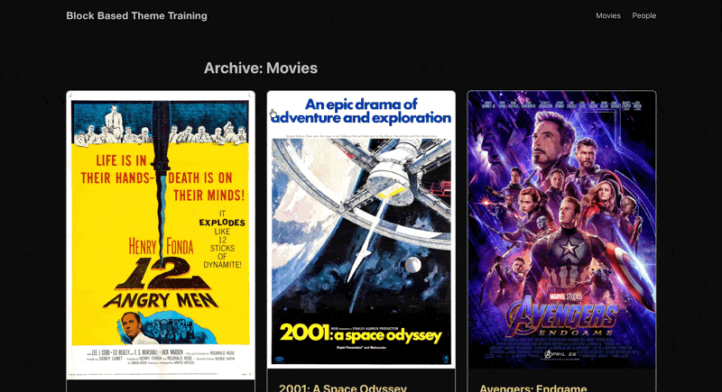

# 6. Render Filters and Block Styles

This is the first time you'll write PHP in the theme. You'll use the `render_block` filter to enhance block output on the frontend and unregister unwanted core block styles in JavaScript.

## Learning Outcomes

1. Know how to use the `render_block` filter and `WP_HTML_Tag_Processor` to modify block output.
2. Understand the PHP module system (`ModuleInterface`, `Module` trait) used in the scaffold.
3. Be able to unregister core block styles using `unregisterBlockStyle()`.

## Context

The scaffold's `src/Blocks.php` already handles block registration and CSS autoenqueuing. We'll add two render filter methods to this module, and create a new JS file to clean up the editor's block style options.

## Part A: PHP render filters

Walk through these step by step. This introduces the `render_block` filter pattern and `WP_HTML_Tag_Processor`.

### The PHP module pattern

Before writing code, let's understand how the scaffold's PHP modules work. Every module in `src/` implements `ModuleInterface` with three methods:

```php
interface ModuleInterface {
    public function can_register(): bool;  // Should this module load?
    public function register();            // Hook in
    public function load_order(): int;     // Priority (lower = earlier)
}
```

The framework auto-discovers all classes in `src/` that implement this interface. You just drop in a class and it registers itself, no manual wiring needed.

<details>
<summary>Not using the 10up scaffold? Here's the vanilla equivalent.</summary>

The `Module` pattern is a thin layer over standard WordPress hooks. A class that calls `add_filter()` inside `register()` is equivalent to wiring the same filter up directly in `functions.php` or a plugin file:

```php
// Vanilla equivalent of a Module class.
add_action( 'init', function () {
    add_filter( 'render_block_core/post-featured-image', 'filter_featured_image_block', 10, 3 );
} );

function filter_featured_image_block( $block_content, $block, $instance ) {
    // Same body shown below.
}
```

The scaffold's `can_register()` / `register()` / `load_order()` methods give you a consistent place to put this wiring and let the framework call it at the right time. If you're working without the scaffold, drop the class wrapper and call `add_action` / `add_filter` directly.

</details>

`src/Blocks.php` already exists and hooks into `init`. We'll add two new methods and register them with the `render_block` filter.

### 1. Add view-transition-name to featured images

Add a `filter_featured_image_block()` method to the bottom of `src/Blocks.php`, just above the closing `}` of the class. It injects a `view-transition-name` style on `core/post-featured-image` blocks using `WP_HTML_Tag_Processor`:

```php title="src/Blocks.php (new method)"
public function filter_featured_image_block( $block_content, $block, $instance ) {

    if ( empty( $instance->context['postId'] ) ) {
        return $block_content;
    }

    $featured_image_id = get_post_thumbnail_id( $instance->context['postId'] );

    $p = new WP_HTML_Tag_Processor( $block_content );

    if ( ! $p->next_tag() ) {
        return $block_content;
    }

    if ( $p->has_class( 'is-style-single-movie-backdrop' ) ) {
        return $block_content;
    }

    $style_attribute       = $p->get_attribute( 'style' );
    $view_transition_style = "view-transition-name: post-featured-image-id-{$featured_image_id};";

    if ( false === strpos( $style_attribute, $view_transition_style ) ) {
        $style_attribute = $view_transition_style . $style_attribute;
    }

    $p->set_attribute( 'style', $style_attribute );

    return $p->get_updated_html();
}
```

`WP_HTML_Tag_Processor` is WordPress's safe way to modify HTML. It parses the block's output, lets you read/modify attributes, and generates the updated HTML. It avoids the fragility of string manipulation or regex on HTML.

Note the two guards up top: we bail out if there's no post to read a thumbnail from, and if the block has no HTML tag to modify. Skipping these means the rest of the function can error on empty or malformed block output.

### 2. Add flex-shrink-0 to fixed-width blocks

Add a `maybe_add_flex_shrink()` method beneath the method you just added. This is a workaround for a Gutenberg issue [#53766](https://github.com/WordPress/gutenberg/issues/53766) where blocks with `selfStretch: "fixed"` don't get `flex-shrink: 0`:

```php title="src/Blocks.php (new method)"
public function maybe_add_flex_shrink( $block_content, $block, $instance ) {

    if ( isset( $block['attrs']['style']['layout']['selfStretch'] ) && 'fixed' === $block['attrs']['style']['layout']['selfStretch'] ) {
        $tags = new WP_HTML_Tag_Processor( $block_content );

        if ( ! $tags->next_tag() ) {
            return $block_content;
        }

        $tags->add_class( 'flex-shrink-0' );
        $block_content = $tags->get_updated_html();
    }

    return $block_content;
}
```

### 3. Replace href-less button anchors with spans

Our card pattern (which becomes a custom block in [Lesson 9](./09-archive-templates-and-cards.md)) renders decorative "Trailer" and "View More" buttons with no `href`. The card title already carries the real link (`isLink: true`), which gives screen readers the actual post title for context rather than a generic button label. Leaving the decorative buttons as real anchors causes two problems:

1. **Duplicate link noise**: a second `<a>` to the same destination shows up in the tab order and in the screen reader's links list, with no clearer label than the title link already provides.
2. **Click capture**: when the entire card is made clickable (see [Lesson 5](./05-styles.md#clickable-cards)), an inner `<a>` swallows the click before it can bubble up to trigger the card-level navigation.

The fix is a `render_block_core/button` filter that swaps the `<a>` for a `<span>` whenever no `href` is present. Add `neutralize_empty_button_link()` to `src/Blocks.php`:

```php title="src/Blocks.php (new method)"
public function neutralize_empty_button_link( $block_content ) {

    if ( ! str_contains( $block_content, '<a' ) ) {
        return $block_content;
    }

    return preg_replace_callback(
        '#<a\b([^>]*)>(.*?)</a>#is',
        function ( $matches ) {
            if ( preg_match( '/\bhref\s*=/i', $matches[1] ) ) {
                return $matches[0];
            }
            return '<span' . $matches[1] . '>' . $matches[2] . '</span>';
        },
        $block_content
    );
}
```

Why regex here instead of `WP_HTML_Tag_Processor` like the other filters? The tag processor can read and write attributes but cannot rename a tag from `<a>` to `<span>`. Regex is the practical choice for this narrow case, scoped to the `core/button` render output where the markup shape is predictable.

Register all three filters inside the `register()` method of `Blocks.php`, after the existing `add_action` lines:

```php
add_filter( 'render_block_core/post-featured-image', [ $this, 'filter_featured_image_block' ], 10, 3 );
add_filter( 'render_block_core/button', [ $this, 'neutralize_empty_button_link' ], 10, 1 );
add_filter( 'render_block', [ $this, 'maybe_add_flex_shrink' ], 10, 3 );
```

:::tip
The `render_block_{block-name}` filter targets a specific block type. The generic `render_block` filter runs for every block. Use the specific filter when you can to avoid unnecessary processing.
:::

## Part B: Unregistering block styles

The editor ships with default block styles (fill/outline for buttons, dots/wide for separators, etc.) that we don't need. We'll remove them to keep the editor clean.

### 1. Create `assets/js/block-styles/index.js`

```js title="assets/js/block-styles/index.js"
import { unregisterBlockStyle } from '@wordpress/blocks';
import domReady from '@wordpress/dom-ready';

domReady(() => {
    unregisterBlockStyle('core/button', 'fill');
    unregisterBlockStyle('core/button', 'outline');
    unregisterBlockStyle('core/quote', 'default');
    unregisterBlockStyle('core/quote', 'plain');
    unregisterBlockStyle('core/quote', 'large');
    unregisterBlockStyle('core/table', 'regular');
    unregisterBlockStyle('core/table', 'stripes');
    unregisterBlockStyle('core/image', 'default');
    unregisterBlockStyle('core/image', 'rounded');
    unregisterBlockStyle('core/separator', 'default');
    unregisterBlockStyle('core/separator', 'wide');
    unregisterBlockStyle('core/separator', 'dots');
    unregisterBlockStyle('core/site-logo', 'default');
    unregisterBlockStyle('core/site-logo', 'rounded');
});
```

`domReady` ensures the block styles are registered before we try to unregister them. Without it, the unregister calls might fire too early.

We could similarly use `registerBlockStyle()` here as mentioned in the [previous lesson](./05-styles.md) _(This is not necessary for our training)_.

```js
import { registerBlockStyle, unregisterBlockStyle } from '@wordpress/blocks';
import domReady from '@wordpress/dom-ready';

domReady(() => {
	unregisterBlockStyle('core/button', 'fill');
	unregisterBlockStyle('core/button', 'outline');

	registerBlockStyle('core/button', {
		name: 'primary',
		label: 'Primary',
		isDefault: true,
	});

	registerBlockStyle('core/button', {
		name: 'secondary',
		label: 'Secondary',
	});
});
```

### 2. Import from the editor entry point

Add the import to `assets/js/block-extensions.js`:

```js
import './block-styles';
```

This is the editor-only JS entry point. It's loaded via `enqueue_block_editor_assets` in `src/Assets.php`.

### 3. Rebuild and verify

Run `npm run build`. Open the editor, select a Button block, and confirm the "Fill" and "Outline" styles are gone from the Styles panel.


:::info
To sync our theme with the finished product, run these commands and then add `import './block-styles';` to `assets/js/block-extensions.js`:

```bash
cp themes/fueled-movies/src/Blocks.php themes/10up-block-theme/src/Blocks.php
mkdir -p themes/10up-block-theme/assets/js/block-styles
cp themes/fueled-movies/assets/js/block-styles/index.js themes/10up-block-theme/assets/js/block-styles/index.js
```

:::

## Files changed in this lesson

| File | Change type | What changes |
| ---- | ----------- | ------------ |
| `src/Blocks.php` | Modified | Added `filter_featured_image_block()` for view-transition-name; added `neutralize_empty_button_link()` to swap href-less button anchors for spans; added `maybe_add_flex_shrink()` for fixed-width blocks |
| `assets/js/block-styles/index.js` | **New** | `unregisterBlockStyle()` calls for button, quote, table, image, separator, site-logo |
| `assets/js/block-extensions.js` | Modified | Added `import './block-styles'` |

## Ship it checkpoint

- View transition names visible on featured images in DevTools
- `flex-shrink-0` class applied to fixed-width blocks
- Decorative card buttons (Trailer, View More) render as `<span>` rather than `<a>` on the frontend
- Core block styles (fill, outline, etc.) are removed from the inspector


*Our Featured Image view-transitions in action*

## Takeaways

- The `render_block` filter lets you modify any block's HTML output on the frontend.
- `WP_HTML_Tag_Processor` is the safe way to modify block HTML attributes. Avoid string manipulation where possible. Regex is the fallback when you need to rewrite the tag itself.
- Use `render_block_{block-name}` for targeted filters, `render_block` for broad ones.
- `unregisterBlockStyle()` + `domReady()` removes unwanted core block styles from the editor.
- The editor-only JS entry point (`block-extensions.js`) is where editor customizations live.

## Further reading

- [Block Extensions](/reference/Blocks/block-extensions)
- [WP_HTML_Tag_Processor (WordPress Developer Resources)](https://developer.wordpress.org/reference/classes/wp_html_tag_processor/)
