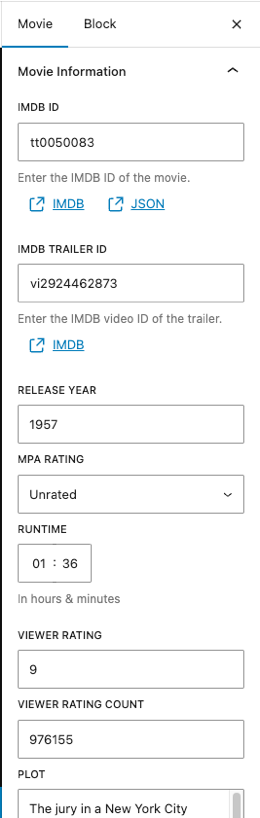
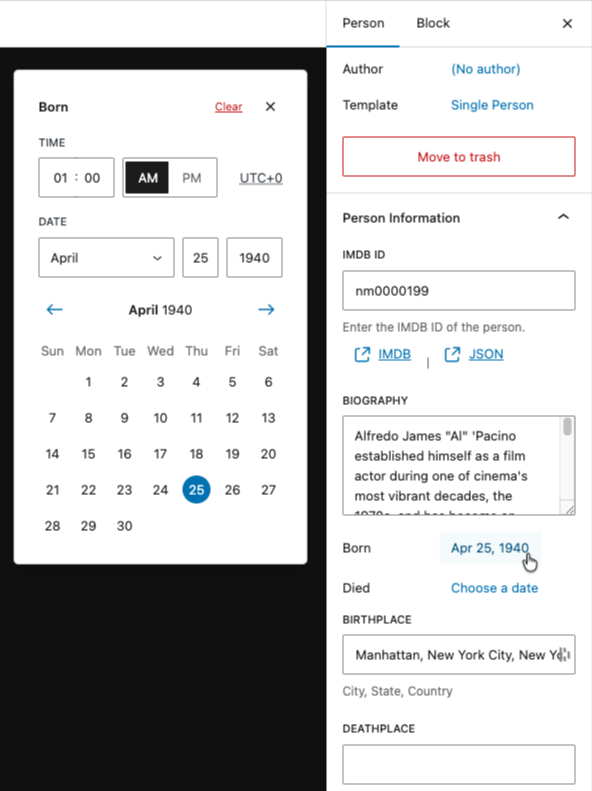

# 8. Editor Controls for Post Meta

In the [previous lesson](./07-content-model.md) we explored how meta fields are defined in the MU plugin. Now we need to build the editor UI so content editors can actually fill them in. WordPress no longer needs custom metaboxes, the block editor's SlotFill system lets us inject panels directly into the document sidebar.

## Learning Outcomes

1. Know how to build editor UI for meta fields using `PluginDocumentSettingPanel`.
2. Be able to add a control that reads and writes post meta via `useEntityProp`.
3. Understand how to scope a sidebar panel to a specific post type.

:::info
There are a lot of new additions in this lesson.  To sync your theme with the finished product, run these commands and then add `import './block-plugins';` to `assets/js/block-extensions.js`.

Run `npm run build` when you are complete.

```bash
mkdir -p themes/10up-block-theme/assets/js/block-plugins
cp themes/fueled-movies/assets/js/block-plugins/index.js themes/10up-block-theme/assets/js/block-plugins/index.js
cp themes/fueled-movies/assets/js/block-plugins/movie-meta-fields.js themes/10up-block-theme/assets/js/block-plugins/movie-meta-fields.js
cp themes/fueled-movies/assets/js/block-plugins/person-meta-fields.js themes/10up-block-theme/assets/js/block-plugins/person-meta-fields.js
mkdir -p themes/10up-block-theme/assets/js/block-components/PostMeta
cp themes/fueled-movies/assets/js/block-components/DateTimePopover.js themes/10up-block-theme/assets/js/block-components/DateTimePopover.js
cp themes/fueled-movies/assets/js/block-components/PostMeta/*.js themes/10up-block-theme/assets/js/block-components/PostMeta/
```

:::

## Architecture

The `fueled-movies` theme registers two sidebar panels - one for Movie fields, one for Person fields - using WordPress's plugin registration system. Each panel renders reusable components from `assets/js/block-components/PostMeta/`.

```
assets/js/
├── block-plugins/
│   ├── index.js                    ← aggregator
│   ├── movie-meta-fields.js        ← Movie sidebar panel
│   └── person-meta-fields.js       ← Person sidebar panel
├── block-components/
│   └── PostMeta/
│       ├── MovieIMDBID.js           ← IMDB ID text field
│       ├── MovieMPARating.js        ← MPA Rating dropdown
│       ├── MoviePlot.js             ← Plot textarea
│       ├── MovieReleaseYear.js      ← Release year
│       ├── MovieRuntime.js          ← Runtime hours/minutes
│       ├── MovieViewerRating.js     ← Viewer rating display
│       ├── MovieViewerRatingCount.js
│       ├── MovieTrailerID.js        ← IMDB Trailer ID
│       ├── PersonBiography.js       ← Biography textarea
│       ├── PersonBirthplace.js      ← Birthplace text field
│       ├── PersonBorn.js            ← Birth date picker
│       ├── PersonDeathplace.js
│       ├── PersonDied.js            ← Death date picker
│       └── PersonIMDBID.js
```

These files are loaded via `block-extensions.js` (the editor-only entry point), which imports `./block-plugins`.

## The sidebar panel

Here's the complete Movie sidebar panel:

```js title="assets/js/block-plugins/movie-meta-fields.js"
import { Flex } from '@wordpress/components';
import { PluginDocumentSettingPanel } from '@wordpress/editor';
import { __ } from '@wordpress/i18n';
import { registerPlugin } from '@wordpress/plugins';
import { usePost } from '@10up/block-components';

import MovieIMDBID from '../block-components/PostMeta/MovieIMDBID';
import MoviePlot from '../block-components/PostMeta/MoviePlot';
import MovieMPARating from '../block-components/PostMeta/MovieMPARating';
import MovieReleaseYear from '../block-components/PostMeta/MovieReleaseYear';
import MovieRuntime from '../block-components/PostMeta/MovieRuntime';
import MovieViewerRating from '../block-components/PostMeta/MovieViewerRating';
import MovieViewerRatingCount from '../block-components/PostMeta/MovieViewerRatingCount';
import MovieTrailerID from '../block-components/PostMeta/MovieTrailerID';

const MovieFields = () => {
    const { postType } = usePost();

    if (postType !== 'tenup-movie') {
        return null;
    }

    return (
        <PluginDocumentSettingPanel
            name="tenup-movie-fields"
            title={__('Movie Information', 'tenup-block-theme')}
        >
            <Flex direction="column">
                <MovieIMDBID />
                <MovieTrailerID />
                <MovieReleaseYear />
                <MovieMPARating />
                <MovieRuntime />
                <MovieViewerRating />
                <MovieViewerRatingCount />
                <MoviePlot />
            </Flex>
        </PluginDocumentSettingPanel>
    );
};

registerPlugin('tenup-movie-fields', {
    render: MovieFields,
});
```

Key patterns:

1. **Post type scoping** - `usePost()` from `@10up/block-components` gives us the current post type. Return `null` if it doesn't match, the panel simply won't render.
2. **`PluginDocumentSettingPanel`** - This is the SlotFill that injects a panel into the document sidebar. The `name` must be unique, and `title` is displayed as the panel header.
3. **`registerPlugin`** - Registers the component as a plugin with the block editor. This is how WordPress knows to render it.
4. **One component per field** - Each meta field has its own component, keeping things modular and testable.


*Our Movie Information meta panel*

## Meta field components

Each component follows a consistent pattern using `PostMeta` from `@10up/block-components`. Here's the MPA Rating dropdown:

```js title="assets/js/block-components/PostMeta/MovieMPARating.js"
import { __ } from '@wordpress/i18n';
import { SelectControl } from '@wordpress/components';
import { PostMeta } from '@10up/block-components';

const MovieMPARating = ({ postMetaProps, ...restProps }) => {
    const options = Object.entries(TenupMovieMPARating.options).map(([key, value]) => ({
        label: value,
        value: key,
    }));

    return (
        <PostMeta metaKey="tenup_movie_mpa_rating" {...postMetaProps}>
            {(meta, setMeta) => (
                <SelectControl
                    label={__('MPA Rating', 'tenup-block-theme')}
                    value={meta}
                    options={options}
                    onChange={(value) => setMeta(value)}
                    __next40pxDefaultSize
                    __nextHasNoMarginBottom
                    {...restProps}
                />
            )}
        </PostMeta>
    );
};
```

The `PostMeta` component from `@10up/block-components` wraps `useEntityProp` and provides the current meta value and a setter function as render props.

If you're not using `@10up/block-components` _(but why wouldn't you?_ 😉 _)_, the equivalent vanilla pattern is:

```js
import { useEntityProp } from '@wordpress/core-data';
import { useSelect } from '@wordpress/data';

const MyMetaField = () => {
    const postType = useSelect((select) => select('core/editor').getCurrentPostType());
    const [meta, setMeta] = useEntityProp('postType', postType, 'meta');
    const value = meta?.tenup_movie_tagline ?? '';
    const onChange = (newValue) => setMeta({ ...meta, tenup_movie_tagline: newValue });

    return (
        <TextControl
            label="Tagline"
            value={value}
            onChange={onChange}
        />
    );
};
```

### Complex meta: MovieRuntime

The runtime field demonstrates a more complex component - it stores an object with `hours` and `minutes` properties:

```js title="assets/js/block-components/PostMeta/MovieRuntime.js"
import { __ } from '@wordpress/i18n';
import { BaseControl, TimePicker } from '@wordpress/components';
import { PostMeta } from '@10up/block-components';

const MovieRuntime = ({ postMetaProps, ...restProps }) => {
    return (
        <PostMeta metaKey="tenup_movie_runtime" {...postMetaProps}>
            {(meta, setMeta) => (
                <BaseControl
                    id="tenup-movie-runtime"
                    label={__('Runtime', 'tenup-block-theme')}
                    help={__('In hours & minutes', 'tenup-block-theme')}
                >
                    <TimePicker.TimeInput
                        onChange={(value) => {
                            setMeta({
                                hours: String(value.hours),
                                minutes: String(value.minutes),
                            });
                        }}
                        value={meta}
                        {...restProps}
                    />
                </BaseControl>
            )}
        </PostMeta>
    );
};
```

Because the PHP `MovieRuntime` field is registered as type `object` with `hours` and `minutes` properties, the `setMeta` call passes a matching object shape.

### Reusable components: DateTimePopover

The Person post type has `born` and `died` date fields. Rather than building a date picker from scratch, we reference existing Gutenberg editor UI and recreate a similar experience.

Look at how WordPress renders the post publishing date in the document sidebar. It uses a [PostPanelRow](https://github.com/WordPress/gutenberg/blob/5ccc60a0d4c129afb121fed353e74f41c21ef5c0/packages/editor/src/components/post-panel-row/index.js#L19) layout with an [InspectorPopoverHeader](https://github.com/WordPress/gutenberg/blob/5ccc60a0d4c129afb121fed353e74f41c21ef5c0/packages/block-editor/src/components/inspector-popover-header/index.js#L22) inside a dropdown. Our `DateTimePopover` component follows the same pattern using the same class names (`editor-post-panel__row-label`, `block-editor-inspector-popover-header`) so it visually matches the core UI.

```js title="assets/js/block-components/DateTimePopover.js"
const DateTimePopover = ({ date, setDate, label }) => {
    return (
        <Dropdown
            style={{ width: '100%' }}
            popoverProps={{ offset: 36, placement: 'left-end' }}
            renderToggle={({ isOpen, onToggle }) => (
                <HStack justify="flex-start" alignment="top">
                    <div className="editor-post-panel__row-label">{__(label, 'tenup-block-theme')}</div>
                    <Button
                        aria-expanded={isOpen}
                        onClick={onToggle}
                        size="compact"
                        variant="tertiary"
                    >
                        {date ? formatDate(date) : __('Choose a date', 'tenup-block-theme')}
                    </Button>
                </HStack>
            )}
            renderContent={({ onClose }) => (
                <div style={{ padding: '16px' }}>
                    <HStack
                        justify="space-between"
                        className="block-editor-inspector-popover-header"
                    >
                        <Heading level={2} size={13}>
                            {__(label, 'tenup-block-theme')}
                        </Heading>
                        <HStack
                            justify="flex-end"
                            align="center"
                            style={{ 'max-width': 'fit-content' }}
                        >
                            <Button
                                onClick={() => setDate('')}
                                size="small"
                                variant="link"
                                isDestructive
                            >
                                {__('Clear', 'tenup-block-theme')}
                            </Button>
                            <Button
                                size="small"
                                className="block-editor-inspector-popover-header__action"
                                label={__('Close', 'tenup-block-theme')}
                                icon={closeSmall}
                                onClick={onClose}
                            />
                        </HStack>
                    </HStack>
                    <DateTimePicker
                        label={__(label, 'tenup-block-theme')}
                        onChange={setDate}
                        currentDate={date}
                        is12Hour
                    />
                </div>
            )}
        />
    );
};
```

The key technique here is borrowing class names from core's existing UI rather than importing internal components. The `editor-post-panel__row-label` class gives us the same label styling as the post status row, and `block-editor-inspector-popover-header` gives us the same popover header layout. This way our date picker feels native to the editor without depending on unstable internal APIs.

A field component like `PersonBorn.js` then just wraps our `DateTimePopover` with the right meta key:

```js title="assets/js/block-components/PostMeta/PersonBorn.js"
const PersonBorn = ({ postMetaProps, ...restProps }) => {
    return (
        <PostMeta metaKey="tenup_person_born" {...postMetaProps}>
            {(meta, setMeta) => (
                <DateTimePopover
                    label={__('Born', 'tenup-block-theme')}
                    date={meta}
                    setDate={(value) => setMeta(value)}
                    {...restProps}
                />
            )}
        </PostMeta>
    );
};
```



:::info
This sort of reverse engineering is not strictly necessary, but it does provide a cohesive editorial experience.

While this example required a more manual approach, the full documentation for components and other items can be found in the [Gutenberg Storybook](https://wordpress.github.io/gutenberg/?path=/docs/introduction--page)
:::

## Tasks

### Walk through 2-3 examples

Students don't need to create each field by hand. The pattern repeats. Walk through these examples to understand how it works:

1. **The panel registration pattern.** Open `movie-meta-fields.js`. Identify the `registerPlugin` call, the `PluginDocumentSettingPanel`, the post type check via `usePost()`, and how field components are composed inside a `Flex`.

2. **A simple text field.** Open one `PostMeta` component (e.g. `MoviePlot.js` or `MovieIMDBID.js`). See how the `@10up/block-components` `PostMeta` render prop pattern works vs the vanilla `useEntityProp` hook shown above. Both are valid approaches.

3. **A more advanced control.** Open `PersonBorn.js`. This shows a reusable shared component (`DateTimePopover.js`) using `Dropdown` + `DateTimePicker`, and how to format/parse date strings for meta storage.

After the walkthrough, explore the remaining components on your own. The pattern repeats.

:::tip

### Bonus: Create your own meta field

To reinforce what you've learned in [the last lesson](./07-content-model.md) and here, try and create your own unique field!


<details>
<summary>Feeling stuck?</summary>
1. Copy one of the PostMeta files in `/mu-plugins/10up-plugin/src/PostMeta/` such as `MoviePlot.php` to `MyCoolMetaField.php`
2. Change the `MoviePlot` class name and use a unique `META_KEY` slug - `my_cool_meta_field`
3. Copy the `/themes/fueled-movies/assets/js/block-components/PostMeta/MoviePlot.js` file to `MyCoolMetaField.js`
4. Change the `MoviePlot` name and export, and swap the meta key in the `<PostMeta/>` component for `my_cool_meta_field`
5. Add the import and place your new component below the `<MoviePlot/>` component in `/themes/fueled-movies/assets/js/block-plugins/movie-meta-fields.js`
6. Run `npm run build` and see your new component in the editor!  Add a value, save, and refresh to confirm the value persists.
7. Check the REST API response at `/wp-json/wp/v2/tenup-movie/{id}` to see your new value there.
</details>

:::

## Ship it checkpoint

- A document panel appears only for the intended post type
- Editing a field updates post meta and persists after refresh

## Takeaways

- Use `PluginDocumentSettingPanel`, not custom metaboxes.
- `useEntityProp` is the standard hook for reading/writing post meta in the editor. The `PostMeta` component from `@10up/block-components` wraps it with a cleaner API; `usePostMetaValue` (covered in [Lesson 12](./12-custom-blocks.md)) is a one-liner alternative for single-key reads from inside a block's `edit.js`.
- Scope panels to the correct post type by checking `postType` and returning `null` if it doesn't match.
- Keep meta components small, one component per field.
- Complex meta (objects, arrays) works the same way. The shape passed to `setMeta` must match the REST schema.

## Further reading

- [SlotFill lesson (Blocks training)](../Blocks/08-slot-fill.md)
- [ToolsPanel guide](/guides/tools-panel)
