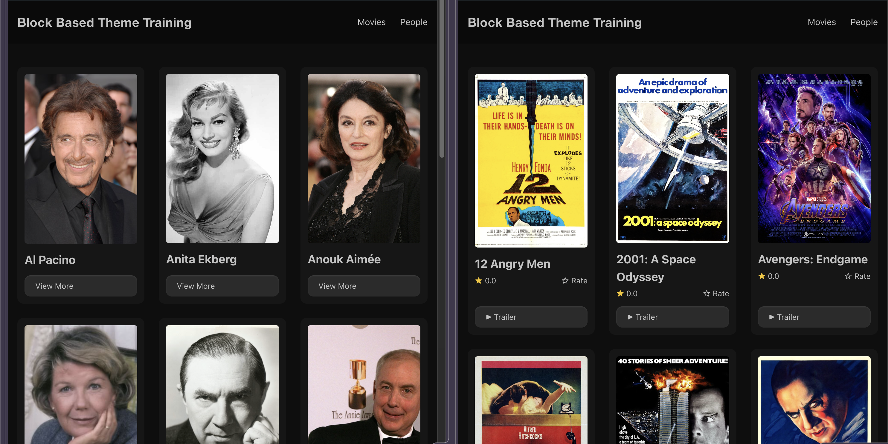

# 9. Archive Templates and the Card Pattern

Build archive pages for Movies and People, and create an adaptive card pattern that renders differently based on post type. This lesson combines templates and patterns into one hands-on exercise.

## Learning Outcomes

1. Be able to build archive templates with Query Loop, Post Template, and pagination.
2. Know how patterns work as template composition tools.
3. Understand how PHP conditionals in patterns can adapt output.
4. Know the difference between a pattern used for starter content and one used for template composition.

## Tasks

### 1. Update the Movie Archives template

We created placeholder archive templates in [Lesson 3](./03-site-editor.md#5-create-placeholder-templates). Now we'll refine them.

:::info
It is often much easier to make changes to template files visually using the Site Editor and you are welcome to do so here.  However, since we only need to change a couple of things, it may be a good exercise to work on editing a template manually.
:::

Open `templates/archive-tenup-movie.html` and make three changes:

1. **Remove the placeholder heading** (`<!-- wp:heading -->Archive: Movies<!-- /wp:heading -->`)
2. **Change the Query attributes** from `"order":"desc","orderBy":"date"` to `"order":"asc","orderBy":"title"`
3. **Change the Post Template attribute** `minimumColumnWidth` from `"21rem"` to `"13rem"` so the cards fit more per row

Your updated template should look like this:

```html title="templates/archive-tenup-movie.html"
<!-- wp:template-part {"slug":"header","tagName":"header"} /-->

<!-- wp:group {"tagName":"main","style":{"spacing":{"margin":{"top":"0","bottom":"0"},"padding":{"top":"var(--wp--preset--spacing--32-48)","bottom":"var(--wp--preset--spacing--32-48)"}}},"layout":{"type":"constrained"}} -->
<main class="wp-block-group" style="margin-top:0;margin-bottom:0;padding-top:var(--wp--preset--spacing--32-48);padding-bottom:var(--wp--preset--spacing--32-48)">

    <!-- wp:query {"queryId":0,"query":{"perPage":9,"postType":"tenup-movie","order":"asc","orderBy":"title","inherit":true},"align":"wide"} -->
    <div class="wp-block-query alignwide">

        <!-- wp:post-template {"layout":{"type":"grid","columnCount":null,"minimumColumnWidth":"13rem"}} -->

            <!-- wp:pattern {"slug":"tenup-theme/base-card"} /-->

        <!-- /wp:post-template -->

        <!-- wp:query-pagination {"paginationArrow":"arrow","align":"wide"} -->
            <!-- wp:query-pagination-previous /-->
            <!-- wp:query-pagination-next /-->
        <!-- /wp:query-pagination -->

    </div>
    <!-- /wp:query -->

</main>
<!-- /wp:group -->

<!-- wp:template-part {"slug":"footer","tagName":"footer"} /-->
```

### 2. Update the Person Archives template

Make the same changes to `templates/archive-tenup-person.html`.

:::info
You could even copy and paste `templates/archive-tenup-movie.html` directly to `archive-tenup-person.html` and it would still work.

This is because the Query attributes set `"inherit":true` which means it will use context from the WP hierarchy and ignore the `postType` attribute here.

However to avoid confusion, it is still recommended to set the proper `postType` attribute.
:::

### 3. Evolve the card pattern

The scaffold ships a simple `patterns/card.php` with a featured image, title, date, and category. We'll evolve it to handle multiple post types using PHP conditionals.

The outer card structure (wrapping Group, featured image, post title) is shared across all post types. Only the inner content changes based on `get_post_type()`:

```php title="patterns/card.php (conditional content only)"
$post_type = get_post_type();
$is_movie  = 'tenup-movie' === $post_type;
$is_person = 'tenup-person' === $post_type;

// Shared: outer Group with is-clickable-card, 2:3 featured image, post title (isLink:true)

// Then conditionally:
if ( $is_movie ) :
    // Viewer rating row (block binding) + "Trailer" button
elseif ( ! $is_movie && ! $is_person ) :
    // Post date + post terms (default blog content)
endif;

if ( $is_movie || $is_person ) :
    // Secondary button: "Trailer" for movies, "View More" for persons
endif;
```

Copy the complete `patterns/card.php` from the fueled-movies theme. The key design decisions:

- **One shared card layout** -- every post type gets the same outer Group (`is-clickable-card`, `2:3` image, `10px` radius, `12px` padding, background color). Only the content inside varies.
- **`isLink: true`** on the post title makes the heading a link, which serves as the primary clickable target for accessibility (screen readers announce the post title).
- **Movie-specific viewer rating row** uses a block binding (`viewerRatingLabelTextNumberOnly`) that won't exist until [Lesson 10](./10-block-bindings.md). It will show empty until then.
- **Movie/person button**: movies show "Trailer," persons show "View More" via a PHP ternary. Blog posts get no button.
- **Blog-specific metadata**: post date and category terms only render for non-movie, non-person post types.

All three archive templates reference the same pattern:

```html
<!-- wp:pattern {"slug":"tenup-theme/base-card"} /-->
```

One pattern, three templates. The PHP conditionals run in the context of each post inside the query loop, so the card automatically adapts.


*Our Movie and Person cards side by side*

### How patterns work in templates

When a template references a pattern via `<!-- wp:pattern {"slug":"..."} /-->`, the pattern's PHP file re-executes on every page load. This is different from patterns inserted into posts, which are copied and detached.

This means:
- Changes to the pattern file propagate immediately to all templates that reference it
- PHP conditionals run in context (the current post type, post ID, etc.)
- No need to re-save posts after changing the pattern

:::tip
Because patterns are PHP files, you can use any PHP logic: conditional rendering, `get_post_meta()`, `get_template_directory_uri()` for asset paths, `get_post_type()` for post-type-aware behavior. The only rule is that the output must be valid block markup.
:::

## Pattern metadata reference

The PHP file header tells WordPress about the pattern:

```php
<?php
/**
 * Title: Base Card
 * Slug: tenup-theme/base-card
 * Description: A card pattern with a featured image, title, and contextual metadata.
 * Inserter: false
 */
```

`Inserter: false` hides the pattern from the inserter while keeping it usable via `<!-- wp:pattern -->` references. Use this for structural patterns that only make sense in a specific template context.

## Notes

- Cards in the archive editor won't match the frontend perfectly because `wp_template` is the post context in the editor, not individual movies/people. This is a known limitation worth calling out.
- The card pattern includes a viewer rating row using the `viewerRatingLabelTextNumberOnly` binding for movie cards. This binding doesn't exist until Lesson 10, so it will show empty until then.

## Files changed in this lesson

| File | Change type | What changes |
| ---- | ----------- | ------------ |
| `templates/archive-tenup-movie.html` | Modified | Removed placeholder heading, updated grid column width and query order |
| `templates/archive-tenup-person.html` | Modified | Same changes as movie archive |
| `patterns/card.php` | Modified | Shared card layout with conditional inner content based on `get_post_type()` |

:::info
To sync your theme with the finished product, run these commands:

```bash
cp themes/fueled-movies/templates/archive-tenup-movie.html themes/10up-block-theme/templates/archive-tenup-movie.html
cp themes/fueled-movies/templates/archive-tenup-person.html themes/10up-block-theme/templates/archive-tenup-person.html
cp themes/fueled-movies/patterns/card.php themes/10up-block-theme/patterns/card.php
```

:::

## Ship it checkpoint

- `/movies/` shows a poster grid of movies
- `/people/` shows a poster grid of people
- All archives use the same `base-card` pattern

:::tip[Bonus: What about index.html?]
We haven't touched the blog index template yet. The scaffold's `templates/index.html` already references the base-card pattern and has a working query loop with pagination, so it works out of the box.

If you'd like to make it your own, open it in the Site Editor and experiment. Add a heading, tweak the grid column width, change the query type to custom and use one of our new post types... This is your template, do whatever you want with it.
:::

## Takeaways

- Archive templates compose a Query Loop with a pattern reference for the card.
- Patterns referenced via `<!-- wp:pattern -->` re-execute on every page load, staying in sync with the source file.
- PHP conditionals in patterns let one card pattern adapt to multiple post types.
- `Inserter: false` hides structural patterns from the inserter while keeping them usable in templates.
- The `is-clickable-card` class and heading link work together for accessible card interactions.

## Further reading

- [Block Patterns Overview](/reference/Patterns/overview)
- [Patterns lesson (Blocks training)](../Blocks/04-patterns.md)
- [Block Type Patterns (WordPress Theme Handbook)](https://developer.wordpress.org/themes/patterns/block-type-patterns/)
