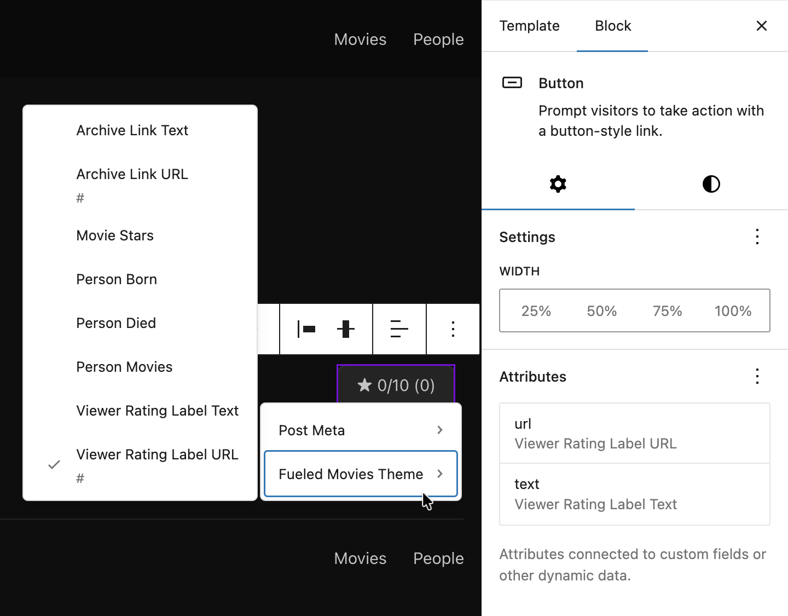
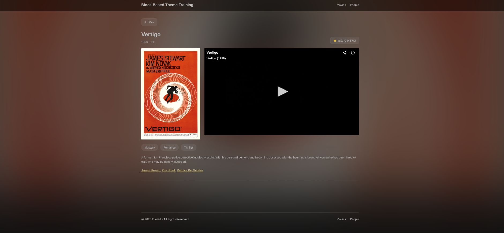
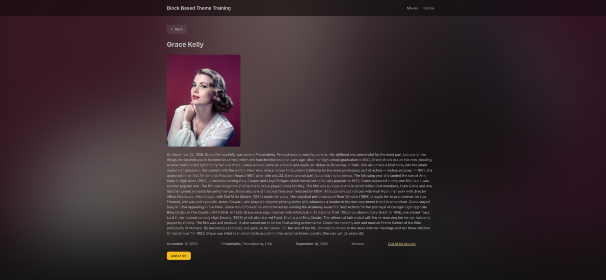

# 10. Block Bindings and Single Templates

The Block Bindings API (WordPress 6.5+) lets core blocks read dynamic values from a custom source: post meta, computed data, relationship queries. Instead of building a custom block for every piece of dynamic text, you bind a core Paragraph, Heading, Button, or Image to a data source and let WordPress handle the rendering.

In this lesson you'll register a custom binding source and build the single movie and person templates.

## Learning Outcomes

1. Understand the Block Bindings API: what it does, which blocks support it, and its limitations.
2. Know how to register a custom binding source in PHP with a callback.
3. Know how to register an editor-side preview so bindings show placeholder text while editing.
4. Know the difference between `core/post-meta` (simple fields) and a custom source (computed values).
5. Be able to build single post templates that use bindings for dynamic content.

:::info
To sync your theme with the finished product, run these commands and then add `import './block-bindings';` to `assets/js/block-extensions.js`:

```bash
cp themes/fueled-movies/src/BlockBindings.php themes/10up-block-theme/src/BlockBindings.php
mkdir -p themes/10up-block-theme/assets/js/block-bindings
cp themes/fueled-movies/assets/js/block-bindings/index.js themes/10up-block-theme/assets/js/block-bindings/index.js
cp themes/fueled-movies/templates/single-tenup-movie.html themes/10up-block-theme/templates/single-tenup-movie.html
cp themes/fueled-movies/templates/single-tenup-person.html themes/10up-block-theme/templates/single-tenup-person.html
```

Run `npm run build` when complete.
:::

## Tasks

### 1. Copy files from the answer key

Copy the files listed above from the `fueled-movies` theme, add the `block-bindings` import to `block-extensions.js`, and rebuild.

### 2. Walk through the PHP binding source

Open `src/BlockBindings.php`. This module follows the same `ModuleInterface` pattern from [Lesson 6](./06-render-filters-and-block-styles.md).

The registration:

```php title="src/BlockBindings.php (registration)"
public function register_block_bindings() {
    // Register a custom binding source with a unique name and a callback
    // that WordPress will call whenever a block uses this source.
    register_block_bindings_source(
        'tenup/block-bindings',
        array(
            'label'              => __( 'Fueled Movies Theme', 'tenup-block-theme' ),
            'get_value_callback' => [ $this, 'block_bindings_callback' ],
        )
    );
}
```

The callback receives `$source_args` (from the block's `metadata.bindings` attribute) and routes to helper methods:

```php title="src/BlockBindings.php (callback routing)"
public function block_bindings_callback( $source_args ) {
    if ( ! isset( $source_args['key'] ) ) {
        return null;
    }

    // Route to different helper methods based on which key the
    // binding is using in its args (set in the template markup).
    switch ( $source_args['key'] ) {
        case 'archiveLinkText':
            return $this->get_archive_link( 'text' );
        case 'archiveLinkUrl':
            return $this->get_archive_link( 'url' );
        case 'movieStars':
            return $this->get_movie_stars();
        case 'personBorn':
            return $this->get_person_born();
        case 'personDied':
            return $this->get_person_died();
        case 'personMovies':
            return $this->get_person_movies();
        case 'viewerRatingLabelText':
            return $this->get_viewer_rating_label( 'text' );
        case 'viewerRatingLabelTextNumberOnly':
            return $this->get_viewer_rating_label( 'number' );
        case 'viewerRatingLabelUrl':
            return $this->get_viewer_rating_label( 'url' );
        default:
            return null;
    }
}
```

#### Example: movieStars

The `movieStars` binding queries Content Connect for related People and returns comma-separated linked names:

```php title="src/BlockBindings.php (movieStars helper)"
private function get_movie_stars() {
    $value   = '';
    $post_id = get_the_ID();

    if ( ! $post_id ) {
        return $value;
    }

    // Bail early if Content Connect isn't available.
    if ( ! function_exists( '\TenUp\ContentConnect\Helpers\get_related_ids_by_name' ) ) {
        return $value;
    }

    // Query the Content Connect relationship for related Person post IDs.
    $star_ids = \TenUp\ContentConnect\Helpers\get_related_ids_by_name( $post_id, 'movie_person' );

    if ( empty( $star_ids ) ) {
        return $value;
    }

    // Fetch the Person posts and build linked name strings.
    $stars_query = new \WP_Query(
        [
            'post_type'      => Person::POST_TYPE,
            'post__in'       => $star_ids,
            'orderby'        => 'post__in',
            'posts_per_page' => 99,
        ]
    );

    if ( ! $stars_query->have_posts() ) {
        return $value;
    }

    $star_links = array_map(
        function ( $star ) {
            return sprintf(
                '<a href="%s">%s</a>',
                esc_url( get_permalink( $star->ID ) ),
                esc_html( $star->post_title )
            );
        },
        $stars_query->posts
    );

    // Return comma-separated linked names (e.g. "Al Pacino, Robert De Niro").
    $value = implode( ', ', $star_links );

    return $value;
}
```

Use `core/post-meta` for straightforward meta display. Use a custom binding source when you need computed values, relationship queries, formatted output, or fallback logic.

### 3. Walk through the JS editor preview

Block bindings have two halves:

- **PHP source**: returns real values for the frontend
- **JS source**: returns placeholder values for the editor preview

Both share the same source name (`tenup/block-bindings`). WordPress uses the JS source in the editor and the PHP source on the frontend.

```js title="assets/js/block-bindings/index.js"
import { registerBlockBindingsSource } from '@wordpress/blocks';

// Register the JS-side source that mirrors the PHP source.
// WordPress uses this in the editor; the PHP callback runs on the frontend.
registerBlockBindingsSource({
    name: 'tenup/block-bindings',
    label: 'Fueled Movies Theme',
    usesContext: ['postId', 'postType'],

    // Return placeholder values so editors see realistic content in the canvas.
    // The key in bindings.content/text/url.args.key matches the PHP switch cases.
    getValues({ bindings }) {
        if (bindings.content?.args?.key === 'movieStars') {
            return { content: 'Placeholder Stars' };
        }
        if (bindings.content?.args?.key === 'personBorn') {
            return { content: 'January 1, 1970' };
        }
        if (bindings.text?.args?.key === 'archiveLinkText') {
            return { text: '← Back' };
        }
        if (bindings.url?.args?.key === 'archiveLinkUrl') {
            return { url: '#' };
        }
        // ... more keys
        return {};
    },

    // Make bindings discoverable in the editor UI (Block Bindings panel).
    getFieldsList() {
        return [
            { label: 'Archive Link Text', type: 'string', args: { key: 'archiveLinkText' } },
            { label: 'Movie Stars', type: 'string', args: { key: 'movieStars' } },
            // ... more fields
        ];
    },
});
```

`getValues()` provides placeholder text so editors see meaningful content in the canvas. `getFieldsList()` makes bindings discoverable in the editor UI.


*The Attributes panel of the Button block where we connect our bindings in the Single Movie template*

:::tip
Keep placeholder text realistic so editors understand what will render. "Placeholder Stars" is better than "Loading..." because it communicates the shape of the content.
:::

### Which blocks support bindings?

These core blocks have built-in binding support:

| Block | Bindable properties |
| ----- | ------------------- |
| Paragraph | `content` |
| Heading | `content` |
| Button | `text`, `url`, `linkTarget`, `rel` |
| Image | `id`, `url`, `alt`, `title`, `caption` |
| Post Date | `datetime` |
| Navigation Link | `url` |
| Navigation Submenu | `url` |

#### Extending bindings to any block

As of WordPress 6.9, bindings are no longer limited to this built-in list. The [`block_bindings_supported_attributes`](https://developer.wordpress.org/block-editor/reference-guides/block-api/block-bindings/#extending-supported-attributes) filter lets any block, including custom blocks, opt into binding support. As of [WordPress 7.0](https://make.wordpress.org/core/2026/03/16/pattern-overrides-in-wp-7-0-support-for-custom-blocks/), any bindable attribute (including on custom blocks) also supports Pattern Overrides, meaning editors can override bound values per-instance in synced patterns.

```php
// Allow a custom block's "heading" attribute to support bindings and pattern overrides.
add_filter(
    'block_bindings_supported_attributes',
    function ( $supported_attributes, $block_name ) {
        if ( 'my-plugin/my-block' === $block_name ) {
            $supported_attributes[] = 'heading';
        }
        return $supported_attributes;
    },
    10,
    2
);
```

What else the attribute needs depends on how your block renders:

- **Dynamic blocks** (blocks with a `render_callback`): the filter is all you need. WordPress merges bound values into `$attributes` before calling your callback, so your PHP receives the correct values automatically.
- **Static blocks** (blocks with saved HTML): the attribute must also have a `source` (`html`, `rich-text`, or `attribute`) and `selector` in `block.json` so WordPress knows where in the saved markup to inject the bound value. Without these, the bound value is silently ignored.

:::note
You may see `role: "content"` on block.json attributes. This controls a separate concern: whether the block stays editable inside content-locked containers (like synced patterns with `templateLock: "contentOnly"`). It is good practice to add `"role": "content"` to bindable attributes, but it is not required for bindings to work.
:::

### 4. Understand binding markup in templates

In template markup, bindings are added via the `metadata.bindings` attribute on a block.

**`core/post-meta` for simple fields:**

```html
<!-- Simple: bind paragraph content directly to a post meta field. -->
<!-- wp:paragraph {
    "metadata": {
        "bindings": {
            "content": {
                "source": "core/post-meta",
                "args": { "key": "tenup_movie_release_year" }
            }
        }
    }
} -->
<p></p>
<!-- /wp:paragraph -->
```

**`tenup/block-bindings` for computed values:**

```html
<!-- Custom source: the PHP callback computes the value (e.g. querying related posts). -->
<!-- wp:paragraph {
    "metadata": {
        "bindings": {
            "content": {
                "source": "tenup/block-bindings",
                "args": { "key": "movieStars" }
            }
        }
    }
} -->
<p></p>
<!-- /wp:paragraph -->
```

**Button with both `text` and `url` bound:**

```html
<!-- Buttons can bind both text and url to different keys. -->
<!-- The inner HTML ("← Back", the href) is fallback content replaced at render time. -->
<!-- wp:button {"metadata":{"bindings":{
    "url":{"source":"tenup/block-bindings","args":{"key":"archiveLinkUrl"}},
    "text":{"source":"tenup/block-bindings","args":{"key":"archiveLinkText"}}
}},"className":"is-style-secondary"} -->
<div class="wp-block-button is-style-secondary">
    <a class="wp-block-button__link wp-element-button" href="/movies/">← Back</a>
</div>
<!-- /wp:button -->
```

The inner HTML (`← Back`, the `href`) is the fallback content that gets replaced at render time by the binding source.

### 5. Tour the single templates

The single templates were copied in step 1. Briefly review their layout structure:

- **Single Movie**: backdrop image, metadata row (release year, MPA rating), two-column layout with poster and trailer, plot/stars sections
- **Single Person**: header with photo and biographical info, filmography section

These templates use simple Paragraphs for metadata right now. In [Lesson 12](./12-custom-blocks.md), you'll revisit them to wrap metadata in `tenup/dl` blocks for semantic HTML. The metadata row uses a basic flex Group without the separator toggle, which comes in [Lesson 11](./11-block-extensions.md). The `tenup/movie-trailer` block that embeds the IMDB trailer is also built in [Lesson 12](./12-custom-blocks.md). The `tenup/rate-movie` block is added in [Lesson 13](./13-interactivity-api.md).

:::note
After copying these templates, the Site Editor will show "Your site doesn't include support for the..." warnings for `tenup/movie-runtime`, `tenup/movie-trailer`, `tenup/rate-movie`, `tenup/dl`, and `tenup/dl-item`. This is expected. Those blocks are built in [Lesson 12](./12-custom-blocks.md) (`tenup/movie-runtime`, `tenup/movie-trailer`, `tenup/dl`, `tenup/dl-item`) and [Lesson 13](./13-interactivity-api.md) (`tenup/rate-movie`). Leave the placeholders alone and the warnings will resolve as you progress.
:::



## Null and empty fallback strategy

Bound blocks always render their markup, even when the value is empty. An empty string results in an empty `<p></p>` on the frontend, which may appear as unwanted whitespace next to a label.

The theme uses two fallback strategies:

1. **Empty string for user-facing text**: fields like `movieStars` intentionally return `''` when there's no data, though an "n/a" or "unavailable" fallback might make just as much sense. The DL blocks added in Lesson 12 will inherit this behavior.
2. **Safe defaults for structural values**: `archiveLinkUrl` falls back to `home_url()` so the link always goes somewhere. `viewerRatingLabelUrl` returns `'#'` as a no-op.

:::caution
Bindings are not conditional: you can't hide a bound block entirely when the value is empty. The block always renders. Plan your fallbacks accordingly.
:::

## Files changed in this lesson

| File | Change type | What changes |
| ---- | ----------- | ------------ |
| `src/BlockBindings.php` | **New** | Registers `tenup/block-bindings` source; routes 9 keys to helper methods; Content Connect queries for movieStars and personMovies; date formatting for personBorn/personDied; viewer rating with K notation for counts |
| `assets/js/block-bindings/index.js` | **New** | Client-side `registerBlockBindingsSource()` with `getValues()` placeholders and `getFieldsList()` |
| `assets/js/block-extensions.js` | Modified | Added `import './block-bindings'` |
| `templates/single-tenup-movie.html` | Modified | Replaced placeholder with full layout using core/post-meta and tenup/block-bindings throughout; references `tenup/movie-trailer` (built in Lesson 12) |
| `templates/single-tenup-person.html` | Modified | Replaced placeholder with full layout using core/post-meta and tenup/block-bindings throughout |

## Ship it checkpoint

- Single movie pages show dynamic metadata (release year, MPA rating, plot, stars, viewer rating)
- Single person pages show dynamic metadata (biography, born, birthplace, died, deathplace, movies)
- Editor shows placeholder text for custom bindings
- Single movie templates show a missing-block placeholder where the trailer will render (resolved in Lesson 12)
- Back button navigates to the correct archive



## Takeaways

- Block bindings let core blocks display dynamic values without custom blocks.
- You need both a PHP source (real values) and a JS source (editor previews).
- Seven core blocks support bindings out of the box. As of WP 6.9, any block can opt in via the `block_bindings_supported_attributes` filter. As of WP 7.0, those bindable attributes also support Pattern Overrides.
- Use `core/post-meta` for simple meta display. Use a custom source for computed or formatted values.
- Always handle null/empty values: bound blocks always render their markup.
- Bindings are not conditional: you can't hide a block based on whether a value exists.

## Further reading

- [Block Bindings API](/reference/Patterns/block-bindings-api)
