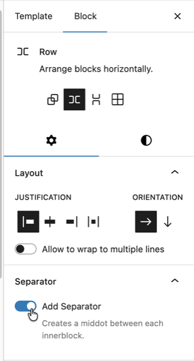
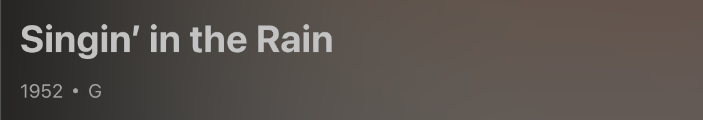

# 11. Block Extensions: Extending Core Blocks

Sometimes you'll find you need more control of a block to meet the needs of your design _(think of an icon picker)_. In this scenario, you extend a core block instead of replacing it. This lesson walks through extending the core Group block with a "separator" toggle using `registerBlockExtension` from `@10up/block-components`.

## Learning Outcomes

1. Know how to extend a core block with custom attributes and controls using `registerBlockExtension`.
2. Understand the three underlying WordPress block filters that `registerBlockExtension` wraps.
3. Be able to conditionally show controls based on block attributes (e.g., layout type).
4. Know when to build a custom block vs extend a core one.

## Tasks

### 1. Create the Group block extension

Create `assets/js/block-filters/group.js`:

```js title="assets/js/block-filters/group.js"
import { __ } from '@wordpress/i18n';
import { InspectorControls } from '@wordpress/block-editor';
import { ToggleControl, PanelBody } from '@wordpress/components';
import { registerBlockExtension } from '@10up/block-components';

registerBlockExtension('core/group', {
    extensionName: 'group-has-separator',
    attributes: {
        hasSeparator: { type: 'boolean', default: false },
    },
    classNameGenerator: (attributes) => {
        const { hasSeparator, layout } = attributes;
        if (hasSeparator && layout?.type === 'flex' && layout?.orientation !== 'vertical') {
            return 'has-separator';
        }
        return '';
    },
    Edit: (props) => {
        const { attributes, setAttributes } = props;
        const { hasSeparator, layout } = attributes;
        if (layout?.type !== 'flex' || layout?.orientation === 'vertical') return null;

        return (
            <InspectorControls group="settings">
                <PanelBody title={__('Separator', 'tenup')}>
                    <ToggleControl
                        label={__('Add Separator', 'tenup')}
                        help={__('Creates a middot between each innerblock.', 'tenup')}
                        checked={hasSeparator}
                        onChange={(value) => setAttributes({ hasSeparator: value })}
                    />
                </PanelBody>
            </InspectorControls>
        );
    },
});
```

`registerBlockExtension` from `@10up/block-components` wraps the three WordPress block filters into a cleaner API:

1. **Add attribute**: [`blocks.registerBlockType`](https://developer.wordpress.org/block-editor/reference-guides/block-api/block-registration/#registerblocktype) adds the `hasSeparator` boolean
2. **Add editor control**: [`editor.BlockEdit`](https://developer.wordpress.org/block-editor/reference-guides/filters/block-filters/#editor-blockedit) renders the toggle conditionally in the inspector
3. **Add class output**: [`blocks.getSaveContent.extraProps`](https://developer.wordpress.org/block-editor/reference-guides/filters/block-filters/#blocks-getsavecontent-extraprops) adds the `has-separator` class

Our separator styles are designed to add a middot between items in a row so the `classNameGenerator` only returns the class when the layout is horizontal flex, ensuring the dots only appear on inline groups.


*The toggle should only display when using the Row Group variation*

### 2. Create the barrel file and update the entry point

Create `assets/js/block-filters/index.js`:

```js title="assets/js/block-filters/index.js"
import './group';
```

Add the import to `assets/js/block-extensions.js`:

```js
import './block-filters';
```

### 3. Verify in the editor

Rebuild with `npm run build`. Open the editor and insert a Group block set to "Row" layout (horizontal flex). The "Add Separator" toggle should appear in the inspector under a "Separator" panel.

The CSS for `.has-separator` was already created in [Lesson 5](./05-styles.md) (`assets/css/blocks/core/group.css`):

```css title="assets/css/blocks/core/group.css"
.wp-block-group.has-separator {
    gap: 0;

    & > * {
        align-items: center;
        display: flex;
    }

    & > *:not(:first-child)::before {
        background-color: currentcolor;
        block-size: 4px;
        border-radius: 999px;
        content: "";
        display: inline-flex;
        inline-size: 4px;
        margin-inline: var(--wp--custom--spacing--8);
    }
}
```

### 4. Verify on the single movie template

The single movie template we copied from the fueled-movies theme already has `"hasSeparator":true` on the metadata row Group. After rebuilding, visit a single movie page on the frontend and confirm you see the dot separators between the release year, MPA rating, and other metadata items.

If the dots aren't showing, open `templates/single-tenup-movie.html` in the Site Editor and find the metadata row Group (the horizontal flex group containing release year, MPA rating, etc.). Enable the "Add Separator" toggle in the inspector and export the updated markup back to the theme file.



## When to build vs extend

| Situation | Approach |
| --------- | -------- |
| Need entirely new markup and behavior | Build a custom block |
| Need to add a feature to an existing block | Extend with block filters |
| Need a dynamic display of post meta | Use block bindings ([Lesson 10](./10-block-bindings.md)) first |
| Need structured nested content | Build parent/child blocks ([Lesson 12](./12-custom-blocks.md)) |

:::tip
Try block bindings first. If a Paragraph with a binding can do the job, you don't need a custom block. Only build custom when core blocks genuinely can't handle the use case.
:::

## Files changed in this lesson

| File | Change type | What changes |
| ---- | ----------- | ------------ |
| `assets/js/block-filters/group.js` | **New** | `registerBlockExtension('core/group')` with `hasSeparator` attribute, `classNameGenerator`, and `Edit` component with ToggleControl |
| `assets/js/block-filters/index.js` | **New** | Imports `./group` |
| `assets/js/block-extensions.js` | Modified | Added `import './block-filters'` |
| `templates/single-tenup-movie.html` | **Revisited** | Metadata row Group now has `"hasSeparator":true` and class `has-separator` |

## Ship it checkpoint

- "Add Separator" toggle appears in Group block inspector (only for Row Group variation)
- Dots appear between items in the metadata row on the single movie page
- Toggle adds styles to both editor and frontend

## Takeaways

- Block extensions add features to core blocks using `registerBlockExtension` from `@10up/block-components`.
- The API wraps three WordPress block filters to handle attribute registration, editor control, and class output.
- Use `classNameGenerator` to conditionally add classes based on block attributes.
- Conditionally render the `Edit` component so controls only appear when relevant (e.g., horizontal flex layouts only).
- Build custom when core blocks can't do the job. Extend when they almost can.

## Further reading

- [Block Extensions](/reference/Blocks/block-extensions)
- [Extending core blocks guide](/guides/extend-a-core-block)
