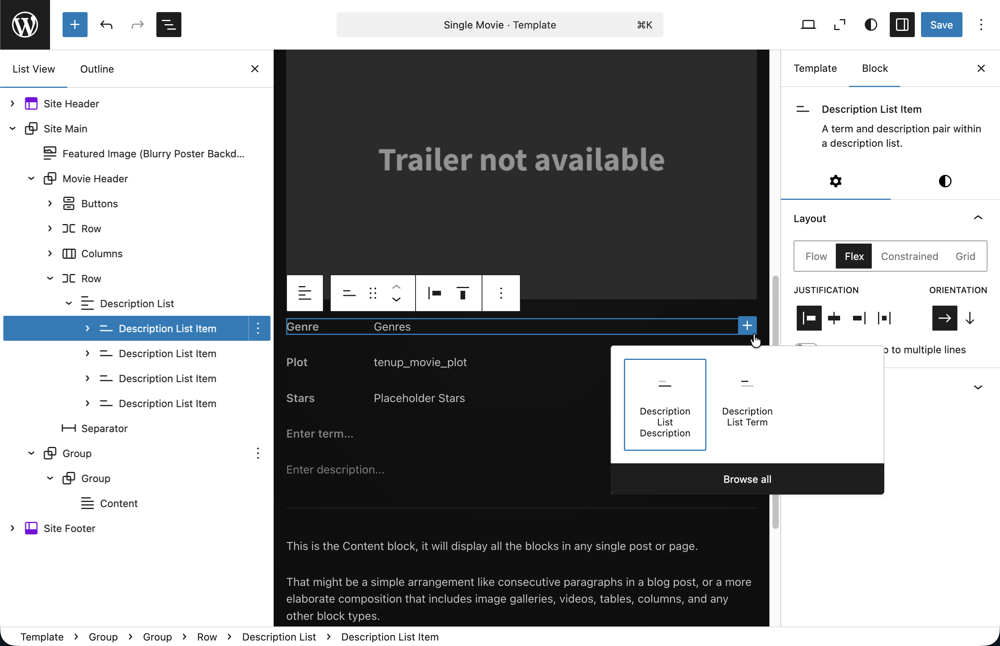
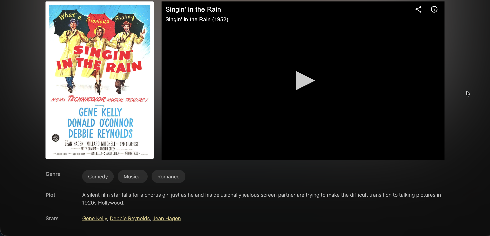

# 12. Custom Blocks: Description Lists and Movie Runtime

Core blocks cover most layout needs, but some HTML structures have no core equivalent. Description lists (`<dl>`, `<dt>`, `<dd>`) and semantic time elements (`<time>`) are two examples. This lesson builds custom blocks for both and revisits the single templates to use them.

## Learning Outcomes

1. Understand a custom block's anatomy: `block.json`, `index.js`, `render.php`, `style.css`.
2. Know how to build parent/child block relationships using `parent` and `allowedBlocks`.
3. Be able to create a dynamic block that renders via PHP.
4. Understand how `usesContext` lets a block read data from the query loop.
5. Know how `get_block_wrapper_attributes()` handles wrapper output.

:::info
To sync your theme with the finished product, run these commands:

```bash
mkdir -p themes/10up-block-theme/blocks
cp -r themes/fueled-movies/blocks/dl themes/10up-block-theme/blocks/dl
cp -r themes/fueled-movies/blocks/dl-item themes/10up-block-theme/blocks/dl-item
cp -r themes/fueled-movies/blocks/dt themes/10up-block-theme/blocks/dt
cp -r themes/fueled-movies/blocks/dd themes/10up-block-theme/blocks/dd
cp -r themes/fueled-movies/blocks/movie-runtime themes/10up-block-theme/blocks/movie-runtime
```

Run `npm run build` when complete.
:::

## Tasks

### 1. Copy blocks from the answer key

Copy the block directories listed above from the `fueled-movies` theme and rebuild.

The theme's `src/Blocks.php` already auto-registers any block with a `block.json` in the `blocks/` directory, so no additional PHP registration is needed.

### 2. Walk through the DL block family

The description list system is a four-block hierarchy for displaying movie and person metadata:

```
tenup/dl              - Parent: the <dl> wrapper
└── tenup/dl-item     - Child: a term+description pair
    ├── tenup/dt      - Leaf: the <dt> term
    └── tenup/dd      - Leaf: the <dd> description (can contain other blocks)
```

#### Enforcing structure with parent and allowedBlocks

The nesting rules are defined in each block's `block.json`:

```json title="blocks/dl-item/block.json (partial)"
{
    "name": "tenup/dl-item",
    "title": "Description List Item",
    "parent": ["tenup/dl"]
}
```

```json title="blocks/dt/block.json (partial)"
{
    "name": "tenup/dt",
    "title": "Description List Term",
    "parent": ["tenup/dl-item"]
}
```

- **`parent`** restricts where a block can be inserted. `tenup/dl-item` can only exist inside `tenup/dl`. `tenup/dt` and `tenup/dd` can only exist inside `tenup/dl-item`.*
- The DL block uses `InnerBlocks` to accept child blocks. The editor automatically filters the inserter to only show allowed children.

_* Alternatively, there is also `ancestor` to be allowed at any level within a blocks nested innerblocks_



#### Dynamic rendering with render.php

At 10up we build dynamic blocks: blocks that render on the server via PHP. The `render.php` file is referenced as `render` in `block.json`:

```json title="blocks/dl/block.json (partial)"
{
    "name": "tenup/dl",
    "render": "file:./render.php",
    "editorScript": "file:./index.js",
    "style": "file:./style.css"
}
```

The PHP render template receives three variables:

```php title="blocks/dl/render.php"
<?php
/**
 * @var array    $attributes Block attributes.
 * @var string   $content    Block content (inner blocks).
 * @var WP_Block $block      Block instance.
 */

if ( empty( trim( $content ) ) ) {
    return;
}

$block_wrapper_attributes = get_block_wrapper_attributes();
?>

<dl <?php echo $block_wrapper_attributes; ?>>
    <?php echo $content; ?>
</dl>
```

- `$attributes`: the block's saved attributes (from `block.json`)
- `$content`: the rendered HTML of inner blocks (already processed by WordPress)
- `$block`: the full `WP_Block` instance (access context via `$block->context` when `usesContext` is set in `block.json`)

`get_block_wrapper_attributes()` generates the correct wrapper attributes (classes, styles, IDs) based on block supports. Always use this instead of building class names manually.

:::tip
Dynamic blocks avoid deprecation headaches: the markup isn't saved to the database, so you can change it anytime without migration scripts. This is why 10up uses dynamic blocks as the standard.
:::

#### The editor component

The editor side uses `useBlockProps` and `useInnerBlocksProps` from `@wordpress/block-editor`:

```js title="blocks/dl/index.js"
import { registerBlockType } from '@wordpress/blocks';
import { InnerBlocks } from '@wordpress/block-editor';
import { BlockEdit } from './edit';
import metadata from './block.json';

registerBlockType(metadata, {
    edit: BlockEdit,
    save: () => <InnerBlocks.Content />,
});
```

For dynamic blocks, the `save` function returns `<InnerBlocks.Content />` (if the block has inner blocks) or `null` (if it doesn't). The actual frontend markup comes from `render.php`.

#### Auto-registration

You don't need to manually register blocks. `src/Blocks.php` globs `dist/blocks/*/block.json` and calls `register_block_type_from_metadata()` for each:

```php title="src/Blocks.php (simplified)"
public function register_theme_blocks() {
    $block_json_files = glob( TENUP_BLOCK_THEME_BLOCK_DIST_DIR . '*/block.json' );

    foreach ( $block_json_files as $filename ) {
        $block_folder = dirname( $filename );
        register_block_type_from_metadata( $block_folder );
    }
}
```

Drop a folder with a `block.json` into `blocks/` and it's automatically available.

### 3. Walk through the Movie Runtime block

The `tenup/movie-runtime` block demonstrates reading data from the post via block context:

```json title="blocks/movie-runtime/block.json (partial)"
{
    "name": "tenup/movie-runtime",
    "usesContext": ["postId", "postType"],
    "render": "file:./render.php"
}
```

```php title="blocks/movie-runtime/render.php (simplified)"
$post_id = $block->context['postId'] ?? null;
if ( ! $post_id ) {
    return;
}

$runtime = get_post_meta( $post_id, 'tenup_movie_runtime', true );
$hours   = $runtime['hours'] ?? '0';
$minutes = $runtime['minutes'] ?? '0';

if ( '0' === $hours && '0' === $minutes ) {
    return;
}
?>

<time <?php echo get_block_wrapper_attributes( [
    'datetime' => esc_attr( 'PT' . $hours . 'H' . $minutes . 'M' ),
] ); ?>>
    <?php // renders "2h 28m" with ARIA labels ?>
</time>
```

The `usesContext` declaration in `block.json` tells WordPress to pass `postId` and `postType` from the query loop context. This lets the block read meta for whatever post it's rendering inside, without hardcoding a post ID.

### 4. Revisit single templates

Update both single templates in the Site Editor to use the new blocks:

**Single Movie** (`templates/single-tenup-movie.html`):
- Wrap plot, stars, and genre in `tenup/dl` blocks
- Add `tenup/movie-runtime` to the metadata row

Notice how the `tenup/dd` blocks contain bound Paragraphs from [Lesson 10](./10-block-bindings.md). The Plot field uses `core/post-meta` (reading directly from meta), while the Stars field uses our custom `tenup/block-bindings` source (querying Content Connect relationships and returning linked names). The DL blocks provide the semantic HTML structure; the bindings provide the dynamic data.

:::warning
Is it worth mentioning once more here that our bindings will still return an empty paragraph tag if they are not set _(i.e. - no Plot meta or Stars relationship)_.

For our custom binding, we can return the fallback in our php callback if we wish, but our for our `core/post-meta` binding we would add our fallback here in the template.
:::

```html title="DL usage example in single-tenup-movie.html"
<!-- wp:tenup/dl {"style":{"layout":{"selfStretch":"fill"}},"layout":{"type":"default"}} -->
    <!-- wp:tenup/dl-item {"layout":{"type":"flex","flexWrap":"nowrap","verticalAlignment":"top"}} -->
        <!-- wp:tenup/dt {"content":"Genre","style":{"layout":{"selfStretch":"fixed","flexSize":"5.5rem"}},"textColor":"text-secondary"} /-->
        <!-- wp:tenup/dd {"style":{"layout":{"selfStretch":"fill"}}} -->
            <!-- wp:post-terms {"term":"tenup-genre"} /-->
        <!-- /wp:tenup/dd -->
    <!-- /wp:tenup/dl-item -->

    <!-- wp:tenup/dl-item {"layout":{"type":"flex","flexWrap":"nowrap","verticalAlignment":"top"}} -->
        <!-- wp:tenup/dt {"content":"Plot","textColor":"text-secondary"} /-->
        <!-- wp:tenup/dd -->
            <!-- wp:paragraph {
                "metadata": {
                    "bindings": {
                        "content": {
                            "source": "core/post-meta",
                            "args": { "key": "tenup_movie_plot" }
                        }
                    }
                }
            } -->
            <p></p>
            <!-- /wp:paragraph -->
        <!-- /wp:tenup/dd -->
    <!-- /wp:tenup/dl-item -->

    <!-- wp:tenup/dl-item {"layout":{"type":"flex","flexWrap":"nowrap","verticalAlignment":"top"}} -->
        <!-- wp:tenup/dt {"content":"Stars","textColor":"text-secondary"} /-->
        <!-- wp:tenup/dd -->
            <!-- wp:paragraph {
                "metadata": {
                    "bindings": {
                        "content": {
                            "source": "tenup/block-bindings",
                            "args": { "key": "movieStars" }
                        }
                    }
                }
            } -->
            <p></p>
            <!-- /wp:paragraph -->
        <!-- /wp:tenup/dd -->
    <!-- /wp:tenup/dl-item -->
<!-- /wp:tenup/dl -->
```

**Single Person** (`templates/single-tenup-person.html`):
- Wrap biography, born, birthplace, died, deathplace, and movies in `tenup/dl` blocks

Export the updated markup back to the theme files.


*Our Description List blocks on the frontend with bound innerblock content*

## Files changed in this lesson

| File | Change type | What changes |
| ---- | ----------- | ------------ |
| `blocks/dl/` | **New** | Block metadata, edit component, render.php, styles |
| `blocks/dl-item/` | **New** | `parent: ["tenup/dl"]`, render.php |
| `blocks/dt/` | **New** | `parent: ["tenup/dl-item"]`, inline editable term |
| `blocks/dd/` | **New** | `parent: ["tenup/dl-item"]`, inner blocks container |
| `blocks/movie-runtime/` | **New** | `usesContext: ["postId", "postType"]`, semantic `<time>` output |
| `templates/single-tenup-movie.html` | **Revisited** | Plot/Stars/Genre wrapped in `tenup/dl` blocks; `tenup/movie-runtime` added to metadata row |
| `templates/single-tenup-person.html` | **Revisited** | All metadata paragraphs wrapped in `tenup/dl` blocks |

## Ship it checkpoint

- DL blocks enforce nesting: only dl-item inside dl, only dt/dd inside dl-item
- Movie runtime displays as "2h 28m" with semantic `<time>` element
- Single movie template has DL with Genre, Plot, Stars
- Single person template has DL with Biography, Born, Birthplace, Died, Deathplace, Movies

## Takeaways

- Custom blocks: `block.json` for metadata, `index.js` for the editor, `render.php` for the frontend.
- Dynamic blocks (PHP-rendered) avoid deprecation problems: the 10up standard.
- Use `parent` and `allowedBlocks` to enforce nesting rules in parent/child block systems.
- `get_block_wrapper_attributes()` handles wrapper classes, styles, and IDs. Always use it.
- `usesContext` in `block.json` lets blocks read data from query loop context.
- Drop a folder with `block.json` into `blocks/` and auto-registration handles the rest.

## Further reading

- [Custom Blocks](/reference/Blocks/custom-blocks)
- [Inner Blocks](/reference/Blocks/inner-blocks)
- [Building Blocks training](../Blocks/01-overview.md)
