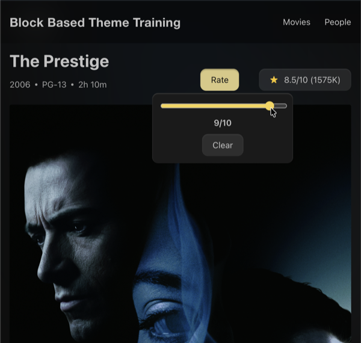
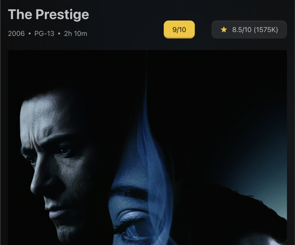

# 13. Interactivity API: Rate a Movie

The Interactivity API replaces ad-hoc frontend JavaScript with a declarative system. Instead of `querySelector` and event listeners, you use `data-wp-*` directives that connect HTML to a reactive store. The block renders meaningful HTML on the server, and the API enhances it on the client.

This lesson walks through the `tenup/rate-movie` block: a fully interactive star rating widget built entirely with the Interactivity API.

:::note
Keeping our ratings persistent is out of scope for this lesson. The rating lives in reactive context for the current page view only.  It resets on reload and does not persist across navigations.
:::

## Learning Outcomes

1. Understand the Interactivity API: stores, state, actions, callbacks, and `data-wp-*` directives.
2. Know how to wire a `view-module.js` to a block via `block.json`.
3. Be able to build interactive UI with proper accessibility.
4. Understand progressive enhancement: the block should be meaningful without JS.
5. Know the `do_blocks()` pattern for rendering block markup from PHP.

:::info
To sync your theme with the finished product:

**1. Copy the block:**

```bash
cp -r themes/fueled-movies/blocks/rate-movie themes/10up-block-theme/blocks/rate-movie
```

**2. Add two new dependencies.** In your theme's `package.json`, add `@wordpress/dependency-extraction-webpack-plugin` and `@wordpress/interactivity` to `dependencies`:

```json
"dependencies": {
    "@10up/block-components": "^1.19.4",
    "@wordpress/dependency-extraction-webpack-plugin": "^5.9.0",
    "@wordpress/interactivity": "^6.38.0",
    "10up-toolkit": "^6.5.0",
    "clsx": "^2.1.1"
}
```

Two new packages here:

- **`@wordpress/dependency-extraction-webpack-plugin`** tells webpack to externalize `@wordpress/*` packages so they use WordPress's built-in copies instead of being bundled.
- **`@wordpress/interactivity`** is the Interactivity API runtime that your `view-module.js` imports from.

The scaffold already has `"useScriptModules": true` in the `10up-toolkit` config, which is required for the Interactivity API's `viewScriptModule` to work.

**3. Install and build:**

```bash
npm install && npm run build
```

:::

## Tasks

### 1. Copy the block from the answer key

Copy the block and install the dependency as described above, then rebuild.

### 2. Review block.json

```json title="blocks/rate-movie/block.json (partial)"
{
    "name": "tenup/rate-movie",
    "title": "Rate Movie",
    "supports": {
        "html": false,
        "interactivity": {
            "interactive": true,
            "clientNavigation": true
        }
    },
    "render": "file:./render.php",
    "editorScript": "file:./index.js",
    "viewScriptModule": "file:./view-module.js",
    "style": "file:./style.css"
}
```

Key entries:

- **`viewScriptModule`**: points to the Interactivity API store. WordPress loads this as an ES module only on the frontend, only when the block is present.
- **`supports.interactivity`**: enables the Interactivity API for this block. `clientNavigation: true` allows the store to persist across client-side navigations.

### 3. Walk through the server-rendered markup

The `render.php` file outputs HTML with `data-wp-*` directives. The `data-wp-context` attribute is emitted via [`wp_interactivity_data_wp_context()`](https://developer.wordpress.org/reference/functions/wp_interactivity_data_wp_context/), which JSON-encodes the array with the flags required for safe HTML-attribute output.

```php title="blocks/rate-movie/render.php (simplified)"
<?php
$block_wrapper_attributes = get_block_wrapper_attributes( [
    'data-wp-interactive' => 'tenup/rate-movie',
] );
?>

<div
    <?php echo $block_wrapper_attributes; ?>
    <?php echo wp_interactivity_data_wp_context( [ 'rating' => null ] ); ?>
>

    <!-- Trigger button -->
    <button
        aria-controls="rate-movie-popover"
        aria-haspopup="true"
        class="wp-block-tenup-rate-movie__trigger"
        data-wp-bind--aria-expanded="state.isPopoverOpen"
        data-wp-text="state.buttonText"
        popovertarget="rate-movie-popover"
        type="button"
    >Rate</button>

    <!-- Popover dialog -->
    <div
        aria-labelledby="rate-movie-popover-label"
        aria-modal="true"
        class="wp-block-tenup-rate-movie__popover"
        data-wp-class--is-open="state.isPopoverOpen"
        data-wp-init="callbacks.initPopover"
        id="rate-movie-popover"
        popover
        role="dialog"
    >
        <!-- Range slider -->
        <label>
            <span class="visually-hidden">Rate this movie from 1 to 10</span>
            <input
                data-wp-bind--value="state.sliderValue"
                data-wp-on--input="actions.selectRating"
                max="10" min="1" step="1"
                type="range"
            />
        </label>

        <!-- Rating display -->
        <span data-wp-text="state.popupRatingText"></span>

        <!-- Clear button -->
        <button
            data-wp-class--is-hidden="!state.hasRating"
            data-wp-on--click="actions.clearRating"
            type="button"
        >Clear</button>
    </div>
</div>
```

#### Directive reference

| Directive | What it does | Example |
| --------- | ------------ | ------- |
| `data-wp-interactive` | Declares which store this block uses | `"tenup/rate-movie"` |
| `data-wp-context` | Sets initial reactive context for this block instance | `{ "rating": null }` |
| `data-wp-text` | Replaces text content with a state value | `state.buttonText` |
| `data-wp-bind--{attr}` | Binds an HTML attribute to state | `data-wp-bind--aria-expanded="state.isPopoverOpen"` |
| `data-wp-on--{event}` | Attaches an event handler to an action | `data-wp-on--click="actions.clearRating"` |
| `data-wp-class--{name}` | Toggles a CSS class based on state | `data-wp-class--is-open="state.isPopoverOpen"` |
| `data-wp-init` | Runs a callback when the element enters the DOM | `callbacks.initPopover` |

#### The do_blocks() pattern

The `render.php` uses `do_blocks()` to render Button blocks from PHP. This ensures the buttons get proper block-style-variation CSS applied.  This approach would also load any other code split block assets such as `view-module.js` for interactivity.

```php title="blocks/rate-movie/render.php (do_blocks pattern)"
$trigger_button = '
<!-- wp:button {"tagName":"button"} -->
<div class="wp-block-button">
    <button class="wp-block-button__link wp-element-button"
        data-wp-bind--aria-expanded="state.isPopoverOpen"
        data-wp-text="state.buttonText"
        popovertarget="rate-movie-popover"
        type="button"
    >Rate</button>
</div>
<!-- /wp:button -->
';

echo do_blocks( $trigger_button );
```

By wrapping the HTML in block comments and running it through `do_blocks()`, WordPress processes it as if it were a real block, applying any style variation CSS that's been registered. This is how the "is-style-secondary" variation on the Clear button gets its styling even though the button is defined in PHP.

### 4. Walk through the store

```js title="blocks/rate-movie/view-module.js"
// store() creates a reactive store scoped to the 'tenup/rate-movie' namespace.
// State is reactive: when values change, any directives referencing them re-render.
// Context (getContext()) is per-block-instance data set via data-wp-context in the markup.
import { store, getContext, getElement } from '@wordpress/interactivity';

const { state } = store('tenup/rate-movie', {
    // Reactive state shared across all instances of this block.
    state: {
        // Tracks whether the popover is currently open.
        isPopoverOpen: false,

        // Derived state (getter): true when the user has set a rating.
        get hasRating() {
            const context = getContext();
            return context.rating !== null && context.rating > 0;
        },

        // Derived state: shows "Rate" or "7/10" depending on rating and popover state.
        get buttonText() {
            if (state.isPopoverOpen) return 'Rate';
            const context = getContext();
            return context.rating > 0 ? `${context.rating}/10` : 'Rate';
        },

        // Derived state: the text inside the popover showing the current selection.
        get popupRatingText() {
            const context = getContext();
            return context.rating !== null && context.rating > 0 ? `${context.rating}/10` : '';
        },

        // Derived state: the range slider's current value (defaults to 1 if no rating).
        get sliderValue() {
            const context = getContext();
            return context.rating !== null ? context.rating : 1;
        },
    },

    // Actions are event handlers triggered by data-wp-on--{event} directives.
    actions: {
        // Sets the rating from the range slider input event.
        selectRating(event) {
            const context = getContext();
            const value = parseInt(event.target.value, 10);
            context.rating = value >= 1 && value <= 10 ? value : null;
        },

        // Resets the rating to null (triggered by the "Clear" button).
        clearRating() {
            getContext().rating = null;
        },
    },

    // Callbacks run in response to lifecycle events like data-wp-init.
    callbacks: {
        // Syncs the popover's open/close state with the reactive store.
        // Uses the native Popover API's toggle event to detect state changes.
        initPopover() {
            const { ref } = getElement();
            if (!ref) return;

            // data-wp-init is on the popover element, so we walk up to find
            // the block wrapper and then locate the trigger button sibling.
            const root = ref.closest('.wp-block-tenup-rate-movie') ?? ref.parentElement;
            const popover = ref;
            const button = root?.querySelector('.wp-block-tenup-rate-movie__trigger');

            if (!popover || !button) return;

            // Listen for the native popover toggle event and sync to reactive state.
            const updateState = () => {
                state.isPopoverOpen = popover.matches(':popover-open');
                button.setAttribute('aria-expanded', state.isPopoverOpen ? 'true' : 'false');
            };

            popover.addEventListener('toggle', updateState);
            updateState();
        },
    },
});
```

Key concepts:

- **`store()`**: creates a reactive store namespaced to `'tenup/rate-movie'`. The namespace must match the `data-wp-interactive` attribute in the markup.
- **`getContext()`**: returns the reactive context for the current block instance. Each rate-movie block on the page has its own `rating` value.
- **Computed state**: `get` properties like `buttonText` are derived from context. They recompute automatically when their dependencies change.
- **Actions**: functions called by `data-wp-on--*` directives. `selectRating` reads the slider value and updates context.
- **Callbacks**: functions called by `data-wp-init` (on mount) or `data-wp-watch` (on change). `initPopover` sets up the native popover toggle listener.

### Interaction flow

1. User clicks the "Rate" button, the native `popover` API opens the dialog
2. `initPopover` callback fires on the `toggle` event, sets `state.isPopoverOpen = true`
3. `data-wp-bind--aria-expanded` updates the button's ARIA attribute
4. User drags the range slider, `data-wp-on--input` fires `actions.selectRating`
5. `selectRating` parses the value and sets `context.rating`
6. `data-wp-text="state.buttonText"` reactively updates to show `"7/10"`
7. User clicks "Clear", `actions.clearRating` sets `context.rating = null`
8. Button text reverts to "Rate"

### 5. Add to the single movie template

Revisit `templates/single-tenup-movie.html` in the Site Editor. Add `<!-- wp:tenup/rate-movie /-->` in the movie header area (near the title and metadata row).

Export the updated markup back to the theme file.




*Our Movie Rating button demonstrating the popover js and updated text*

:::caution
The Interactivity API is not a replacement for React. It's designed for server-rendered blocks that need client-side behavior. Editor-side interactivity still lives in `edit.js`.
:::

:::tip
As a bonus, see if you can add local storage to a movie's rating so the values persist across page loads.
:::

## Files changed in this lesson

| File | Change type | What changes |
| ---- | ----------- | ------------ |
| `package.json` | Modified | Added `@wordpress/interactivity` dependency; `useScriptModules: true` in toolkit config |
| `blocks/rate-movie/block.json` | **New** | Interactive block metadata with `viewScriptModule` |
| `blocks/rate-movie/render.php` | **New** | Server-rendered HTML with `data-wp-*` directives, `do_blocks()` pattern for buttons |
| `blocks/rate-movie/view-module.js` | **New** | Interactivity API store with state, actions, callbacks |
| `blocks/rate-movie/index.js` | **New** | Minimal editor registration |
| `blocks/rate-movie/style.css` | **New** | Popover, trigger, slider, and rating display styles |
| `templates/single-tenup-movie.html` | **Revisited** | Added `<!-- wp:tenup/rate-movie /-->` in movie header area |

## Ship it checkpoint

- The block uses a view module with store state/actions (no console errors)
- Accessibility: popover labeling, `aria-expanded`, keyboard navigation all work
- State rules enforced (null initial, range 1-10, clear resets to null)
- Rating displays on the button after selection ("7/10")


## Takeaways

- The Interactivity API adds frontend behavior to server-rendered blocks declaratively.
- Directives (`data-wp-on--click`, `data-wp-bind--*`, `data-wp-text`) connect HTML to store state.
- Always server-render the initial HTML in `render.php`. The API enhances it, not replaces it.
- Each block instance has its own context via `data-wp-context` and `getContext()`.
- Computed state (`get` properties) automatically update when dependencies change.
- Accessibility is not optional: ARIA attributes, keyboard support, screen reader testing.
- Use `do_blocks()` when outputting block markup from PHP to ensure style variations are applied.

## Further reading

- [Interactivity API getting started](/guides/interactivity-api-getting-started)
