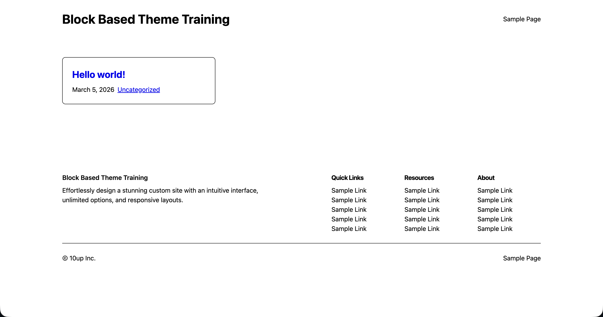
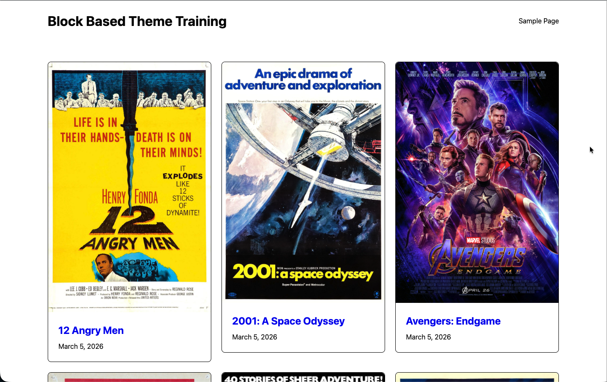
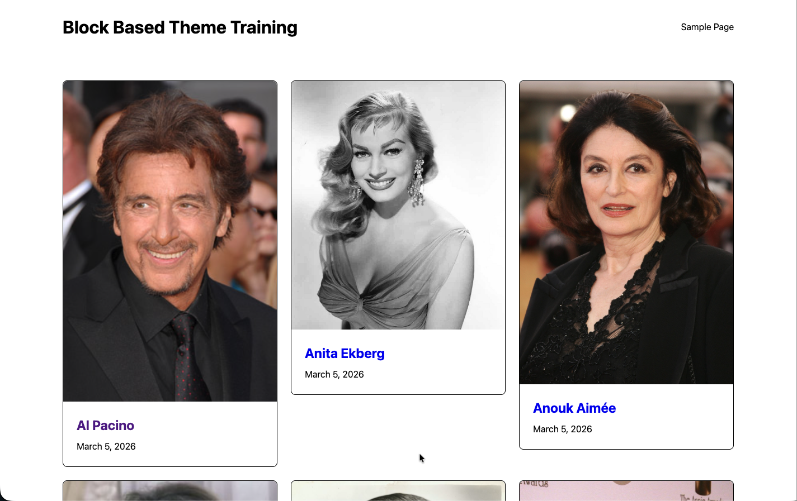

# 10up Block Based Themes Training

## Overview

This training course will walk you through the building of a block-based WordPress theme. By the end, you'll have transformed [the 10up Block Theme](https://github.com/10up/wp-scaffold/tree/trunk/themes/10up-block-theme) into a fully functional movie database theme, complete with custom post types, block bindings, editor controls, and interactive blocks.

If you're new to blocks entirely, we recommend starting with our [Building Blocks](/training/Blocks/) training course first.

## Prerequisites

- [Node.js](https://nodejs.org/) (>=20) and npm (>=9)
- PHP (>=8.3)
- [Composer](https://getcomposer.org/) (>=2)
- MySQL (8+)
- Git
- A code editor
- Basic familiarity with the command line

## Getting started

### 1. Create a LocalWP site

You can certainly do this course using your development environment of choice, but we recommend [LocalWP](https://localwp.com/) and have outlined the steps necessary to get started with it below.

<dl>
<dt>Create a site</dt>
<dd>Create a new site</dd>
<dt>What's your site's name?</dt>
<dd><code>Block Based Theme Training</code><br/>Advanced options > Local site domain: <code>block-based-theme-training.local</code></dd>
<dt>Choose your environment</dt>
<dd>Custom<br/>PHP version: <code>8.3.x</code><br/>Web server: <code>nginx</code><br/>Database: <code>MYSQL 8+</code></dd>
<dt>Set up WordPress</dt>
<dd>Username: <code>admin</code><br/>Password: <code>password</code><br/>Email: <code>example@example.com</code><br/>Is this a WordPress Multisite? <code>No</code> (open <strong>Advanced Options</strong> to reveal this)</dd>
</dl>

### 2. Open the Site Shell and clone the repository

From the LocalWP dashboard screen for your site, select **Site Shell**. Every command in the rest of this section runs from that shell.

Clone [the repo](https://github.com/10up/block-based-theme-training) into `wp-content` and install dependencies:

```bash
rm -rf wp-content

git clone git@github.com:10up/block-based-theme-training.git wp-content

cd wp-content

nvm use && npm install && npm run build

composer install
composer install --working-dir=mu-plugins/10up-plugin
composer install --working-dir=themes/10up-block-theme
composer install --working-dir=themes/fueled-movies
```

:::info
Going forward, please work from the `wp-content` folder when executing commands such as `npm run build`. The course will later provide additional instructions under the assumption your terminal is in that directory.
:::

### 3. Activate the theme and set debug constants

Still in the Site Shell:

```bash
wp theme activate 10up-block-theme

wp config set WP_DEBUG true --raw
wp config set WP_DEBUG_LOG true --raw
wp config set WP_DEBUG_DISPLAY false --raw
wp config set SCRIPT_DEBUG true --raw
wp config set WP_DEVELOPMENT_MODE all
```

:::tip
If you get stuck at any point, you can activate the **Fueled Movies** theme to see the finished product: `wp theme activate fueled-movies`. Switch back with `wp theme activate 10up-block-theme` (or swap in the WP admin under Appearance > Themes).
:::

## Content Import

Import the sample movie and person content, 30 films and approximately 90 people _(roughly 3 cast members per movie)_:

```bash
wp fueled-movies import
```

:::warning
This import fetches data from IMDB one movie at a time and can take several minutes to complete. Kick it off and feel free to jump into [Lesson 1: Anatomy of a Block Based Theme](./01-overview.md) while it runs.  When it completes, you can then come back here to confirm the screenshots below with your local.
:::

## What you should see

Visit the frontend at [block-based-theme-training.local](http://block-based-theme-training.local), you should see the following.



To ensure our content has imported, visit [block-based-theme-training.local/movies](http://block-based-theme-training.local/movies) and [block-based-theme-training.local/people](http://block-based-theme-training.local/people).




## Lessons

1. [Anatomy of a Block Based Theme](./01-overview.md)
2. [Orientation: The 10up Block Theme](./02-using-10up-block-theme.md)
3. [The Site Editor](./03-site-editor.md)
4. [theme.json: Design Tokens and Settings](./04-theme-json.md)
5. [Styles: CSS Architecture and Style Variations](./05-styles.md)
6. [Render Filters and Block Styles](./06-render-filters-and-block-styles.md)
7. [Understanding the Content Model](./07-content-model.md)
8. [Editor Controls for Post Meta](./08-editor-controls.md)
9. [Archive Templates and the Card Pattern](./09-archive-templates-and-cards.md)
10. [Block Bindings and Single Templates](./10-block-bindings.md)
11. [Block Extensions: Extending Core Blocks](./11-block-extensions.md)
12. [Custom Blocks: Description Lists and Movie Runtime](./12-custom-blocks.md)
13. [Interactivity API: Rate a Movie](./13-interactivity-api.md)

## Support

If you run into issues with this training project, feel free to reach out in Slack to [`#10up-gutenberg`](https://10up.slack.com/archives/C8Z3WMN1K). We also welcome bug reports, suggestions and contributions via the [Issues & Discussions tab on GitHub](https://github.com/10up/gutenberg-best-practices/issues).
